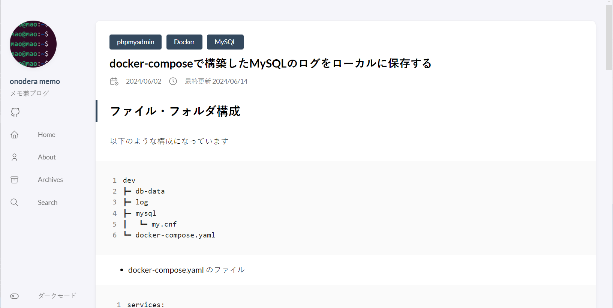

## 環境
- Windows 11 Home バージョン 23H2
- hugo v0.121.1-extended windows/amd64
- hugoのテーマ：stack("https://github.com/CaiJimmy/hugo-theme-stack")

## 更新日時の表示
記事のMarkdownファイルに"lastmod:"を追加し、更新日時を入れます
```
title: xxx
date: 2024-06-01
lastmod: 2024-06-14
slug:
```
そうすると記事の一番下に更新日時が表示されます

ただ、一番下なので記事を見たとき更新日時をすぐに確認できないので、作成日時の横に更新日時を表示させられるようにします

## 作成日時の横に更新日時を表示
下記のパスにある"footer.html"を開きます
```
./layouts/partials/article/components/footer.html
```

上記ファイルの中にある下記の部分をコピーします
下記が更新日時を表示させているコードです
```
{{- if ne .Lastmod .Date -}}
    <section class="article-lastmod">
        {{ partial "helper/icon" "clock" }}
        <span>
            {{ T "article.lastUpdatedOn" }} {{ .Lastmod.Format ( or .Site.Params.dateFormat.lastUpdated "Jan 02, 2006 15:04 MST" ) }}
        </span>
    </section>
{{- end -}}
```

下記のパスにある"details.html"を開きます
```
./layouts/partials/article/components/details.html
```

下記のコメント（20行目から29行目）を付けた部分に先ほどコピーしたコードを追加します
```
<footer class="article-time">
        {{ if $showDate }}
            <div>
                {{ partial "helper/icon" "date" }}
                <time class="article-time--published">
                    {{- .Date.Format (or .Site.Params.dateFormat.published "Jan 02, 2006") -}}
                </time>
            </div>
        {{ end }}

        {{ if $showReadingTime }}
            <div>
                {{ partial "helper/icon" "clock" }}
                <time class="article-time--reading">
                    {{ T "article.readingTime" .ReadingTime }}
                </time>
            </div>
        {{ end }}

        <!--ここから-->
        {{- if ne .Lastmod .Date -}}
        <div class="article-time--lastUpdated">
            {{ partial "helper/icon" "clock" }}
            <time>
                {{ T "article.lastUpdatedOn" }} {{ .Lastmod.Format ( or .Site.Params.dateFormat.lastUpdated "Jan 02, 2006 15:04 MST" ) }}
            </time>
        </div>
        {{- end -}}
        <!--ここを追加-->

    </footer>
```

## 確認
下記のコマンドで起動して確認してみます
```
hugo server -D
```


無事作成日時の横に更新日時が表示されました
