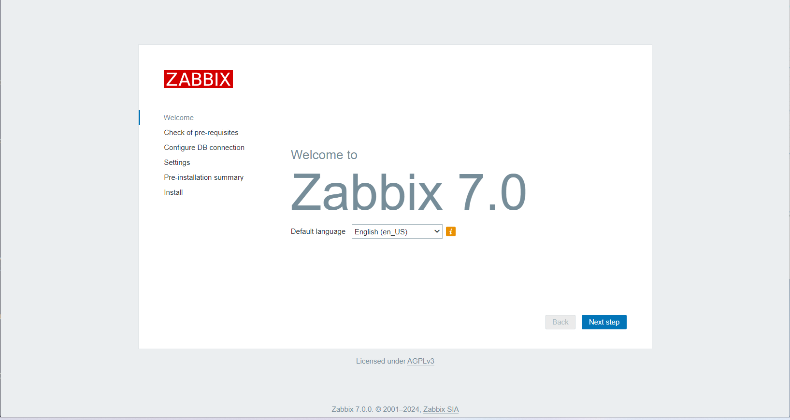
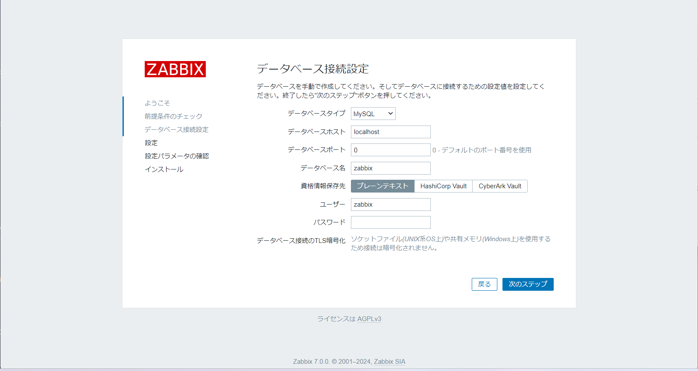

## 環境
- Ubuntu 24.04
- Zbbix 7.0
    - Ubuntu
    - MySQL
    - Nginx

## 手順
- このページの通りにインストールをしていく("https://www.zabbix.com/jp/download?zabbix=7.0&os_distribution=ubuntu&os_version=24.04&components=server_frontend_agent&db=mysql&ws=nginx")
- ただし、MySQLは別でインストールをする必要がある

以下に公式手順をコピペしたものを記載しています

### Zabbixリポジトリをインストールする
```
wget https://repo.zabbix.com/zabbix/7.0/ubuntu/pool/main/z/zabbix-release/zabbix-release_7.0-1+ubuntu24.04_all.deb
dpkg -i zabbix-release_7.0-1+ubuntu24.04_all.deb
apt update
```

### Zabbixサーバー、フロントエンド、エージェントをインストールする
```
apt install zabbix-server-mysql zabbix-frontend-php zabbix-nginx-conf zabbix-sql-scripts zabbix-agent
```

### MySQLをインストールする
```
sudo apt install mysql-server
```

### 初期データベースを作成する
```
mysql -uroot -p
password
```
```
mysql> create database zabbix character set utf8mb4 collate utf8mb4_bin;
mysql> create user zabbix@localhost identified by 'password';
mysql> grant all privileges on zabbix.* to zabbix@localhost;
mysql> set global log_bin_trust_function_creators = 1;
mysql> quit;
```

### Zabbix サーバー ホストで初期スキーマとデータをインポートします。新しく作成したパスワードを入力するよう求められます。
```
zcat /usr/share/zabbix-sql-scripts/mysql/server.sql.gz | mysql --default-character-set=utf8mb4 -uzabbix -p zabbix
```

データベース スキーマをインポートした後、log_bin_trust_function_creators オプションを無効にします。
```
mysql -uroot -p
password
```
```
mysql> set global log_bin_trust_function_creators = 0;
mysql> quit;
```

### Zabbixサーバーのデータベースを構成する
ファイル /etc/zabbix/zabbix_server.conf を編集します。
```
DBPassword=password
```

### Zabbixフロントエンド用にPHPを構成する
ファイル /etc/zabbix/nginx.conf を編集し、コメントアウトを解除して 'listen' および 'server_name' ディレクティブを設定します。
```
listen 8080;
server_name example.com;
```

### Zabbixサーバーとエージェントのプロセスを起動する
Zabbix サーバーおよびエージェント プロセスを起動し、システムの起動時に起動するようにします。
```
systemctl restart zabbix-server zabbix-agent nginx php8.3-fpm
systemctl enable zabbix-server zabbix-agent nginx php8.3-fpm
```

### Zabbix UI Webページを開く
```
IPアドレス:8080
```
初期設定をします
- ブラウザの画面






ログインする際の初期ID・パスワードは以下の通りです
- Username：Admin
- Password：zabbix


## 参考URL
- https://www.zabbix.com/jp/download?zabbix=7.0&os_distribution=ubuntu&os_version=24.04&components=server_frontend_agent&db=mysql&ws=nginx
- https://www.site24x7.jp/blog/zabbix-6-construction/

## 備考：MySQLをアンインストールして再インストールする
MySQLをインストールしてZbbixのデータベースを作成する際にエラーになってしまったので、再度インストールをした際の手順です

- アンインストール
```
sudo apt update
sudo apt upgrade
sudo apt purge mysql*
sudo rm -rf /etx/mysql /var/lib/mysql
sudo apt autoremove
sudo apt autoclean
```

- 再インストール
```
sudo apt install mysql-server
```