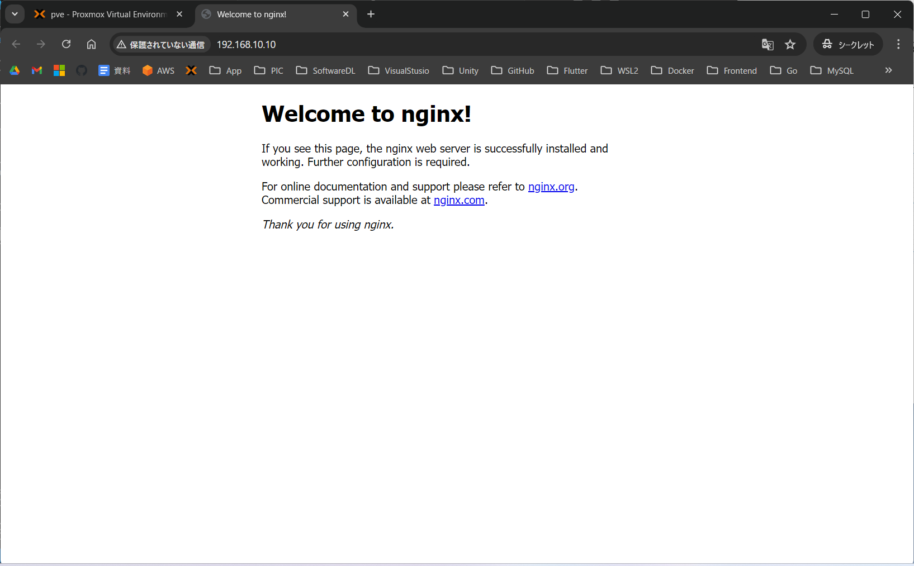

## Ansibleの拡張機能のインストール
- VScodeの拡張機能"redhat.ansible"があるのでインストールしておくと便利になる

## Ansibleのインストール
参考URL
- https://docs.ansible.com/ansible/latest/installation_guide/installation_distros.html#installing-ansible-on-ubuntu
```
sudo apt install software-properties-common
sudo apt-add-repository --yes --update ppa:ansible/ansible
sudo apt install ansible
```
バージョンの確認
```
ansible --version
which ansible
```

## ファイル構造を見れるようにtreeをインストール
```
sudo apt install tree
```

## アドホック・コマンド
フォルダの構造
```
mao@ansible-server:~/ansible-test$ tree
.
├── ansible-ssh
├── ansible.cfg
└── host.yaml

1 directory, 3 files
mao@ansible-server:~/ansible-test$ 
```

### ファイルの中身
ansible-ssh
- 実行されてsshで接続されると生成されるファイル

ansible.cfg（設定ファイル）
```
[defaults]
# fingerprintを検証しない設定
host_key_checking = False
```

host.yaml（インベントリーファイル）
```
# YAML は ”---" から開始する
---
# "all" グループの宣言
all:
  # "all" グループに含まれるホストに関する情報を定義する宣言
  hosts:
    # 管理対象ノードの情報を定義する宣言
    ansible-test-server: 
      ansible_host: 192.168.10.10
      ansible_user: mao
      ansible_password: mao
      ansible_ssh_private_key_file: /home/mao/ansible-test/ansible-ssh
      #ansible_python_interpreter: Python インタープリターの path
      ansible_port: 22
```

### 実行
下記コマンドを実行すると、それぞれのサーバーのストレージ容量を確認できる
```
ansible all -i host.yaml -m ansible.builtin.command -a "df -h"
ansible all -i hosts.yml -a "df -h"
```
- "-i"はインベントリーファイルの指定
- "-m ansible.builtin.command"は短縮可能

実行結果
```
mao@ansible-server:~/ansible-test$ ansible all -i host.yaml -m ansible.builtin.command -a "df -h"
ansible-test-server | CHANGED | rc=0 >>
Filesystem                         Size  Used Avail Use% Mounted on
tmpfs                              795M  692K  794M   1% /run
/dev/mapper/ubuntu--vg-ubuntu--lv  8.1G  2.5G  5.2G  32% /
tmpfs                              3.9G     0  3.9G   0% /dev/shm
tmpfs                              5.0M     0  5.0M   0% /run/lock
/dev/sda2                          1.7G  181M  1.5G  12% /boot
tmpfs                              795M   12K  795M   1% /run/user/1000
mao@ansible-server:~/ansible-test$ 
```

## Ansible-playbookの実行
参考URL
- https://docs.ansible.com/ansible/latest/collections/index.html

### ファイル構造
```
mao@ansible-server:~/ansible-test$ tree
.
├── ansible-ssh
├── ansible.cfg
├── host.yaml
└── nginx_playbook.yaml

1 directory, 4 files
mao@ansible-server:~/ansible-test$ 
```

"nginx_playbook.yaml"の中身
```
# Ansible-playbook
- name: setup nginx server
  hosts:
    - all
  become: yes
  tasks:
    - name: Install
      ansible.builtin.command: apt install -y nginx

    - name: Start
      ansible.builtin.service:
        name: nginx
        state: started

    - name: Enable nginx
      ansible.builtin.service:
        name: nginx
        #enabled: yes
        enabled: no

    #- name: nginx version
      #ansible.builtin.command: nginx -v

    #- name: status
      #ansible.builtin.command: systemctl status nginx
```

### 実行
nginxがインストールされます
```
ansible-playbook -i host.yaml nginx_playbook.yaml --ask-become-pass
```
- "--ask-become-pass":sudoパスワードを求めるオプション

実行結果
- 実行時にパスワードを求められるので入力します
```
mao@ansible-server:~/ansible-test$ ansible-playbook -i host.yaml nginx_playbook.yaml --ask-become-pass
BECOME password: 

PLAY [setup nginx server] ********************************************************************

TASK [Gathering Facts] ***********************************************************************
ok: [ansible-test-server]

TASK [Install] *******************************************************************************
changed: [ansible-test-server]

TASK [Start] *********************************************************************************
ok: [ansible-test-server]

TASK [Enable nginx] **************************************************************************
ok: [ansible-test-server]

PLAY RECAP ***********************************************************************************
ansible-test-server        : ok=4    changed=1    unreachable=0    failed=0    skipped=0    rescued=0    ignored=0   

mao@ansible-server:~/ansible-test$
```

無事nginxが起動しています


