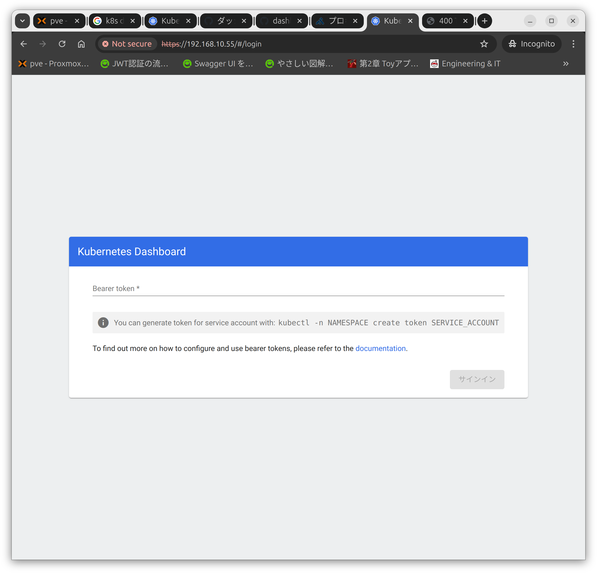
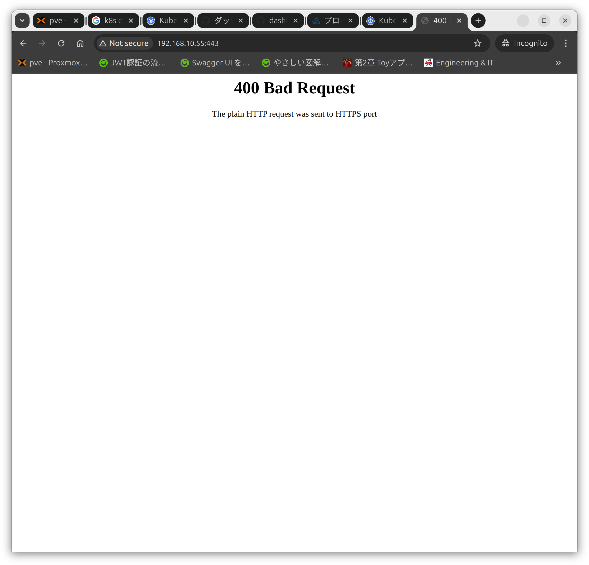

## 環境
- Kubernetes 1.30.2
- Helm v3.15.3
  - kubernetes-dashboard-7.5.0

## Helmの導入
参考URL
- https://helm.sh/ja/docs/intro/install/
- https://github.com/helm/helm/releases
- https://qiita.com/loftkun/items/bcfe1f205cde4d74a384

今回はバイナリを使用する方法でインストールします

バイナリをダウンロードします
```
wget https://get.helm.sh/helm-v3.15.3-linux-amd64.tar.gz
```
```
mao@k8s-control-plane-01:~$ wget https://get.helm.sh/helm-v3.15.3-linux-amd64.tar.gz
--2024-08-08 09:11:52--  https://get.helm.sh/helm-v3.15.3-linux-amd64.tar.gz
Resolving get.helm.sh (get.helm.sh)... 152.199.39.108, 2606:2800:247:1cb7:261b:1f9c:2074:3c
Connecting to get.helm.sh (get.helm.sh)|152.199.39.108|:443... connected.
HTTP request sent, awaiting response... 200 OK
Length: 16626424 (16M) [application/x-tar]
Saving to: ‘helm-v3.15.3-linux-amd64.tar.gz’

helm-v3.15.3-linux-am 100%[======================>]  15.86M   102MB/s    in 0.2s    

2024-08-08 09:11:52 (102 MB/s) - ‘helm-v3.15.3-linux-amd64.tar.gz’ saved [16626424/16626424]

mao@k8s-control-plane-01:~$ 
```

圧縮されているので展開します\
展開するとバイナリファイルが出てきます
```
tar -zxvf helm-v3.15.3-linux-amd64.tar.gz
```
```
mao@k8s-control-plane-01:~$ tar -zxvf helm-v3.15.3-linux-amd64.tar.gz
linux-amd64/
linux-amd64/helm
linux-amd64/README.md
linux-amd64/LICENSE
mao@k8s-control-plane-01:~$ 
```

バイナリファイルを移動します
```
sudo mv linux-amd64/helm /usr/local/bin/helm
```

バイナリを移動したらバージョンを確認してみます
```
helm version
```
```
mao@k8s-control-plane-01:~$ helm version
version.BuildInfo{Version:"v3.15.3", GitCommit:"3bb50bbbdd9c946ba9989fbe4fb4104766302a64", GitTreeState:"clean", GoVersion:"go1.22.5"}
mao@k8s-control-plane-01:~$ 
```
"v3.15.3"と表示されたのでこれでインストールは完了しました\
アップデートする際はこのバイナリを新しいものに置き換えます

- アンインストール方法
```
$ which helm
/usr/local/bin/helm
$ sudo rm /usr/local/bin/helm
```

## Helmを使用してKubernetes-dashboardをデプロイする
参考URL
- https://kubernetes.io/docs/tasks/access-application-cluster/web-ui-dashboard/
- https://artifacthub.io/packages/helm/k8s-dashboard/kubernetes-dashboard
- https://qiita.com/loftkun/items/bcfe1f205cde4d74a38

### Helmにリポジトリを追加
```
helm repo add kubernetes-dashboard https://kubernetes.github.io/dashboard/
```
```
mao@k8s-control-plane-01:~$ helm repo add kubernetes-dashboard https://kubernetes.github.io/dashboard/
"kubernetes-dashboard" has been added to your repositories
mao@k8s-control-plane-01:~$ 
```

追加されているか確認をする
```
mao@k8s-control-plane-01:~$ helm repo list
NAME                    URL                                    
kubernetes-dashboard    https://kubernetes.github.io/dashboard/
mao@k8s-control-plane-01:~$ 
```

### Helmを使用してデプロイ
公式サイトに記載にある手順でデプロイします
```
helm upgrade --install kubernetes-dashboard kubernetes-dashboard/kubernetes-dashboard --create-namespace --namespace kubernetes-dashboard
```
```
mao@k8s-control-plane-01:~$ helm upgrade --install kubernetes-dashboard kubernetes-dashboard/kubernetes-dashboard --create-namespace --namespace kubernetes-dashboard
Release "kubernetes-dashboard" does not exist. Installing it now.
NAME: kubernetes-dashboard
LAST DEPLOYED: Thu Aug  8 12:22:06 2024
NAMESPACE: kubernetes-dashboard
STATUS: deployed
REVISION: 1
TEST SUITE: None
NOTES:
*************************************************************************************************
*** PLEASE BE PATIENT: Kubernetes Dashboard may need a few minutes to get up and become ready ***
*************************************************************************************************

Congratulations! You have just installed Kubernetes Dashboard in your cluster.

To access Dashboard run:
  kubectl -n kubernetes-dashboard port-forward svc/kubernetes-dashboard-kong-proxy 8443:443

NOTE: In case port-forward command does not work, make sure that kong service name is correct.
      Check the services in Kubernetes Dashboard namespace using:
        kubectl -n kubernetes-dashboard get svc

Dashboard will be available at:
  https://localhost:8443
mao@k8s-control-plane-01:~$
```

### サービスアカウントの作成
参考URL
- https://github.com/kubernetes/dashboard/blob/master/docs/user/access-control/creating-sample-user.md

マニフェストファイルを作成して以下の内容を書き込みます
- dashboard-adminuser.yaml
```
apiVersion: v1
kind: ServiceAccount
metadata:
  name: admin-user
  namespace: kubernetes-dashboard

---
apiVersion: rbac.authorization.k8s.io/v1
kind: ClusterRoleBinding
metadata:
  name: admin-user
roleRef:
  apiGroup: rbac.authorization.k8s.io
  kind: ClusterRole
  name: cluster-admin
subjects:
- kind: ServiceAccount
  name: admin-user
  namespace: kubernetes-dashboard
```

デプロイします
```
kubectl apply -f dashboard-adminuser.yaml
```
```
mao@k8s-control-plane-01:~$ kubectl apply -f dashboard-adminuser.yaml
serviceaccount/admin-user created
clusterrolebinding.rbac.authorization.k8s.io/admin-user created
mao@k8s-control-plane-01:~$ 
```

### 外部からアクセスできるようにする
ポートフォワードをする
```
kubectl -n kubernetes-dashboard port-forward svc/kubernetes-dashboard-kong-proxy 8443:443
```
Ctrl+Cでポートフォワード停止

### ログイン用のトークンを確認
外部からアクセスできるようにしてブラウザにIPアドレスを入力して表示するとログインを求められるので、\
以下の方法でログイン用のトークンを発行します
```
kubectl -n kubernetes-dashboard create token admin-user
```
```
mao@k8s-control-plane-01:~$ kubectl -n kubernetes-dashboard create token admin-user
eyJhbGciOiJSUzI1NiIsImtpZCI6ImtRS1lrek1TRUE3LXRCeEVpU2hJRDhEUGhWT0lzeG1QM1lwNjBHbkl1MlkifQ.eyJhdWQiOlsiaHR0cHM6Ly9rdWJlcm5ldGVzLmRlZmF1bHQuc3ZjLmNsdXN0ZXIubG9jYWwiXSwiZXhwIjoxNzIzMTI0NjUyLCJpYXQiOjE3MjMxMjEwNTIsImlzcyI6Imh0dHBzOi8va3ViZXJuZXRlcy5kZWZhdWx0LnN2Yy5jbHVzdGVyLmxvY2FsIiwianRpIjoiNDk4ZTg0YjctNTFmZi00NWRjLTgxODYtOGVhODMwMTY4NDdkIiwia3ViZXJuZXRlcy5pbyI6eyJuYW1lc3BhY2UiOiJrdWJlcm5ldGVzLWRhc2hib2FyZCIsInNlcnZpY2VhY2NvdW50Ijp7Im5hbWUiOiJhZG1pbi11c2VyIiwidWlkIjoiNDczMzgwYWMtZWM3Yi00ZTBkLThiOTMtN2E1YjdkNDkzMTI5In19LCJuYmYiOjE3MjMxMjEwNTIsInN1YiI6InN5c3RlbTpzZXJ2aWNlYWNjb3VudDprdWJlcm5ldGVzLWRhc2hib2FyZDphZG1pbi11c2VyIn0.WoGFlfvaUxchL1RqUP60GPEr7Q4laleBmixc-XyeZp48R4dVaZILC9eCsgDGJZbc3Q9_uh9ynVBle40lOLShwvsvbMcvrecNT-konG2HHCaUnMRV_nZeS7qaT5pYZCwKskW9AkdRsXS4dDKY7Wlj6jEStryM0OcYNdPm0JtxtXX6ejK5qA0wl6zPpcqLmnPHqMhRcUw0gHuIu9AL9cAoTT7sDUPBZSBwE1P5MS-eNAQx05xfNkUkilL1kNN-gnE-PX7u79uCXTi8lhoYlO48fQMOoo6MIGsqw9QBZcfx-uFGolwrWa3KmyQuaOAc8pghUjipGtV1KHSkEA1TDjx69g
mao@k8s-control-plane-01:~$ 
```

- ログイン画面


### サービスアカウントの削除
```
kubectl delete -f dashboard-adminuser.yaml
```
```
mao@k8s-control-plane-01:~$ kubectl delete -f dashboard-adminuser.yaml
serviceaccount "admin-user" deleted
clusterrolebinding.rbac.authorization.k8s.io "admin-user" deleted
mao@k8s-control-plane-01:~$ 
```

- 上記の方法でサービスアカウントを削除すれば以下はやらなくても大丈夫
```
kubectl -n kubernetes-dashboard delete serviceaccount admin-user
kubectl -n kubernetes-dashboard delete clusterrolebinding admin-user
```

### ダッシュボードを削除
```
helm uninstall release_name -n release_namespace
```
```
helm uninstall kubernetes-dashboard -n kubernetes-dashboard
```
```
mao@k8s-control-plane-01:~/k8s$ helm ls -A
NAME                    NAMESPACE               REVISION        UPDATED                                      STATUS          CHART                           APP VERSION
kubernetes-dashboard    kubernetes-dashboard    1               2024-08-08 10:09:12.228703023 +0000 UTC      deployed        kubernetes-dashboard-7.5.0                 
mao@k8s-control-plane-01:~/k8s$ helm uninstall kubernetes-dashboard -n kubernetes-dashboard
release "kubernetes-dashboard" uninstalled
mao@k8s-control-plane-01:~/k8s$ helm ls -A
NAME    NAMESPACE       REVISION        UPDATED STATUS  CHART   APP VERSION
mao@k8s-control-plane-01:~/k8s$ 
```

- 無事削除されたことを確認
```
mao@k8s-control-plane-01:~$ kubectl -n kubernetes-dashboard get svc
No resources found in kubernetes-dashboard namespace.
mao@k8s-control-plane-01:~$ 
```

## kubernetes-dashboardをクラスタ外からLoadBlancerを使いアクセスできるようにする
今までの方法だと外部からアクセスする際にポートフォワードをしなければならず、大変＋LoadBalancerがあるので、LoadBalancerでIPアドレスを割り当てて、そこに外部からアクセスできるようにしました。

設定ファイルのダウンロード
- https://github.com/kubernetes/dashboard/blob/master/charts/kubernetes-dashboard/values.yaml
```
wget https://raw.githubusercontent.com/kubernetes/dashboard/master/charts/kubernetes-dashboard/values.yaml
```
```
mao@k8s-control-plane-01:~$ wget https://raw.githubusercontent.com/kubernetes/dashboard/master/charts/kubernetes-dashboard/values.yaml
--2024-08-09 23:37:44--  https://raw.githubusercontent.com/kubernetes/dashboard/master/charts/kubernetes-dashboard/values.yaml
Resolving raw.githubusercontent.com (raw.githubusercontent.com)... 185.199.110.133, 185.199.111.133, 185.199.108.133, ...
Connecting to raw.githubusercontent.com (raw.githubusercontent.com)|185.199.110.133|:443... connected.
HTTP request sent, awaiting response... 200 OK
Length: 12820 (13K) [text/plain]
Saving to: ‘values.yaml’

values.yaml          100%[===================>]  12.52K  --.-KB/s    in 0s      

2024-08-09 23:37:44 (128 MB/s) - ‘values.yaml’ saved [12820/12820]

mao@k8s-control-plane-01:~$ 
```

デプロイする
- "-f values.yaml"でファイルを指定する
- https://github.com/kubernetes/dashboard/tree/master/charts/kubernetes-dashboard
```
helm upgrade --install kubernetes-dashboard kubernetes-dashboard/kubernetes-dashboard --create-namespace --namespace kubernetes-dashboard -f values.yaml
```

- "values.yaml"ファイルの"kong.proxy.type"が"ClusterIP"になっていたので"LoadBalancer"へと変更したらクラスタ外からでもアクセスできるようになった
- 普通にIPアドレスのみでアクセスすると"400 Bad Request"になるので"https"を付けたらアクセスできた
<!--  -->
```
kong:
  enabled: true
  ## Configuration reference: https://docs.konghq.com/gateway/3.6.x/reference/configuration
  env:
    dns_order: LAST,A,CNAME,AAAA,SRV
    plugins: 'off'
    nginx_worker_processes: 1
  ingressController:
    enabled: false
  dblessConfig:
    configMap: kong-dbless-config
  proxy:
    #type: ClusterIP
    type: LoadBalancer
    #loadBalancerIP: 192.168.10.57
    http:
      enabled: false
```

- "EXTERNAL-IP"が割り当てられている
```
mao@k8s-control-plane-01:~$ kubectl -n kubernetes-dashboard get svc
NAME                                   TYPE           CLUSTER-IP       EXTERNAL-IP     PORT(S)                         AGE
kubernetes-dashboard-api               ClusterIP      10.111.166.219   <none>          8000/TCP                        10m
kubernetes-dashboard-auth              ClusterIP      10.110.8.100     <none>          8000/TCP                        10m
kubernetes-dashboard-kong-manager      NodePort       10.99.108.147    <none>          8002:31994/TCP,8445:31824/TCP   10m
kubernetes-dashboard-kong-proxy        LoadBalancer   10.103.61.118    192.168.10.55   443:32210/TCP                   10m
kubernetes-dashboard-metrics-scraper   ClusterIP      10.111.179.107   <none>          8000/TCP                        10m
kubernetes-dashboard-web               ClusterIP      10.100.158.51    <none>          8000/TCP                        10m
mao@k8s-control-plane-01:~$ 
```

## リソースの削除
### サービスアカウントの削除
```
kubectl delete -f dashboard-adminuser.yaml
```
```
mao@k8s-control-plane-01:~$ kubectl delete -f dashboard-adminuser.yaml
serviceaccount "admin-user" deleted
clusterrolebinding.rbac.authorization.k8s.io "admin-user" deleted
mao@k8s-control-plane-01:~$ 
```

- 上記の方法でサービスアカウントを削除すれば以下はやらなくても大丈夫
```
kubectl -n kubernetes-dashboard delete serviceaccount admin-user
kubectl -n kubernetes-dashboard delete clusterrolebinding admin-user
```

### ダッシュボードを削除
```
helm uninstall release_name -n release_namespace
```
```
helm uninstall kubernetes-dashboard -n kubernetes-dashboard
```
```
mao@k8s-control-plane-01:~/k8s$ helm ls -A
NAME                    NAMESPACE               REVISION        UPDATED                                      STATUS          CHART                           APP VERSION
kubernetes-dashboard    kubernetes-dashboard    1               2024-08-08 10:09:12.228703023 +0000 UTC      deployed        kubernetes-dashboard-7.5.0                 
mao@k8s-control-plane-01:~/k8s$ helm uninstall kubernetes-dashboard -n kubernetes-dashboard
release "kubernetes-dashboard" uninstalled
mao@k8s-control-plane-01:~/k8s$ helm ls -A
NAME    NAMESPACE       REVISION        UPDATED STATUS  CHART   APP VERSION
mao@k8s-control-plane-01:~/k8s$ 
```

- 無事削除されたことを確認
```
mao@k8s-control-plane-01:~$ kubectl -n kubernetes-dashboard get svc
No resources found in kubernetes-dashboard namespace.
mao@k8s-control-plane-01:~$ 
```
