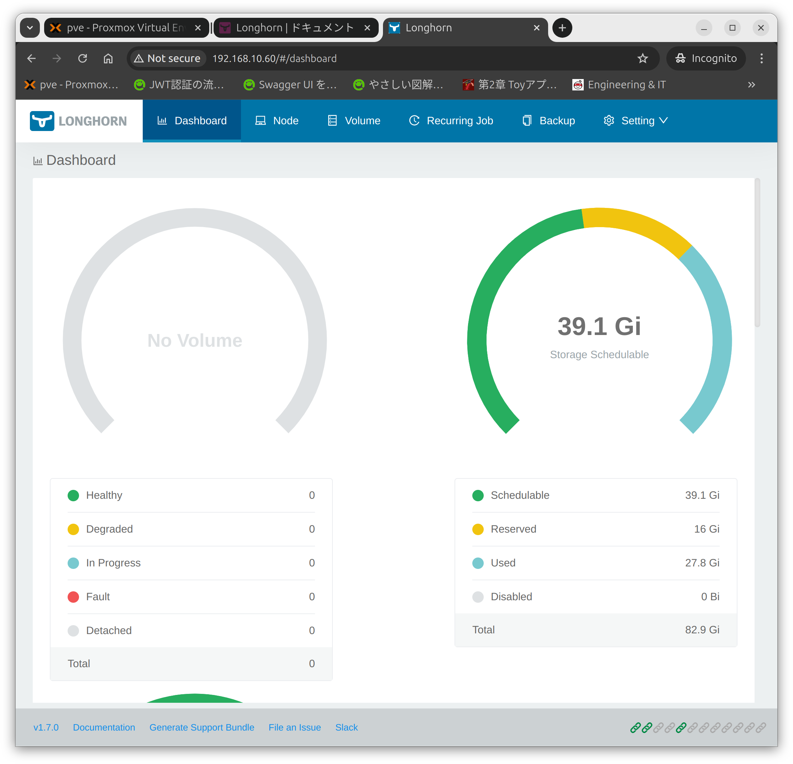
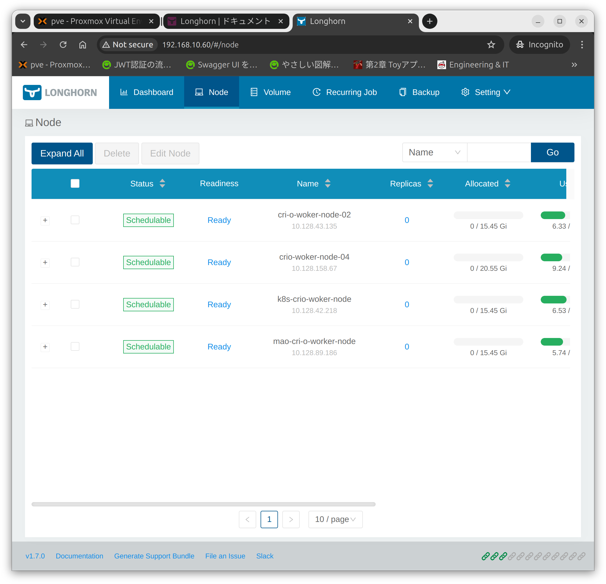

## 環境
- Kubernetes 1.31.0
  - Control-Plane：1台
  - Woker-Node：3台+1台
- cri-o v1.30.4
- Longhorn 1.7.0

## 参考URL
インストール手順
- https://longhorn.io/docs/1.7.0/deploy/install/install-with-kubectl/

インストール要件
- https://longhorn.io/docs/1.7.0/deploy/install/#installation-requirements
- https://longhorn.io/docs/1.7.0/advanced-resources/longhornctl/install-longhornctl/

Dashboardも表示できるようにする
  - https://longhorn.io/docs/1.7.0/deploy/accessing-the-ui/

## インストール手順
マニフェストファイルをダウンロードする
```
wget https://raw.githubusercontent.com/longhorn/longhorn/v1.7.0/deploy/longhorn.yaml
```
- 4724行目あたり
- Dashboardを外部からアクセスできるように"type: LoadBalancer"する
```
- type: ClusterIP
+ type: LoadBalancer
```

デプロイする
```
kubectl apply -f longhorn.yaml
kubectl delete -f longhorn.yaml
```

インストールの進行状況を確認する
```
kubectl get pods \
--namespace longhorn-system \
--watch
```

デプロイができているか確認する
```
kubectl -n longhorn-system get pod
kubectl -n longhorn-system get svc
```

### Podがすぐ"Evicted"になってしまう（解決済み）
- 試したこと（どれも解決しなかった）
  - EvictedになっているPodを削除した→変化なし、Podが再生成されるがEvictedになる
  - メモリを16GBに増やす→変化なし
  - Woker-Nodeを追加した→変化なし
  - マニフェストファイル上の"replicas"の数を変更した→変化なし

- 解決した方法
  - Dashboard上で確認した際に"down"となっており、Evictedが表示されているPodがあるNodeのストレージ容量がぎりぎりになっていたため容量を増やした
  - ストレージの容量を元々は10GBだったが20GBに拡張したら問題なく"Running"になり問題なく動作した
  - "Evicted","ContainerStatusUnknown","Error"になってしまう場合はNodeのストレージの容量不足でなっていた

```
mao@cri-o-control-plane-01:~$ kubectl get nodes -o wide
NAME                     STATUS   ROLES           AGE     VERSION   INTERNAL-IP     EXTERNAL-IP   OS-IMAGE             KERNEL-VERSION     CONTAINER-RUNTIME
cri-o-control-plane-01   Ready    control-plane   4d17h   v1.31.0   192.168.10.55   <none>        Ubuntu 24.04 LTS     6.8.0-41-generic   cri-o://1.30.4
cri-o-woker-node-02      Ready    <none>          4d17h   v1.31.0   192.168.10.58   <none>        Ubuntu 24.04 LTS     6.8.0-41-generic   cri-o://1.30.4
crio-woker-node-04       Ready    <none>          87m     v1.31.0   192.168.10.59   <none>        Ubuntu 24.04.1 LTS   6.8.0-41-generic   cri-o://1.30.4
k8s-crio-woker-node      Ready    <none>          46m     v1.31.0   192.168.10.57   <none>        Ubuntu 24.04 LTS     6.8.0-41-generic   cri-o://1.30.4
mao-cri-o-worker-node    Ready    <none>          4d17h   v1.31.0   192.168.10.56   <none>        Ubuntu 24.04 LTS     6.8.0-41-generic   cri-o://1.30.4
```
```
mao@cri-o-control-plane-01:~$ kubectl -n longhorn-system get pod -o wide
NAME                                                READY   STATUS                   RESTARTS      AGE   IP              NODE                    NOMINATED NODE   READINESS GATES
csi-attacher-d7d65647-7pmv5                         1/1     Running                  3 (93m ago)   22h   10.128.89.161   mao-cri-o-worker-node   <none>           <none>
csi-attacher-d7d65647-7sgfb                         1/1     Running                  2 (93m ago)   22h   10.128.89.164   mao-cri-o-worker-node   <none>           <none>
csi-attacher-d7d65647-xsrqw                         1/1     Running                  1             22h   10.128.43.177   cri-o-woker-node-02     <none>           <none>
csi-provisioner-c4bc78768-8nnmq                     1/1     Running                  2             22h   10.128.43.176   cri-o-woker-node-02     <none>           <none>
csi-provisioner-c4bc78768-bfvkv                     1/1     Running                  2 (93m ago)   22h   10.128.89.166   mao-cri-o-worker-node   <none>           <none>
csi-provisioner-c4bc78768-j9mvn                     1/1     Running                  3 (93m ago)   22h   10.128.89.169   mao-cri-o-worker-node   <none>           <none>
csi-resizer-5d979bd54f-mm2nv                        1/1     Running                  2 (93m ago)   22h   10.128.89.171   mao-cri-o-worker-node   <none>           <none>
csi-resizer-5d979bd54f-r9v2l                        1/1     Running                  1             22h   10.128.43.171   cri-o-woker-node-02     <none>           <none>
csi-resizer-5d979bd54f-zsvsp                        1/1     Running                  2 (93m ago)   22h   10.128.89.160   mao-cri-o-worker-node   <none>           <none>
csi-snapshotter-6967b768c5-5k7bw                    1/1     Running                  2 (93m ago)   22h   10.128.89.168   mao-cri-o-worker-node   <none>           <none>
csi-snapshotter-6967b768c5-b8rhc                    1/1     Running                  1             22h   10.128.43.172   cri-o-woker-node-02     <none>           <none>
csi-snapshotter-6967b768c5-bgndk                    1/1     Running                  2 (93m ago)   22h   10.128.89.170   mao-cri-o-worker-node   <none>           <none>
engine-image-ei-04c05bf8-5scw8                      1/1     Running                  0             90m   10.85.0.3       crio-woker-node-04      <none>           <none>
engine-image-ei-04c05bf8-cwv4s                      0/1     Error                    0             50s   10.128.42.209   k8s-crio-woker-node     <none>           <none>
engine-image-ei-04c05bf8-js9cs                      1/1     Running                  1             22h   10.128.89.167   mao-cri-o-worker-node   <none>           <none>
engine-image-ei-04c05bf8-qcsrv                      1/1     Running                  1             22h   10.128.43.181   cri-o-woker-node-02     <none>           <none>
instance-manager-0ecb4b94c60d35839b99dd2d623388ed   0/1     Evicted                  0             31s   <none>          k8s-crio-woker-node     <none>           <none>
instance-manager-aab3d619b1ba92d19591bd1d921a1146   1/1     Running                  0             86m   10.128.158.65   crio-woker-node-04      <none>           <none>
instance-manager-ceb82c2dc60ec205037420596df48d66   1/1     Running                  0             94m   10.128.89.173   mao-cri-o-worker-node   <none>           <none>
instance-manager-d5708d70dcb6e03f00727b77e7699675   1/1     Running                  0             94m   10.128.43.183   cri-o-woker-node-02     <none>           <none>
longhorn-csi-plugin-9h5pz                           3/3     Running                  6 (93m ago)   22h   10.128.89.163   mao-cri-o-worker-node   <none>           <none>
longhorn-csi-plugin-cpt7t                           3/3     Running                  5 (94m ago)   22h   10.128.43.175   cri-o-woker-node-02     <none>           <none>
longhorn-csi-plugin-d5mf9                           0/3     Error                    0             49s   10.128.42.210   k8s-crio-woker-node     <none>           <none>
longhorn-csi-plugin-ncxxj                           3/3     Running                  5 (88m ago)   90m   10.85.0.2       crio-woker-node-04      <none>           <none>
longhorn-driver-deployer-588c6bb4c8-6ldxd           1/1     Running                  1             22h   10.128.43.180   cri-o-woker-node-02     <none>           <none>
longhorn-manager-fc8qn                              0/2     ContainerStatusUnknown   1             53s   10.128.42.208   k8s-crio-woker-node     <none>           <none>
longhorn-manager-lx4n2                              2/2     Running                  2             22h   10.128.89.162   mao-cri-o-worker-node   <none>           <none>
longhorn-manager-qwbxr                              2/2     Running                  3 (87m ago)   90m   10.85.0.4       crio-woker-node-04      <none>           <none>
longhorn-manager-vkfm9                              2/2     Running                  2             22h   10.128.43.178   cri-o-woker-node-02     <none>           <none>
longhorn-ui-5cb7d58f9c-44sr7                        1/1     Running                  2 (94m ago)   22h   10.128.89.172   mao-cri-o-worker-node   <none>           <none>
longhorn-ui-5cb7d58f9c-6jczn                        1/1     Running                  1             21h   10.128.43.174   cri-o-woker-node-02     <none>           <none>
mao@cri-o-control-plane-01:~$
```
```
mao@cri-o-control-plane-01:~$ kubectl -n longhorn-system get pod -o wide
NAME                                                READY   STATUS                   RESTARTS      AGE   IP              NODE                    NOMINATED NODE   READINESS GATES
csi-attacher-d7d65647-7pmv5                         1/1     Running                  3 (92m ago)   22h   10.128.89.161   mao-cri-o-worker-node   <none>           <none>
csi-attacher-d7d65647-7sgfb                         1/1     Running                  2 (92m ago)   22h   10.128.89.164   mao-cri-o-worker-node   <none>           <none>
csi-attacher-d7d65647-xsrqw                         1/1     Running                  1             22h   10.128.43.177   cri-o-woker-node-02     <none>           <none>
csi-provisioner-c4bc78768-8nnmq                     1/1     Running                  2             22h   10.128.43.176   cri-o-woker-node-02     <none>           <none>
csi-provisioner-c4bc78768-bfvkv                     1/1     Running                  2 (92m ago)   22h   10.128.89.166   mao-cri-o-worker-node   <none>           <none>
csi-provisioner-c4bc78768-j9mvn                     1/1     Running                  3 (92m ago)   22h   10.128.89.169   mao-cri-o-worker-node   <none>           <none>
csi-resizer-5d979bd54f-mm2nv                        1/1     Running                  2 (92m ago)   22h   10.128.89.171   mao-cri-o-worker-node   <none>           <none>
csi-resizer-5d979bd54f-r9v2l                        1/1     Running                  1             22h   10.128.43.171   cri-o-woker-node-02     <none>           <none>
csi-resizer-5d979bd54f-zsvsp                        1/1     Running                  2 (92m ago)   22h   10.128.89.160   mao-cri-o-worker-node   <none>           <none>
csi-snapshotter-6967b768c5-5k7bw                    1/1     Running                  2 (92m ago)   22h   10.128.89.168   mao-cri-o-worker-node   <none>           <none>
csi-snapshotter-6967b768c5-b8rhc                    1/1     Running                  1             22h   10.128.43.172   cri-o-woker-node-02     <none>           <none>
csi-snapshotter-6967b768c5-bgndk                    1/1     Running                  2 (92m ago)   22h   10.128.89.170   mao-cri-o-worker-node   <none>           <none>
engine-image-ei-04c05bf8-5scw8                      1/1     Running                  0             88m   10.85.0.3       crio-woker-node-04      <none>           <none>
engine-image-ei-04c05bf8-85qqz                      0/1     Error                    0             15m   <none>          k8s-crio-woker-node     <none>           <none>
engine-image-ei-04c05bf8-js9cs                      1/1     Running                  1             22h   10.128.89.167   mao-cri-o-worker-node   <none>           <none>
engine-image-ei-04c05bf8-qcsrv                      1/1     Running                  1             22h   10.128.43.181   cri-o-woker-node-02     <none>           <none>
instance-manager-0ecb4b94c60d35839b99dd2d623388ed   0/1     ContainerStatusUnknown   1             15m   <none>          k8s-crio-woker-node     <none>           <none>
instance-manager-aab3d619b1ba92d19591bd1d921a1146   1/1     Running                  0             85m   10.128.158.65   crio-woker-node-04      <none>           <none>
instance-manager-ceb82c2dc60ec205037420596df48d66   1/1     Running                  0             92m   10.128.89.173   mao-cri-o-worker-node   <none>           <none>
instance-manager-d5708d70dcb6e03f00727b77e7699675   1/1     Running                  0             92m   10.128.43.183   cri-o-woker-node-02     <none>           <none>
longhorn-csi-plugin-9h5pz                           3/3     Running                  6 (92m ago)   22h   10.128.89.163   mao-cri-o-worker-node   <none>           <none>
longhorn-csi-plugin-cpt7t                           3/3     Running                  5 (92m ago)   22h   10.128.43.175   cri-o-woker-node-02     <none>           <none>
longhorn-csi-plugin-ncxxj                           3/3     Running                  5 (87m ago)   88m   10.85.0.2       crio-woker-node-04      <none>           <none>
longhorn-csi-plugin-ndgbb                           0/3     Error                    1             15m   <none>          k8s-crio-woker-node     <none>           <none>
longhorn-driver-deployer-588c6bb4c8-6ldxd           1/1     Running                  1             22h   10.128.43.180   cri-o-woker-node-02     <none>           <none>
longhorn-manager-842xw                              0/2     ContainerStatusUnknown   2             15m   <none>          k8s-crio-woker-node     <none>           <none>
longhorn-manager-lx4n2                              2/2     Running                  2             22h   10.128.89.162   mao-cri-o-worker-node   <none>           <none>
longhorn-manager-qwbxr                              2/2     Running                  3 (86m ago)   88m   10.85.0.4       crio-woker-node-04      <none>           <none>
longhorn-manager-vkfm9                              2/2     Running                  2             22h   10.128.43.178   cri-o-woker-node-02     <none>           <none>
longhorn-ui-5cb7d58f9c-44sr7                        1/1     Running                  2 (92m ago)   22h   10.128.89.172   mao-cri-o-worker-node   <none>           <none>
longhorn-ui-5cb7d58f9c-6jczn                        1/1     Running                  1             21h   10.128.43.174   cri-o-woker-node-02     <none>           <none>
mao@cri-o-control-plane-01:~$
```

## Dashboardを確認する
- LoadBalancerを指定したのでIPアドレスが割り当てられています
- 下記コマンドで確認します
```
kubectl -n longhorn-system get service
```
```
mao@cri-o-control-plane-01:~$ kubectl -n longhorn-system get service
NAME                          TYPE           CLUSTER-IP       EXTERNAL-IP     PORT(S)        AGE
longhorn-admission-webhook    ClusterIP      10.109.17.201    <none>          9502/TCP       24h
longhorn-backend              ClusterIP      10.102.186.222   <none>          9500/TCP       24h
longhorn-conversion-webhook   ClusterIP      10.103.48.37     <none>          9501/TCP       24h
longhorn-frontend             LoadBalancer   10.99.231.247    192.168.10.60   80:31171/TCP   24h
longhorn-recovery-backend     ClusterIP      10.111.12.211    <none>          9503/TCP       24h
mao@cri-o-control-plane-01:~$
```
- "192.168.10.60"にアクセスするとDashboardが表示されます


