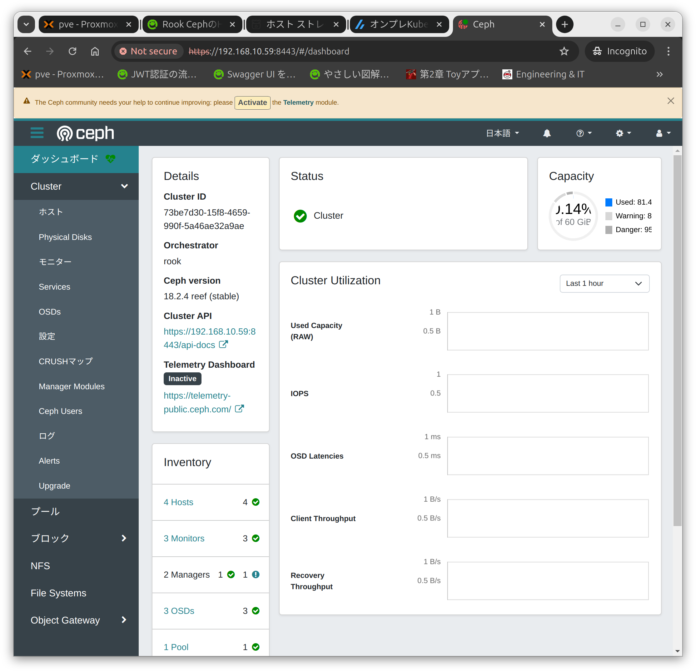

## 環境
- Kubernetes 1.31.0
  - Control-Plane：1台
  - Woker-Node：3台+1台
- cri-o v1.30.4
- CNI(Container Networking Interface)
  - Calico v3.28.0
  - Cilium v1.16.1
- Rook-Ceph 1.15

## 参考URL
- https://rook.io/docs/rook/latest-release/Getting-Started/quickstart
- https://qiita.com/ohtsuka-shota/items/cc45d595f742f3625099
- https://qiita.com/takuya_0301/items/5f6ad4fa197d0e4f9815
- https://qiita.com/showchan33/items/f678665c5fddb3bf7551
- https://qiita.com/t_ume/items/4ac37f746bf07146d5f9
- https://zenn.dev/vampire_yuta/articles/367ee53b78d681
- https://techstep.hatenablog.com/entry/2020/02/02/134702

## CNIにCalicoを使用していると動作しない
- https://hidemium.hatenablog.com/entry/2023/01/21/083020
- https://github.com/rook/rook/issues/7769

## インストール
インストール手順は公式ドキュメントを参考にする
- https://rook.io/docs/rook/latest-release/Getting-Started/quickstart

マニフェストファイルをダウンロードする
```
wget https://raw.githubusercontent.com/rook/rook/release-1.15/deploy/examples/crds.yaml
wget https://raw.githubusercontent.com/rook/rook/release-1.15/deploy/examples/common.yaml
wget https://raw.githubusercontent.com/rook/rook/release-1.15/deploy/examples/operator.yaml
wget https://raw.githubusercontent.com/rook/rook/release-1.15/deploy/examples/cluster.yaml
```

## CNIがCaliicoの場合（上手く行かない）
- いくつかのPodが"Pending"になってしまう

### Rookをデプロイする
下記コマンドを実行して"Rook"をデプロイする
```
kubectl create -f crds.yaml -f common.yaml -f operator.yaml
```

デプロイされたか確認する
```
kubectl -n rook-ceph get pod
```
```
mao@cilium-control-plane-01:~$ kubectl -n rook-ceph get pod
NAME                                 READY   STATUS    RESTARTS   AGE
rook-ceph-operator-b777cf696-d2v8d   1/1     Running   0          2m19s
mao@cilium-control-plane-01:~$
```
```
kubectl get all -n rook-ceph
```
```
mao@cilium-control-plane-01:~$ kubectl get all -n rook-ceph
NAME                                     READY   STATUS    RESTARTS   AGE
pod/rook-ceph-operator-b777cf696-d2v8d   1/1     Running   0          3m6s

NAME                                 READY   UP-TO-DATE   AVAILABLE   AGE
deployment.apps/rook-ceph-operator   1/1     1            1           3m6s

NAME                                           DESIRED   CURRENT   READY   AGE
replicaset.apps/rook-ceph-operator-b777cf696   1         1         1       3m6s
mao@cilium-control-plane-01:~$
```

### Cephをデプロイする
```
kubectl create -f cluster.yaml
kubectl apply -f cluster.yaml
```
```
mao@cri-o-control-plane-01:~$ kubectl -n rook-ceph get pod
NAME                                            READY   STATUS              RESTARTS   AGE
csi-cephfsplugin-frgl7                          3/3     Running             0          33s
csi-cephfsplugin-provisioner-76cc6d46cd-88s2t   0/6     ContainerCreating   0          33s
csi-cephfsplugin-provisioner-76cc6d46cd-8p4wr   0/6     ContainerCreating   0          33s
csi-cephfsplugin-rbjwz                          3/3     Running             0          33s
csi-cephfsplugin-rrc96                          0/3     ContainerCreating   0          33s
csi-rbdplugin-2l57x                             3/3     Running             0          34s
csi-rbdplugin-9mjr7                             0/3     ContainerCreating   0          34s
csi-rbdplugin-b64g2                             3/3     Running             0          34s
csi-rbdplugin-provisioner-cd76f59d6-m2dtd       0/6     ContainerCreating   0          33s
csi-rbdplugin-provisioner-cd76f59d6-zrnlw       0/6     ContainerCreating   0          33s
rook-ceph-csi-detect-version-2wfxz              0/1     PodInitializing     0          23s
rook-ceph-mon-a-canary-644484764b-rlb5d         2/2     Running             0          36s
rook-ceph-mon-b-canary-5cbb87459c-4jsrl         2/2     Running             0          36s
rook-ceph-mon-c-canary-5c54488996-lcmsh         0/2     Pending             0          36s
rook-ceph-operator-9b9dd876c-5xkpb              1/1     Running             0          3m29s
mao@cri-o-control-plane-01:~$ 
```
```
mao@cri-o-control-plane-01:~$ kubectl -n rook-ceph get pod -o wide
NAME                                            READY   STATUS      RESTARTS        AGE     IP              NODE                    NOMINATED NODE   READINESS GATES
csi-cephfsplugin-frgl7                          3/3     Running     0               3m28s   192.168.10.56   mao-cri-o-worker-node   <none>           <none>
csi-cephfsplugin-provisioner-76cc6d46cd-88s2t   6/6     Running     0               3m28s   10.128.89.151   mao-cri-o-worker-node   <none>           <none>
csi-cephfsplugin-provisioner-76cc6d46cd-8p4wr   6/6     Running     1 (2m44s ago)   3m28s   10.128.42.210   k8s-crio-woker-node     <none>           <none>
csi-cephfsplugin-rbjwz                          3/3     Running     0               3m28s   192.168.10.58   cri-o-woker-node-02     <none>           <none>
csi-cephfsplugin-rrc96                          3/3     Running     2 (110s ago)    3m28s   192.168.10.57   k8s-crio-woker-node     <none>           <none>
csi-rbdplugin-2l57x                             3/3     Running     0               3m29s   192.168.10.56   mao-cri-o-worker-node   <none>           <none>
csi-rbdplugin-9mjr7                             3/3     Running     2 (2m16s ago)   3m29s   192.168.10.57   k8s-crio-woker-node     <none>           <none>
csi-rbdplugin-b64g2                             3/3     Running     0               3m29s   192.168.10.58   cri-o-woker-node-02     <none>           <none>
csi-rbdplugin-provisioner-cd76f59d6-m2dtd       6/6     Running     0               3m28s   10.128.89.150   mao-cri-o-worker-node   <none>           <none>
csi-rbdplugin-provisioner-cd76f59d6-zrnlw       6/6     Running     1 (2m47s ago)   3m28s   10.128.42.209   k8s-crio-woker-node     <none>           <none>
rook-ceph-csi-detect-version-2wfxz              0/1     Completed   0               3m18s   10.128.42.211   k8s-crio-woker-node     <none>           <none>
rook-ceph-mon-a-5b99cfb698-n9df2                0/2     Pending     0               2m27s   <none>          <none>                  <none>           <none>
rook-ceph-operator-9b9dd876c-5xkpb              0/1     Completed   0               6m24s   10.128.42.206   k8s-crio-woker-node     <none>           <none>
rook-ceph-operator-9b9dd876c-8jp86              0/1     Completed   0               2m20s   10.128.43.163   cri-o-woker-node-02     <none>           <none>
rook-ceph-operator-9b9dd876c-xr24m              0/1     Pending     0               108s    <none>          <none>                  <none>           <none>
mao@cri-o-control-plane-01:~$ 
```

#### 削除する
```
kubectl delete -f crds.yaml -f common.yaml -f operator.yaml
kubectl delete -f cluster.yaml
```

#### Kubernetes の Evicted な Pod を消してディスク領域を空ける
- https://zenn.dev/imksoo/articles/c3e27dc0392990
```
kubectl get pod -A --no-headers --field-selector status.phase!=Running | awk '{print "kubectl delete -n "$1" pod/"$2}' | sh
```

## CNIがCiliumの場合（上手く行く）
### Rookをデプロイする
下記コマンドを実行して"Rook"をデプロイする
```
kubectl create -f crds.yaml -f common.yaml -f operator.yaml
```

デプロイされたか確認する
```
kubectl -n rook-ceph get pod
```
```
mao@cilium-control-plane-01:~$ kubectl -n rook-ceph get pod
NAME                                 READY   STATUS    RESTARTS   AGE
rook-ceph-operator-b777cf696-d2v8d   1/1     Running   0          2m19s
mao@cilium-control-plane-01:~$
```
```
kubectl get all -n rook-ceph
```
```
mao@cilium-control-plane-01:~$ kubectl get all -n rook-ceph
NAME                                     READY   STATUS    RESTARTS   AGE
pod/rook-ceph-operator-b777cf696-d2v8d   1/1     Running   0          3m6s

NAME                                 READY   UP-TO-DATE   AVAILABLE   AGE
deployment.apps/rook-ceph-operator   1/1     1            1           3m6s

NAME                                           DESIRED   CURRENT   READY   AGE
replicaset.apps/rook-ceph-operator-b777cf696   1         1         1       3m6s
mao@cilium-control-plane-01:~$
```

### Cephをデプロイする
- "cluster.yaml"を編集する
```
storage: # cluster level storage configuration and selection
    #useAllNodes: true
    #useAllDevices: true

    useAllNodes: false
    useAllDevices: false

    #deviceFilter:
    config:
      # crushRoot: "custom-root" # specify a non-default root label for the CRUSH map
      # metadataDevice: "md0" # specify a non-rotational storage so ceph-volume will use it as block db device of bluestore.
      # databaseSizeMB: "1024" # uncomment if the disks are smaller than 100 GB
      # osdsPerDevice: "1" # this value can be overridden at the node or device level
      # encryptedDevice: "true" # the default value for this option is "false"
      # deviceClass: "myclass" # specify a device class for OSDs in the cluster
    allowDeviceClassUpdate: false # whether to allow changing the device class of an OSD after it is created
    allowOsdCrushWeightUpdate: false # whether to allow resizing the OSD crush weight after osd pvc is increased
    # Individual nodes and their config can be specified as well, but 'useAllNodes' above must be set to false. Then, only the named
    # nodes below will be used as storage resources.  Each node's 'name' field should match their 'kubernetes.io/hostname' label.
    nodes:
      #- name: "192.168.10.56"
      - name: "cilium-woker-node-01"
        devices:
        - name: "sdb"
      #- name: "192.168.10.57"
      - name: "cilium-woker-node-01"
        devices:
        - name: "sdb"
      #- name: "192.168.10.58"
      - name: "cilium-woker-node-01"
        devices:
        - name: "sdb"
    
    # nodes:
    #   - name: "172.17.4.201"
    #     devices: # specific devices to use for storage can be specified for each node
    #       - name: "sdb"
    #       - name: "nvme01" # multiple osds can be created on high performance devices
    #         config:
    #           osdsPerDevice: "5"
    #       - name: "/dev/disk/by-id/ata-ST4000DM004-XXXX" # devices can be specified using full udev paths
    #     config: # configuration can be specified at the node level which overrides the cluster level config
    #   - name: "172.17.4.301"
    #     deviceFilter: "^sd."
    # when onlyApplyOSDPlacement is false, will merge both placement.All() and placement.osd
```
- "nodes"の"name:"はIPアドレスだと動作しないのでNodeの名前を入力する（"cilium-woker-node-01"等）
- "storage.nodes.name.devices.name"は使用するストレージを選択する（この場合は"sdb"を使用している）
- https://rook.io/docs/rook/latest-release/CRDs/Cluster/host-cluster/#specific-nodes-and-devices

デプロイする
```
kubectl create -f cluster.yaml
kubectl apply -f cluster.yaml
```

確認する
```
kubectl get pod -n rook-ceph -o wide
```
```
mao@cilium-control-plane-01:~$ kubectl get pod -n rook-ceph -o wide
NAME                                                             READY   STATUS    RESTARTS      AGE   IP              NODE                   NOMINATED NODE   READINESS GATES
csi-cephfsplugin-gtfc5                                           3/3     Running   1 (66m ago)   67m   192.168.10.58   cilium-woker-node-03   <none>           <none>
csi-cephfsplugin-provisioner-76cc6d46cd-78cns                    6/6     Running   1 (66m ago)   67m   10.128.3.86     cilium-woker-node-03   <none>           <none>
csi-cephfsplugin-provisioner-76cc6d46cd-jd26f                    6/6     Running   0             67m   10.128.2.193    cilium-woker-node-02   <none>           <none>
csi-cephfsplugin-qvmmv                                           3/3     Running   0             67m   192.168.10.57   cilium-woker-node-02   <none>           <none>
csi-cephfsplugin-vj7s5                                           3/3     Running   1 (66m ago)   67m   192.168.10.56   cilium-woker-node-01   <none>           <none>
csi-rbdplugin-mz4v6                                              3/3     Running   1 (67m ago)   67m   192.168.10.56   cilium-woker-node-01   <none>           <none>
csi-rbdplugin-pggtk                                              3/3     Running   1 (67m ago)   67m   192.168.10.58   cilium-woker-node-03   <none>           <none>
csi-rbdplugin-provisioner-cd76f59d6-2tbhw                        6/6     Running   1 (66m ago)   67m   10.128.3.138    cilium-woker-node-03   <none>           <none>
csi-rbdplugin-provisioner-cd76f59d6-ngmxj                        6/6     Running   1 (66m ago)   67m   10.128.0.35     cilium-woker-node-01   <none>           <none>
csi-rbdplugin-zttwq                                              3/3     Running   0             67m   192.168.10.57   cilium-woker-node-02   <none>           <none>
rook-ceph-crashcollector-cilium-woker-node-01-8456599cf6-tgc64   1/1     Running   0             67m   10.128.0.132    cilium-woker-node-01   <none>           <none>
rook-ceph-crashcollector-cilium-woker-node-02-97bd68f69-rg25b    1/1     Running   0             67m   10.128.2.12     cilium-woker-node-02   <none>           <none>
rook-ceph-crashcollector-cilium-woker-node-03-6644b8c6d8-72j7c   1/1     Running   0             67m   10.128.3.134    cilium-woker-node-03   <none>           <none>
rook-ceph-exporter-cilium-woker-node-01-5f4cf5f7f6-b74j2         1/1     Running   0             67m   10.128.0.133    cilium-woker-node-01   <none>           <none>
rook-ceph-exporter-cilium-woker-node-02-55674c8b97-t9rj5         1/1     Running   0             67m   10.128.2.218    cilium-woker-node-02   <none>           <none>
rook-ceph-exporter-cilium-woker-node-03-6cf4549856-mt9mb         1/1     Running   0             67m   10.128.3.210    cilium-woker-node-03   <none>           <none>
rook-ceph-mgr-a-5cc85f554-vhz4f                                  3/3     Running   0             67m   10.128.0.188    cilium-woker-node-01   <none>           <none>
rook-ceph-mgr-b-6598b8cc89-7zh6m                                 3/3     Running   0             67m   10.128.2.130    cilium-woker-node-02   <none>           <none>
rook-ceph-mon-a-86bdc645fd-mmkk4                                 2/2     Running   0             70m   10.128.2.185    cilium-woker-node-02   <none>           <none>
rook-ceph-mon-b-669799cb8d-f9ktn                                 2/2     Running   0             69m   10.128.3.42     cilium-woker-node-03   <none>           <none>
rook-ceph-mon-c-7d68b88dc9-k7jlv                                 2/2     Running   0             67m   10.128.0.131    cilium-woker-node-01   <none>           <none>
rook-ceph-operator-b777cf696-d2v8d                               1/1     Running   0             78m   10.128.2.155    cilium-woker-node-02   <none>           <none>
mao@cilium-control-plane-01:~$ 
```
- 全て"Running"になっているので問題なくデプロイできている

## Web UI (Dashboard) LoadBalancer
- MetalLBをインストールする

### LoadBalancerデプロイ
参考URL
- https://rook.io/docs/rook/latest-release/Storage-Configuration/Monitoring/ceph-dashboard/#load-balancer
- https://github.com/rook/rook/blob/release-1.15/deploy/examples/dashboard-loadbalancer.yaml

マニフェストファイルをダウンロードする
```
wget https://raw.githubusercontent.com/rook/rook/release-1.15/deploy/examples/dashboard-loadbalancer.yaml
```

デプロイする
```
kubectl create -f dashboard-loadbalancer.yaml
```

デプロイされたダッシュボードのIPアドレスを確認する
```
kubectl -n rook-ceph get service
```
```
mao@cilium-control-plane-01:~$ kubectl -n rook-ceph get service
NAME                                   TYPE           CLUSTER-IP       EXTERNAL-IP     PORT(S)             AGE
rook-ceph-exporter                     ClusterIP      10.108.226.114   <none>          9926/TCP            93m
rook-ceph-mgr                          ClusterIP      10.98.27.89      <none>          9283/TCP            93m
rook-ceph-mgr-dashboard                ClusterIP      10.102.164.58    <none>          8443/TCP            93m
rook-ceph-mgr-dashboard-loadbalancer   LoadBalancer   10.98.225.42     192.168.10.59   8443:32740/TCP      2m8s
rook-ceph-mon-a                        ClusterIP      10.105.48.50     <none>          6789/TCP,3300/TCP   97m
rook-ceph-mon-b                        ClusterIP      10.97.27.164     <none>          6789/TCP,3300/TCP   96m
rook-ceph-mon-c                        ClusterIP      10.102.18.161    <none>          6789/TCP,3300/TCP   94m
mao@cilium-control-plane-01:~$ 
```

下記のIPアドレスにアクセスする
```
https://192.168.10.59:8443/
```

### ダッシュボードのログイン情報の確認方法
- パスワードの確認方法
```
kubectl -n rook-ceph get secret rook-ceph-dashboard-password -o jsonpath="{['data']['password']}" | base64 --decode && echo
```

画面にアクセスして入力する
- admin
- Fd)q*/TcDC.x-YaM+t1X

