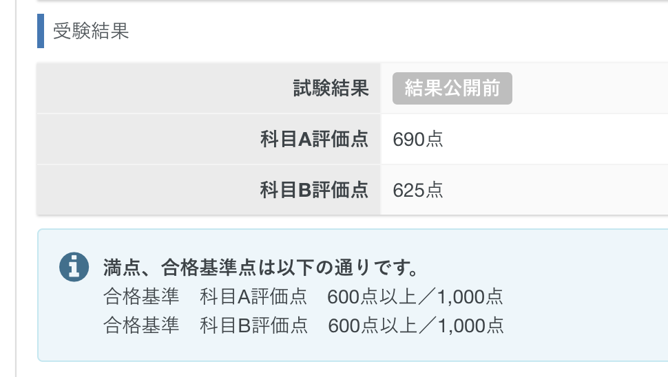

## 試験について
- 基本情報技術者試験
- 試験日_2024年09月30日
- 科目A_690点
- 科目B_625点

## なぜ取得しようと思ったのか
基本的な知識をしっかり勉強して視野を広げたかったのと、知識の証明として資格を取得したかったからです。

## 使用した教材・サイト
### 科目A
- 基本情報技術者試験ドットコム、過去問道場
    - https://www.fe-siken.com/fekakomon.php
- 【2024年】基本情報技術者試験の科目Aを12時間で完璧に理解
    - https://www.youtube.com/watch?v=oqaBEnhIxk0

### 科目B
- 情報処理教科書 出るとこだけ！基本情報技術者［科目B］第4版
    - https://www.amazon.co.jp/dp/4798182524
- 基本情報技術者試験ドットコム、過去問道場
    - https://www.fe-siken.com/fekakomon.php
Youtube
- 【科目B】アルゴリズム問題をたった1動画で対策_基本情報技術者試験
    - https://www.youtube.com/watch?v=wFpyeWto8Og
- IPA(情報処理推進機構)、サンプル問題
    - https://www.ipa.go.jp/shiken/syllabus/henkou/2022/20220425.html

## 勉強してみて感じたこと
科目Aの勉強をしていて聞いたことある単語だが、意味を知らなかったり、他の単語と混同したりしていたのを勉強していくことで正しい意味を理解していけました。

少しずつ単語と意味を頭の中で紐付いて来たことで、問題が解けるようになっていきました。
解けるようになっていくと自分自身がレベルアップしているような感覚になり、どんどん楽しくなっていきました。

試験勉強をしたことで自分の中では、当初の目標通りITに関する視野が広げることができました。\
結果として試験も点数ギリギリですが合格することができ、資格を取得するという目標も達成することができました。

## 次の目標
LPIC1と応用情報技術者試験を次の目標にしています。\
LPIC1はKubernetesを触っていて、Linuxをより知りたいと思ったからです。\
そのための第一歩としてLPIC1を取得しようと思っています。\
応用情報技術者試験は、基本情報技術者試験の次のステップとしてと、もっと深くITについて勉強したいからです。
