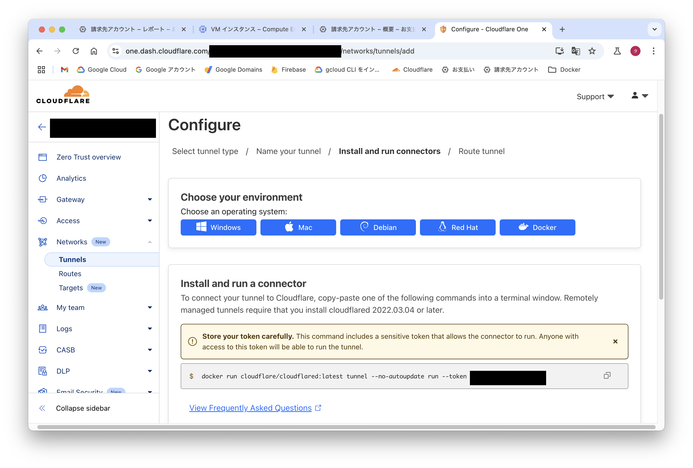
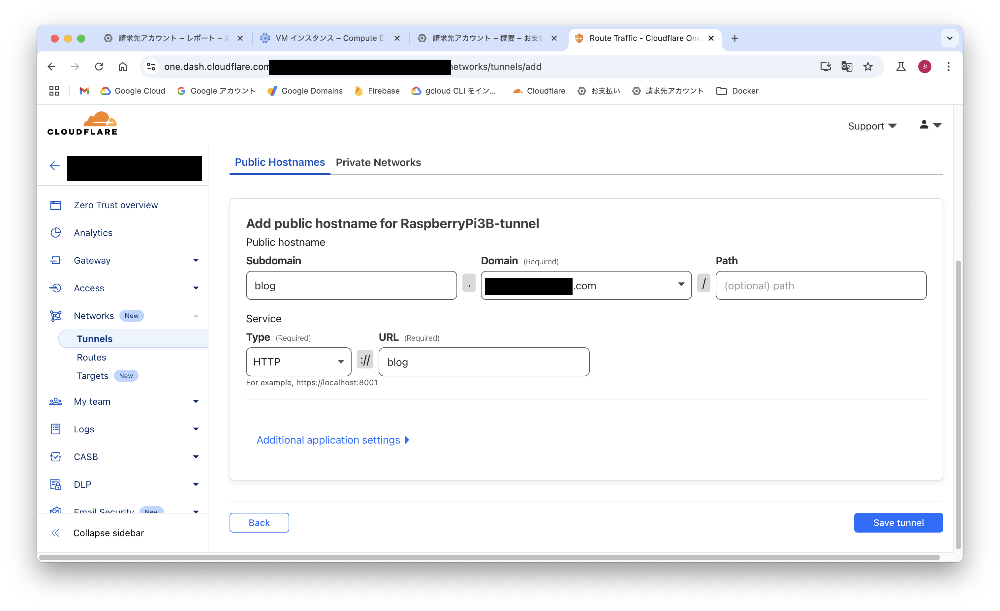
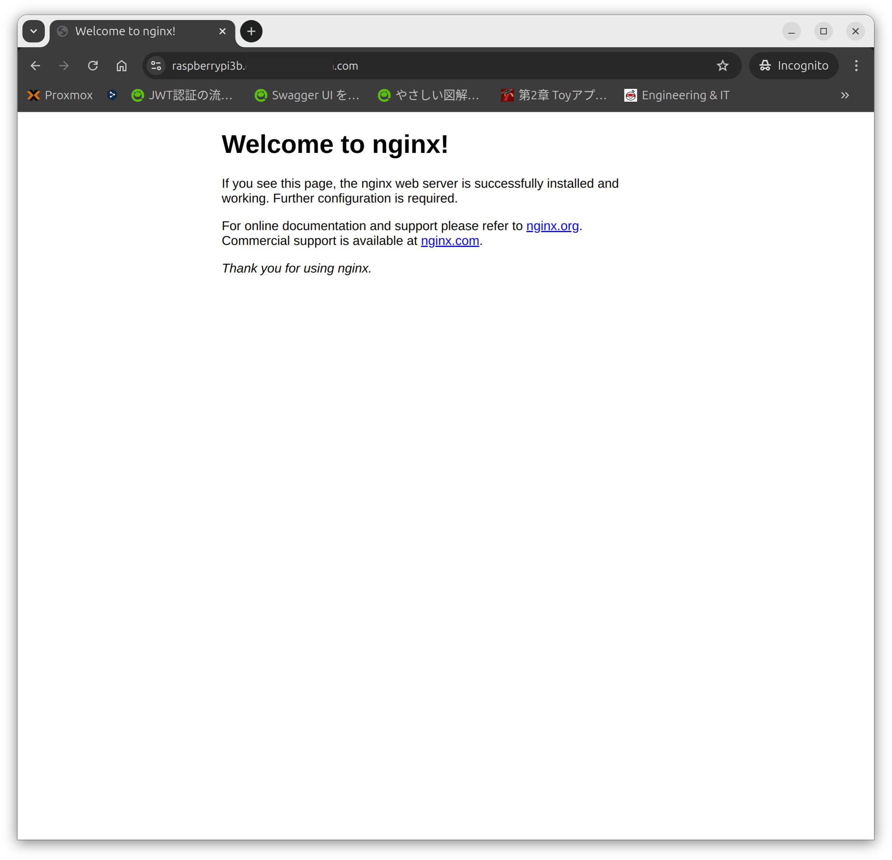

## Ubuntuにスワップを作成する（ラズパイ）
ラズパイのスペックは下記の通りです
- Raspberry Pi 3B
- メモリ1GB
- SDカード32GB

メモリが少ないのでDockerを使用するには少ないので、8GBのスワップメモリを作成します

1. 何も表示されない場合はスワップは作成されていない
```
sudo swapon --show
```

2. ストレージの容量を確認します
```
df -h
```

3. スワップ用のファイルを作成する
- 8GBのスワップを作成する
```
sudo fallocate -l 8G /swapfile
ls -lh /swapfile
```

4. スワップファイルを設定して、有効にします
```
sudo chmod 600 /swapfile
sudo mkswap /swapfile
sudo swapon /swapfile
```

5. 再度確認をします
```
sudo swapon --show
```

6. スワップが作成されています
```
mao@raspberrypi3:~$ sudo swapon --show
NAME      TYPE SIZE USED PRIO
/swapfile file   8G   0B   -2
```

7. スワップの永続設定をする
```
sudo nano /etc/fstab
```
- 下記を追記する
```
/swapfile none swap sw 0 0
```

## UbuntuにDockerをインストールする
公式ドキュメントを参考にインストールする
- https://docs.docker.com/engine/install/ubuntu/

### debをダウンロードする
- 2024年10月05日時点での最新版をダウンロードする
- amd64ではなくarm64をダウンロードする
```
wget https://download.docker.com/linux/ubuntu/dists/noble/pool/stable/arm64/containerd.io_1.7.22-1_arm64.deb \
wget https://download.docker.com/linux/ubuntu/dists/noble/pool/stable/arm64/docker-buildx-plugin_0.17.1-1~ubuntu.24.04~noble_arm64.deb \
wget https://download.docker.com/linux/ubuntu/dists/noble/pool/stable/arm64/docker-ce-cli_27.3.1-1~ubuntu.24.04~noble_arm64.deb \
wget https://download.docker.com/linux/ubuntu/dists/noble/pool/stable/arm64/docker-ce_27.3.1-1~ubuntu.24.04~noble_arm64.deb \
wget https://download.docker.com/linux/ubuntu/dists/noble/pool/stable/arm64/docker-compose-plugin_2.29.7-1~ubuntu.24.04~noble_arm64.deb
```

### インストールをする
```
sudo dpkg -i ./containerd.io_<version>_<arch>.deb \
  ./docker-ce_<version>_<arch>.deb \
  ./docker-ce-cli_<version>_<arch>.deb \
  ./docker-buildx-plugin_<version>_<arch>.deb \
  ./docker-compose-plugin_<version>_<arch>.deb
```
```
sudo dpkg -i ./containerd.io_1.7.22-1_arm64.deb \
  ./docker-ce_27.3.1-1~ubuntu.24.04~noble_arm64.deb \
  ./docker-ce-cli_27.3.1-1~ubuntu.24.04~noble_arm64.deb \
  ./docker-buildx-plugin_0.17.1-1~ubuntu.24.04~noble_arm64.deb \
  ./docker-compose-plugin_2.29.7-1~ubuntu.24.04~noble_arm64.deb
```
- containerd.io_1.7.22-1_arm64.deb
- docker-ce_27.3.1-1-ubuntu.24.04~noble_arm64.deb
- docker-ce-cli_27.3.1-1-ubuntu.24.04~noble_arm64.deb
- docker-buildx-plugin_0.17.1-1-ubuntu.24.04~noble_arm64.deb
- docker-compose-plugin_2.29.7-1-ubuntu.24.04~noble_arm64.deb

### バージョン確認
dockerとdocker composeのバージョンを確認する
```
sudo docker version
sudo docker compose version
```

## Cloudflare Tunnelを作成する
### トンネルをCloudflareのサイトで作成する
- Cloudflareのホーム画面の左側のメニューから"Zero Trust"を押します
- その後、左側のメニューから"Networks">"Tunnels"を押します
- "Tunnels"の画面になったら""を押してTunnelを作成します
- "Create a tunnel"と表示された画面になります
  - "Select your tunnel type"は"Cloudflared"を選択して"Next"を押します
  - "Name your tunnel"に自分がわかるようにTunnelの名前を入力し、"Save Tunnel"を押します
- すると"Configure"ｔ表示された画面になります
    
  - "Choose your environment"は"Docker"を選択します
  - "Install and run a connector"にdockerコマンドとトークンが表示されるので、コピーしておきます
  - トークンは他の人には絶対に見せないでください（トークンがあれば接続できてしまいます）
  - コピーをしたら"Next"を押します
- "Add public hostname for TunnelName"と表示された画面になります
    
  - "Subdomain"にはサブドメイン名を入力します
  - "Domain"にはCloudflareで管理されているドメインが選択できます
  - "Service"の"Type"にはHTTPやSSHなどを選択できます
  - "URL"にはdocker composeの場合はコンテナ名とポートを入力し、"Save tunnel"を押します
    - （例）Type:"HTTP",Service:"nginx:8080"
- "Tunnels"と表示された画面に戻ります、以上でトンネルが作成されます

## dokcer composeファイルの作成と起動・停止
compose.yamlファイルの作成をする
- compose.yaml
```
services:
  blog:
    image: nginx:latest

  tunnel:
    restart: always
    image: cloudflare/cloudflared:latest
    command: tunnel --no-autoupdate run
    environment:
      - TUNNEL_TOKEN=トンネル作成時のトークンをここに記載する
```

起動と停止のコマンド
```
sudo docker compose up -d
sudo docker compose down --volumes
```

## アクセスする
docker composeで起動し、設定したサブドメインにアクセスして画面が表示されれば無事起動されトンネルができている\
下記の画像は"raspberrypi3b"をサブドメインとして設定した\
503等がでると、cloudflaredは起動しているがdocker compose内での接続が上手く行っていない可能性がある\
※コンテナ名やポート番号が異なるなど


## 参考URL
- MisskeyをDocker Compose+Cloudflare Tunnelでサクッと建てる
  - https://zenn.dev/hrko/scraps/29df6c7ac02f03
- 個人的docker composeおすすめtips 9選
  - https://future-architect.github.io/articles/20240620a/
- cloudflare tunnelで自宅サーバー（動的IP）を運用したい、しかもdocker composeで
  - https://qiita.com/github0013@github/items/6686cc39a297b521d58e
