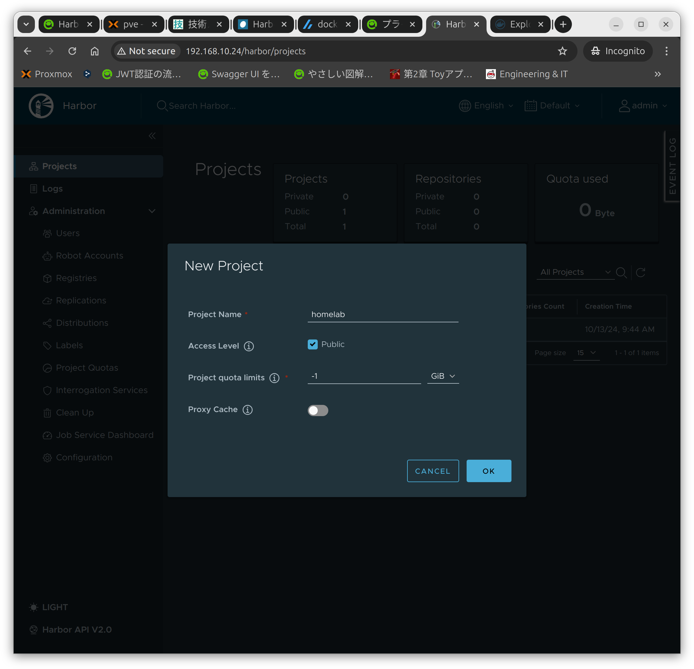
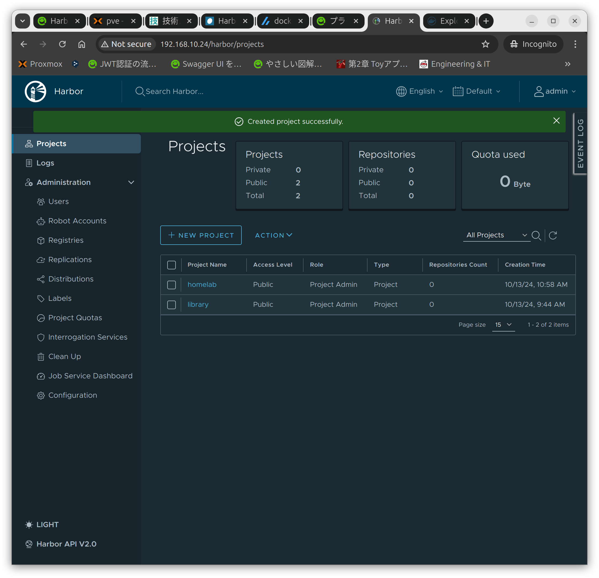
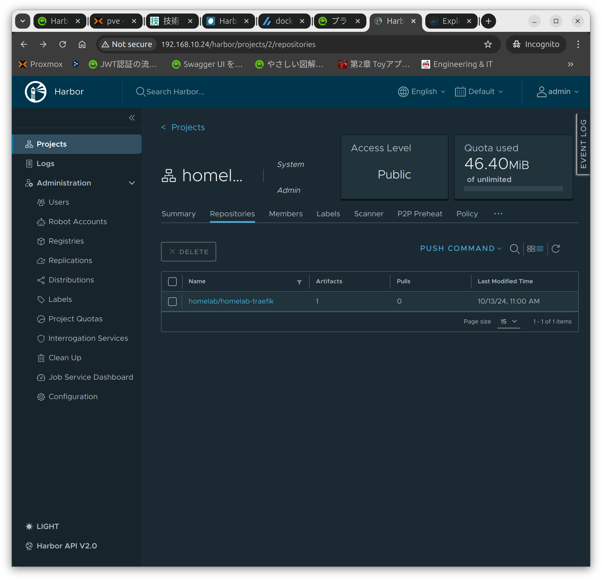

## 環境
- harbor v2.11.1
- docker version 27.3.1
- Docker Compose version v2.29.7
- OpenSSL 3.0.13

インストール要件確認
- https://goharbor.io/docs/2.11.0/install-config/installation-prereqs/

harborのオフラインインストーラーとdocker,docker compose,OpenSSLが必要なのでダウンロードとインストールをしていきます

## offlineインストーラーをダウンロードする
最新版を確認しダウンロードする
- https://github.com/goharbor/harbor/releases

2024年10月13日時点での最新版の2.11.1をダウンロードします
```
wget https://github.com/goharbor/harbor/releases/download/v2.11.1/harbor-offline-installer-v2.11.1.tgz
```

ダウンロードしたファイルを解凍して設定ファイルをコピーする
```
tar xvzf harbor-offline-installer-v2.11.1.tgz
cd harbor
cp harbor.yml.tmpl harbor.yml
```
```
mao@harbor-server:~$ tar xvzf harbor-offline-installer-v2.11.1.tgz
harbor/harbor.v2.11.1.tar.gz
harbor/prepare
harbor/LICENSE
harbor/install.sh
harbor/common.sh
harbor/harbor.yml.tmpl
mao@harbor-server:~$ cd harbor
mao@harbor-server:~/harbor$ cp harbor.yml.tmpl harbor.yml
mao@harbor-server:~/harbor$ 
```

設定ファイルを編集する
- "hostname:"をIPアドレスへ変更する
- "https:"の設定を、今回はhttpでアクセスするのでコメントアウトする
    - "certificate: /your/certificate/path"もコメントアウトする
    - "private_key: /your/private/key/path"もコメントアウトする
```
# Configuration file of Harbor

# The IP address or hostname to access admin UI and registry service.
# DO NOT use localhost or 127.0.0.1, because Harbor needs to be accessed by external clients.
+ hostname: 192.168.10.24
- hostname: reg.mydomain.com

# http related config
http:
  # port for http, default is 80. If https enabled, this port will redirect to https port
  port: 80

# https related config
+ #https:
- https:
  # https port for harbor, default is 443
+ #port: 443
- port: 443
  # The path of cert and key files for nginx
+ #certificate: /your/certificate/path
+ #private_key: /your/private/key/path
- certificate: /your/certificate/path
- private_key: /your/private/key/path
  # enable strong ssl ciphers (default: false)
  # strong_ssl_ciphers: false
```

## docker engineとdocker composeをインストールする
公式ドキュメントの通りにインストールする
- https://docs.docker.com/engine/install/ubuntu/#install-using-the-repository
```
# Add Docker's official GPG key:
sudo apt-get update
sudo apt-get install ca-certificates curl
sudo install -m 0755 -d /etc/apt/keyrings
sudo curl -fsSL https://download.docker.com/linux/ubuntu/gpg -o /etc/apt/keyrings/docker.asc
sudo chmod a+r /etc/apt/keyrings/docker.asc

# Add the repository to Apt sources:
echo \
  "deb [arch=$(dpkg --print-architecture) signed-by=/etc/apt/keyrings/docker.asc] https://download.docker.com/linux/ubuntu \
  $(. /etc/os-release && echo "$VERSION_CODENAME") stable" | \
  sudo tee /etc/apt/sources.list.d/docker.list > /dev/null
sudo apt-get update
```
```
sudo apt-get install docker-ce docker-ce-cli containerd.io docker-buildx-plugin docker-compose-plugin
```

## OpenSSLがインストールされているか確認する
```
openssl version
```
```
mao@harbor-server:~$ openssl version
OpenSSL 3.0.13 30 Jan 2024 (Library: OpenSSL 3.0.13 30 Jan 2024)
mao@harbor-server:~$ 
```

## harborをインストールする
下記のコマンドを実行してインストールする
```
sudo ./install.sh
```
```
mao@harbor-server:~/harbor$ sudo ./install.sh

[Step 0]: checking if docker is installed ...

Note: docker version: 27.3.1

[Step 1]: checking docker-compose is installed ...

Note: Docker Compose version v2.29.7

[Step 2]: loading Harbor images ...
fa65d0b345aa: Loading layer   40.5MB/40.5MB
40dbf36fc7e0: Loading layer  112.7MB/112.7MB
e27e903fe711: Loading layer  51.64MB/51.64MB
312f4e210c8d: Loading layer  13.78MB/13.78MB
3e3d5fae203b: Loading layer  65.54kB/65.54kB
bd56ad4f7c00: Loading layer   2.56kB/2.56kB
58bd888248a1: Loading layer  1.536kB/1.536kB
8ad07d6448d6: Loading layer  12.29kB/12.29kB
7604bd93290d: Loading layer  2.744MB/2.744MB
8637aeee1380: Loading layer  492.5kB/492.5kB
Loaded image: goharbor/prepare:v2.11.1
59cd002b46d2: Loading layer  21.86MB/21.86MB
2e8f9fa1e5f5: Loading layer    175MB/175MB
ecd34246c904: Loading layer  26.04MB/26.04MB
d8b960cafd25: Loading layer  18.54MB/18.54MB
410dc4347a57: Loading layer   5.12kB/5.12kB
80921caabb24: Loading layer  6.144kB/6.144kB
e91542fda4dd: Loading layer  3.072kB/3.072kB
df3f2e9dd439: Loading layer  2.048kB/2.048kB
d8facbd2a6c0: Loading layer   2.56kB/2.56kB
4715dde7127c: Loading layer   7.68kB/7.68kB
Loaded image: goharbor/harbor-db:v2.11.1
926647c50af4: Loading layer  17.23MB/17.23MB
99ff9f9dc8ce: Loading layer  28.75MB/28.75MB
99078c9b3a60: Loading layer  4.608kB/4.608kB
fe5588cde585: Loading layer  29.54MB/29.54MB
Loaded image: goharbor/harbor-exporter:v2.11.1
4ec814cdc7b2: Loading layer  21.86MB/21.86MB
235f2878bf8a: Loading layer  110.5MB/110.5MB
cdccfb99123c: Loading layer  3.072kB/3.072kB
c7ea796bb849: Loading layer   59.9kB/59.9kB
f8a27040ef0d: Loading layer  61.95kB/61.95kB
Loaded image: goharbor/redis-photon:v2.11.1
7a130cf406bb: Loading layer  121.1MB/121.1MB
Loaded image: goharbor/nginx-photon:v2.11.1
7786af5594f6: Loading layer  121.1MB/121.1MB
0c39daf00027: Loading layer  6.703MB/6.703MB
c9af590a487f: Loading layer  251.9kB/251.9kB
9ba79732c750: Loading layer  1.477MB/1.477MB
Loaded image: goharbor/harbor-portal:v2.11.1
2124fec7bf7d: Loading layer  17.23MB/17.23MB
257165566506: Loading layer  3.584kB/3.584kB
71c6cf01ef4c: Loading layer   2.56kB/2.56kB
e6aaf52bc017: Loading layer  67.13MB/67.13MB
ac2b2a90f17c: Loading layer  5.632kB/5.632kB
2deff795bee3: Loading layer  125.4kB/125.4kB
e4bd545de86d: Loading layer  201.7kB/201.7kB
847012124c72: Loading layer  68.25MB/68.25MB
d1601b055891: Loading layer   2.56kB/2.56kB
Loaded image: goharbor/harbor-core:v2.11.1
e4f7bca07127: Loading layer  130.8MB/130.8MB
3d744fdec5a0: Loading layer  3.584kB/3.584kB
e2c98f9cef30: Loading layer  3.072kB/3.072kB
cbe22372d70a: Loading layer   2.56kB/2.56kB
c3cc060f064c: Loading layer  3.072kB/3.072kB
184ad5ccf4f4: Loading layer  3.584kB/3.584kB
4a30d6215ed7: Loading layer  20.48kB/20.48kB
Loaded image: goharbor/harbor-log:v2.11.1
d2e836032dca: Loading layer  17.23MB/17.23MB
6159b9476a38: Loading layer  3.584kB/3.584kB
6cd40121c7f9: Loading layer   2.56kB/2.56kB
ab578d976e3e: Loading layer  54.27MB/54.27MB
74d4b342c232: Loading layer  55.06MB/55.06MB
Loaded image: goharbor/harbor-jobservice:v2.11.1
a370043a2cd6: Loading layer  14.22MB/14.22MB
068c345c0269: Loading layer  4.096kB/4.096kB
24607b1b1b88: Loading layer  17.86MB/17.86MB
d460b7320fa0: Loading layer  3.072kB/3.072kB
41f6293d43da: Loading layer  38.93MB/38.93MB
47c258cefc9f: Loading layer  57.57MB/57.57MB
Loaded image: goharbor/harbor-registryctl:v2.11.1
b020161dfc96: Loading layer  14.22MB/14.22MB
660cc2bb7fc2: Loading layer  4.096kB/4.096kB
093817c1779d: Loading layer  3.072kB/3.072kB
baa5b276e894: Loading layer  17.86MB/17.86MB
4db5e5303fdc: Loading layer  18.65MB/18.65MB
Loaded image: goharbor/registry-photon:v2.11.1
cf045d0bacdb: Loading layer  14.73MB/14.73MB
7b3be75d25ec: Loading layer  4.096kB/4.096kB
300144cef16c: Loading layer  3.072kB/3.072kB
20b0983274b3: Loading layer  127.1MB/127.1MB
c64d3b51f3b9: Loading layer  14.89MB/14.89MB
ecf40289f004: Loading layer  142.7MB/142.7MB
Loaded image: goharbor/trivy-adapter-photon:v2.11.1


[Step 3]: preparing environment ...

[Step 4]: preparing harbor configs ...
prepare base dir is set to /home/mao/harbor
ERROR:root:Error: The protocol is https but attribute ssl_cert is not set
Error happened in config validation...
mao@harbor-server:~/harbor$ 
```
```
mao@harbor-server:~/harbor$ sudo ./install.sh

[Step 0]: checking if docker is installed ...

Note: docker version: 27.3.1

[Step 1]: checking docker-compose is installed ...

Note: Docker Compose version v2.29.7

[Step 2]: loading Harbor images ...
Loaded image: goharbor/prepare:v2.11.1
Loaded image: goharbor/harbor-db:v2.11.1
Loaded image: goharbor/harbor-exporter:v2.11.1
Loaded image: goharbor/redis-photon:v2.11.1
Loaded image: goharbor/nginx-photon:v2.11.1
Loaded image: goharbor/harbor-portal:v2.11.1
Loaded image: goharbor/harbor-core:v2.11.1
Loaded image: goharbor/harbor-log:v2.11.1
Loaded image: goharbor/harbor-jobservice:v2.11.1
Loaded image: goharbor/harbor-registryctl:v2.11.1
Loaded image: goharbor/registry-photon:v2.11.1
Loaded image: goharbor/trivy-adapter-photon:v2.11.1


[Step 3]: preparing environment ...

[Step 4]: preparing harbor configs ...
prepare base dir is set to /home/mao/harbor
WARNING:root:WARNING: HTTP protocol is insecure. Harbor will deprecate http protocol in the future. Please make sure to upgrade to https
Generated configuration file: /config/portal/nginx.conf
Generated configuration file: /config/log/logrotate.conf
Generated configuration file: /config/log/rsyslog_docker.conf
Generated configuration file: /config/nginx/nginx.conf
Generated configuration file: /config/core/env
Generated configuration file: /config/core/app.conf
Generated configuration file: /config/registry/config.yml
Generated configuration file: /config/registryctl/env
Generated configuration file: /config/registryctl/config.yml
Generated configuration file: /config/db/env
Generated configuration file: /config/jobservice/env
Generated configuration file: /config/jobservice/config.yml
Generated and saved secret to file: /data/secret/keys/secretkey
Successfully called func: create_root_cert
Generated configuration file: /compose_location/docker-compose.yml
Clean up the input dir


Note: stopping existing Harbor instance ...
WARN[0000] /home/mao/harbor/docker-compose.yml: the attribute `version` is obsolete, it will be ignored, please remove it to avoid potential confusion 


[Step 5]: starting Harbor ...
WARN[0000] /home/mao/harbor/docker-compose.yml: the attribute `version` is obsolete, it will be ignored, please remove it to avoid potential confusion 
[+] Running 10/10
 ✔ Network harbor_harbor        Created                                          0.1s 
 ✔ Container harbor-log         Started                                          0.7s 
 ✔ Container registry           Started                                          0.9s 
 ✔ Container harbor-portal      Started                                          1.0s 
 ✔ Container harbor-db          Started                                          1.1s 
 ✔ Container registryctl        Started                                          1.1s 
 ✔ Container redis              Started                                          1.0s 
 ✔ Container harbor-core        Started                                          1.1s 
 ✔ Container harbor-jobservice  Started                                          1.4s 
 ✔ Container nginx              Started                                          1.4s 
✔ ----Harbor has been installed and started successfully.----
mao@harbor-server:~/harbor$ 
```

インストール後に自動で下記のようなフォルダ構成になる
```
mao@harbor-server:~/harbor$ tree
.
├── LICENSE
├── common
│   └── config
│       ├── core
│       │   ├── app.conf
│       │   ├── certificates
│       │   └── env
│       ├── db
│       │   └── env
│       ├── jobservice
│       │   ├── config.yml
│       │   └── env
│       ├── log
│       │   ├── logrotate.conf
│       │   └── rsyslog_docker.conf
│       ├── nginx
│       │   ├── conf.d
│       │   └── nginx.conf
│       ├── portal
│       │   └── nginx.conf
│       ├── registry
│       │   ├── config.yml
│       │   ├── passwd
│       │   └── root.crt
│       ├── registryctl
│       │   ├── config.yml
│       │   └── env
│       └── shared
│           └── trust-certificates
├── common.sh
├── docker-compose.yml
├── harbor.v2.11.1.tar.gz
├── harbor.yml
├── harbor.yml.tmpl
├── install.sh
└── prepare

15 directories, 22 files
mao@harbor-server:~/harbor$ 
```

WebUIにIPアドレスでアクセスし下記のアカウント情報でログインする
- Username
    - admin
- Password
    - Harbor12345

## harborのWebUI上でプロジェクトを作成する
WebUIでログインして、左のメニューバーから"Project"を押す
最初は"library"があるが、今回はプロジェクトを新規作成する
- "NEW PROJECT"を押す
- "Project Name"を今回は"homelab"にする
- "Public"にチェックを入れておく
"OK"を押すとプロジェクトを作成される



## harborにdocker imageをpushする
ログインする
```
docker login 192.168.10.24
```

ログインしようとするとhttpsではないのでエラーになる
```
mao@harbor-server:~/harbor$ docker login 192.168.10.24
Username: admin
Password: 
time="2024-10-13T01:22:33Z" level=info msg="Error logging in to endpoint, trying next endpoint" error="Get \"https://192.168.10.24/v2/\": dial tcp 192.168.10.24:443: connect: connection refused"
Get "https://192.168.10.24/v2/": dial tcp 192.168.10.24:443: connect: connection refused
mao@harbor-server:~/harbor$ 
```

### httpで接続できるように設定する
ファイルを作成する
- daemon.json
```
{
    "insecure-registries": [
        "192.168.10.24"
    ]
}
```

設定ファイルをコピーしてdockerを再起動する
```
sudo cp -f ./daemon.json /etc/docker/daemon.json
sudo systemctl restart docker
sudo systemctl daemon-reload
```

### httpでdockerにログインする
リロードしたあとにそのままだとログインできなかったので、一度docker composeを再起動する
```
sudo docker compose down --volumes
sudo docker compose up -d
```

ログインする
```
sudo docker login 192.168.10.24
```
- Username
    - admin
- Password
    - Harbor12345

```
mao@harbor-server:~/harbor$ sudo docker login 192.168.10.24
Username: admin
Password: 
WARNING! Your password will be stored unencrypted in /root/.docker/config.json.
Configure a credential helper to remove this warning. See
https://docs.docker.com/engine/reference/commandline/login/#credential-stores

Login Succeeded
mao@harbor-server:~/harbor$ 
```

### docker imageをDockerHubからpullしてharborにpushする
DockerHubからimageをpullする
- 例として"traefik:3.1.6"と"debian:12.7"をpullしてpushする
```
sudo docker pull traefik:3.1.6
sudo docker pull debian:12.7
```

pullしてimageにtagを付ける
```
sudo docker tag traefik:3.1.6 192.168.10.24/homelab/homelab-traefik:3.1.6
sudo docker tag debian:12.7 192.168.10.24/homelab/homelab-debian:12.7
```

harborにimageをpushする
```
sudo docker push 192.168.10.24/homelab/homelab-traefik:3.1.6
sudo docker push 192.168.10.24/homelab/homelab-debian:12.7
```

imageを削除する
```
sudo docker image ls
sudo docker rmi traefik:3.1.6
sudo docker rmi 192.168.10.24/homelab/homelab-traefik:3.1.6

sudo docker rmi debian:12.7
sudo docker rmi 192.168.10.24/homelab/homelab-debian:12.7
sudo docker image ls
```

```
mao@harbor-server:~/harbor$ sudo docker pull traefik:3.1.6
3.1.6: Pulling from library/traefik
43c4264eed91: Pull complete 
f60fb4c0fbec: Pull complete 
9a6d31097c4f: Pull complete 
e5f06ee63d76: Pull complete 
Digest: sha256:f703a2ac2ddf75f6e06c9cccac7f158765e2ab42d642b04e79e2e3d7355c2ddc
Status: Downloaded newer image for traefik:3.1.6
docker.io/library/traefik:3.1.6
mao@harbor-server:~/harbor$ sudo docker tag traefik:3.1.6 192.168.10.24/homelab/homelab-traefik:3.1.6
mao@harbor-server:~/harbor$ sudo docker push 192.168.10.24/homelab/homelab-traefik:3.1.6
The push refers to repository [192.168.10.24/homelab/homelab-traefik]
affde95bf5bb: Pushed 
9a1c58574d55: Pushed 
96513adaf6d9: Pushed 
63ca1fbb43ae: Pushed 
3.1.6: digest: sha256:22aec04848987fe5b3999a4099d766de614b04da52a936fc5ac214ffec04dbac size: 1157
mao@harbor-server:~/harbor$ 
```
```
mao@harbor-server:~/harbor$ sudo docker pull debian:12.7
12.7: Pulling from library/debian
cdd62bf39133: Pull complete 
Digest: sha256:27586f4609433f2f49a9157405b473c62c3cb28a581c413393975b4e8496d0ab
Status: Downloaded newer image for debian:12.7
docker.io/library/debian:12.7
mao@harbor-server:~/harbor$ sudo docker tag debian:12.7 192.168.10.24/homelab/homelab-debian:12.7
mao@harbor-server:~/harbor$ sudo docker push 192.168.10.24/homelab/homelab-debian:12.7
The push refers to repository [192.168.10.24/homelab/homelab-debian]
d50132f2fe78: Pushed 
12.7: digest: sha256:e225d70fafe80791f18c79b8d76afa1d1b4192b3a40a50f1ffd4de84555ebd04 size: 529
mao@harbor-server:~/harbor$ sudo docker rmi debian:12.7
Untagged: debian:12.7
Untagged: debian@sha256:27586f4609433f2f49a9157405b473c62c3cb28a581c413393975b4e8496d0ab
mao@harbor-server:~/harbor$ sudo docker rmi 192.168.10.24/homelab/homelab-debian:12.7
Untagged: 192.168.10.24/homelab/homelab-debian:12.7
Untagged: 192.168.10.24/homelab/homelab-debian@sha256:e225d70fafe80791f18c79b8d76afa1d1b4192b3a40a50f1ffd4de84555ebd04
Deleted: sha256:c7f9867d67219411cb7dff983c83eddb881d415eae5495ad9116fb5d6db8bb60
Deleted: sha256:d50132f2fe78aaa8e67f229e53305d0c4a7a86c9deda4bf3160be0a678926458
mao@harbor-server:~/harbor$ sudo docker image ls
REPOSITORY                      TAG       IMAGE ID       CREATED       SIZE
goharbor/harbor-exporter        v2.11.1   cdf68efc001e   8 weeks ago   114MB
goharbor/redis-photon           v2.11.1   acf90a312d47   8 weeks ago   170MB
goharbor/trivy-adapter-photon   v2.11.1   24a8273e807a   8 weeks ago   339MB
goharbor/harbor-registryctl     v2.11.1   43fca2a06374   8 weeks ago   168MB
goharbor/registry-photon        v2.11.1   9da6663b36f2   8 weeks ago   90.3MB
goharbor/nginx-photon           v2.11.1   193a1b77b7d4   8 weeks ago   159MB
goharbor/harbor-log             v2.11.1   2752e033bfbb   8 weeks ago   169MB
goharbor/harbor-jobservice      v2.11.1   a8005a88b3dc   8 weeks ago   165MB
goharbor/harbor-core            v2.11.1   eaf65baad3f6   8 weeks ago   191MB
goharbor/harbor-portal          v2.11.1   f58813018a49   8 weeks ago   167MB
goharbor/harbor-db              v2.11.1   be56f8030c48   8 weeks ago   277MB
goharbor/prepare                v2.11.1   1d00ffdb2e67   8 weeks ago   216MB
mao@harbor-server:~/harbor$ 
```

WebUI上でもイメージがpushされているか確認する


## harborからdocker imageをpullする
下記のコマンドでharborからpullしてみる
```
sudo docker pull 192.168.10.24/homelab/homelab-traefik:3.1.6
sudo docker pull 192.168.10.24/homelab/homelab-debian:12.7
```

pullしようとしているdocker imageがないことを確認する
```
mao@harbor-server:~$ sudo docker image ls
REPOSITORY                      TAG       IMAGE ID       CREATED       SIZE
goharbor/harbor-exporter        v2.11.1   cdf68efc001e   8 weeks ago   114MB
goharbor/redis-photon           v2.11.1   acf90a312d47   8 weeks ago   170MB
goharbor/trivy-adapter-photon   v2.11.1   24a8273e807a   8 weeks ago   339MB
goharbor/harbor-registryctl     v2.11.1   43fca2a06374   8 weeks ago   168MB
goharbor/registry-photon        v2.11.1   9da6663b36f2   8 weeks ago   90.3MB
goharbor/nginx-photon           v2.11.1   193a1b77b7d4   8 weeks ago   159MB
goharbor/harbor-log             v2.11.1   2752e033bfbb   8 weeks ago   169MB
goharbor/harbor-jobservice      v2.11.1   a8005a88b3dc   8 weeks ago   165MB
goharbor/harbor-core            v2.11.1   eaf65baad3f6   8 weeks ago   191MB
goharbor/harbor-portal          v2.11.1   f58813018a49   8 weeks ago   167MB
goharbor/harbor-db              v2.11.1   be56f8030c48   8 weeks ago   277MB
goharbor/prepare                v2.11.1   1d00ffdb2e67   8 weeks ago   216MB
```

ないことを確認したのでdocker imageをpullする
```
mao@harbor-server:~$ sudo docker pull 192.168.10.24/homelab/homelab-traefik:3.1.6
3.1.6: Pulling from homelab/homelab-traefik
43c4264eed91: Pull complete 
f60fb4c0fbec: Pull complete 
9a6d31097c4f: Pull complete 
e5f06ee63d76: Pull complete 
Digest: sha256:22aec04848987fe5b3999a4099d766de614b04da52a936fc5ac214ffec04dbac
Status: Downloaded newer image for 192.168.10.24/homelab/homelab-traefik:3.1.6
192.168.10.24/homelab/homelab-traefik:3.1.6
mao@harbor-server:~$ sudo docker pull 192.168.10.24/homelab/homelab-debian:12.7
12.7: Pulling from homelab/homelab-debian
cdd62bf39133: Pull complete 
Digest: sha256:e225d70fafe80791f18c79b8d76afa1d1b4192b3a40a50f1ffd4de84555ebd04
Status: Downloaded newer image for 192.168.10.24/homelab/homelab-debian:12.7
192.168.10.24/homelab/homelab-debian:12.7
```

ちゃんとpullできているか確認する
```
mao@harbor-server:~$ sudo docker image ls
REPOSITORY                              TAG       IMAGE ID       CREATED       SIZE
192.168.10.24/homelab/homelab-traefik   3.1.6     ec31dae6a8fb   4 days ago    174MB
192.168.10.24/homelab/homelab-debian    12.7      c7f9867d6721   2 weeks ago   117MB
goharbor/harbor-exporter                v2.11.1   cdf68efc001e   8 weeks ago   114MB
goharbor/redis-photon                   v2.11.1   acf90a312d47   8 weeks ago   170MB
goharbor/trivy-adapter-photon           v2.11.1   24a8273e807a   8 weeks ago   339MB
goharbor/harbor-registryctl             v2.11.1   43fca2a06374   8 weeks ago   168MB
goharbor/registry-photon                v2.11.1   9da6663b36f2   8 weeks ago   90.3MB
goharbor/nginx-photon                   v2.11.1   193a1b77b7d4   8 weeks ago   159MB
goharbor/harbor-log                     v2.11.1   2752e033bfbb   8 weeks ago   169MB
goharbor/harbor-jobservice              v2.11.1   a8005a88b3dc   8 weeks ago   165MB
goharbor/harbor-core                    v2.11.1   eaf65baad3f6   8 weeks ago   191MB
goharbor/harbor-portal                  v2.11.1   f58813018a49   8 weeks ago   167MB
goharbor/harbor-db                      v2.11.1   be56f8030c48   8 weeks ago   277MB
goharbor/prepare                        v2.11.1   1d00ffdb2e67   8 weeks ago   216MB
mao@harbor-server:~$ 
```

しっかりと"homelab-traefik"と"homelab-debian"が増えているのでpullできている

以上でharborを使用して、自分専用のローカルリポジトリが作成できた\
今回は仮想マシン上に構築したが、Kubernetes上にも構築できるようなので、そちらもやってみようと思う

## 参考URL
- OSSのコンテナレジストリ「Harbor」インストール手順
    - https://tech-mmmm.blogspot.com/2022/12/ossharbor.html
- docker-composeでHarborをインストールする
    - https://zenn.dev/vampire_yuta/articles/5fc115fcfd083f
- プライベートコンテナリポジトリを構築しdockerコンテナを起動してみる
    - https://qiita.com/watav/items/bac6564f9fb38578a67b
- Harbor(プライベートコンテナレジストリ)のインストール
    - https://engineeroutput.com/harbor%E3%83%97%E3%83%A9%E3%82%A4%E3%83%99%E3%83%BC%E3%83%88%E3%82%B3%E3%83%B3%E3%83%86%E3%83%8A%E3%83%AC%E3%82%B8%E3%82%B9%E3%83%88%E3%83%AA%E3%81%AE%E3%82%A4%E3%83%B3%E3%82%B9%E3%83%88%E3%83%BC/
