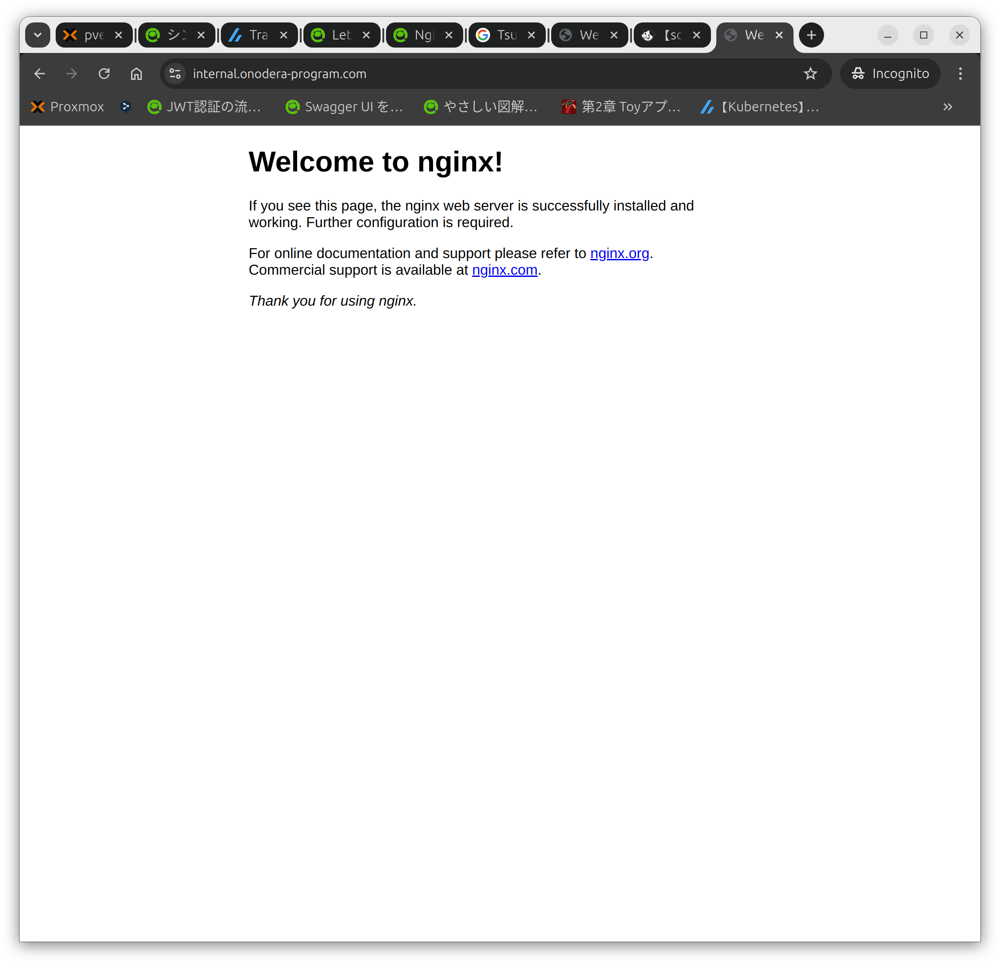

## 背景
ローカルの開発環境をHTTPSでアクセスしたいが、自己署名証明書だと警告が出たりと問題があるので、正規の証明書を発行して使用する

前回の記事で証明書を発行したので、今回はnginxに証明書をコピーし、HTTPSでアクセスできるようにする

## 環境
2VM
- Unbound(DNS)
    - unbound 1.19.2.
- Nginx
    - nginx version: nginx/1.24.0 (Ubuntu)

## nginxのインストールと起動
インストールと状態の確認をする
```
sudo apt install nano
sudo apt install nginx
sudo systemctl start nginx
sudo systemctl status nginx
```

"Active"が"active (running)"になっていればOK
```
mao@internal-domain:~$ sudo systemctl status nginx
● nginx.service - A high performance web server and a reverse proxy server
     Loaded: loaded (/usr/lib/systemd/system/nginx.service; enabled; preset: enabled)
     Active: active (running) since Sun 2024-12-15 01:33:08 UTC; 46s ago
       Docs: man:nginx(8)
    Process: 17202 ExecStartPre=/usr/sbin/nginx -t -q -g daemon on; master_process on; (code=exited, status=0/SUCCESS)
    Process: 17204 ExecStart=/usr/sbin/nginx -g daemon on; master_process on; (code=exited, status=0/SUCCESS)
   Main PID: 17205 (nginx)
      Tasks: 5 (limit: 9445)
     Memory: 3.6M (peak: 3.9M)
        CPU: 9ms
     CGroup: /system.slice/nginx.service
             ├─17205 "nginx: master process /usr/sbin/nginx -g daemon on; master_process on;"
             ├─17206 "nginx: worker process"
             ├─17207 "nginx: worker process"
             ├─17208 "nginx: worker process"
             └─17209 "nginx: worker process"

Dec 15 01:33:08 internal-domain systemd[1]: Starting nginx.service - A high performance web server and a reverse proxy server...
Dec 15 01:33:08 internal-domain systemd[1]: Started nginx.service - A high performance web server and a reverse proxy server.
```

IPアドレスにアクセスしてnginxのスタートページが表示されることを確認する

## 証明書を入れるフォルダを作成し、証明書ファイルをアップロードする
証明書を入れるフォルダを作成する
```
sudo mkdir /etc/nginx/ssl
```

ローカルのPCからNginxがインストールされているサーバーへ証明書ファイルをアップロードする
```
scp -r /home/mao/internal.onodera-program.com mao@192.168.10.30:/home/mao/
```
```
mao@mao (x86_64) : /home/mao 
> scp -r /home/mao/internal.onodera-program.com mao@192.168.10.30:/home/mao/
mao@192.168.10.30's password: 
cert1.pem                                     100% 1306   927.0KB/s   00:00    
fullchain1.pem                                100% 2872     2.4MB/s   00:00    
privkey1.pem                                  100%  241   529.7KB/s   00:00    
README                                        100%  692     1.8MB/s   00:00    
chain1.pem                                    100% 1566     3.7MB/s   00:00    
```

## Nginxの設定ファイルを作成する
設定ファイルを作成し、編集します
```
sudo nano /etc/nginx/conf.d/default.conf
```

- default.conf
```
server {
    listen       80;
    listen       443 ssl;
    listen  [::]:80;
    listen  [::]:443 ssl;
    server_name  localhost;
    server_name  internal.onodera-program.com;

    ssl_certificate /etc/nginx/ssl/fullchain1.pem;
    ssl_certificate_key /etc/nginx/ssl/privkey1.pem;

    location / {
        root   /usr/share/nginx/html;
        index  index.html index.htm;
    }

    #error_page  404              /404.html;

    # redirect server error pages to the static page /50x.html
    #
    error_page   500 502 503 504  /50x.html;
    location = /50x.html {
        root   /usr/share/nginx/html;
    }
}
```
- "server_name"は使用するドメインを記載する
- "ssl_certificate"と"ssl_certificate_key"はアップロードしたファイルをフルパスで記載する

設定を読み込むためにnginxを再起動する
```
sudo systemctl restart nginx
sudo systemctl status nginx
```

## DNSサーバーの設定をする
ローカル内にあるDNSサーバー（今回はUnboundを構築した）に、IPアドレスとドメイン名を設定する\
アクセスするPCのDNSを上記設定がされているDNSサーバーのIPアドレスを指定する

## ドメイン名＋HTTPSでアクセスしてみる
"https://ドメイン名"にアクセスする
- 例："https://internal.onodera-program.com"

証明書の警告等が表示されずにアクセスできればOK


## その他
あとは同じ要領で証明書を他のサーバーに登録して、ローカルのサーバーにHTTPSでアクセスできるようにする\
k8sのIngressに登録すれば、ローカル内でHTTPS＋ドメイン名でアクセスできるようになる、はず

## 参考URL
- Let's Encrypt で Nginx にSSLを設定する
 - https://qiita.com/HeRo/items/f9eb8d8a08d4d5b63ee9
- Nginxに自己署名証明書を設定してHTTPS接続してみる
 - https://qiita.com/ohakutsu/items/814825a76b5299a96661
- Linuxでリモート・ローカル間でファイルを転送するコマンド
 - https://uxmilk.jp/50946
- 127.0.0.1にLet' Encryptで証明書を発行してhttpsでのローカル開発と本番の差異を低減するための具体的な手順
 - https://scrapbox.io/nwtgck/127.0.0.1%E3%81%ABLet'_Encrypt%E3%81%A7%E8%A8%BC%E6%98%8E%E6%9B%B8%E3%82%92%E7%99%BA%E8%A1%8C%E3%81%97%E3%81%A6https%E3%81%A7%E3%81%AE%E3%83%AD%E3%83%BC%E3%82%AB%E3%83%AB%E9%96%8B%E7%99%BA%E3%81%A8%E6%9C%AC%E7%95%AA%E3%81%AE%E5%B7%AE%E7%95%B0%E3%82%92%E4%BD%8E%E6%B8%9B%E3%81%99%E3%82%8B%E3%81%9F%E3%82%81%E3%81%AE%E5%85%B7%E4%BD%93%E7%9A%84%E3%81%AA%E6%89%8B%E9%A0%86
- ローカルホスト（127.0.0.1）用のSSL証明書を取得する
 - https://hiroshi-nagayama.com/%E3%83%AD%E3%83%BC%E3%82%AB%E3%83%AB%E3%83%9B%E3%82%B9%E3%83%88%EF%BC%88127-0-0-1%EF%BC%89%E7%94%A8%E3%81%AEssl%E8%A8%BC%E6%98%8E%E6%9B%B8%E3%82%92%E5%8F%96%E5%BE%97%E3%81%99%E3%82%8B/
- ローカル開発環境の https 化
 - https://blog.jxck.io/entries/2020-06-29/https-for-localhost.html
