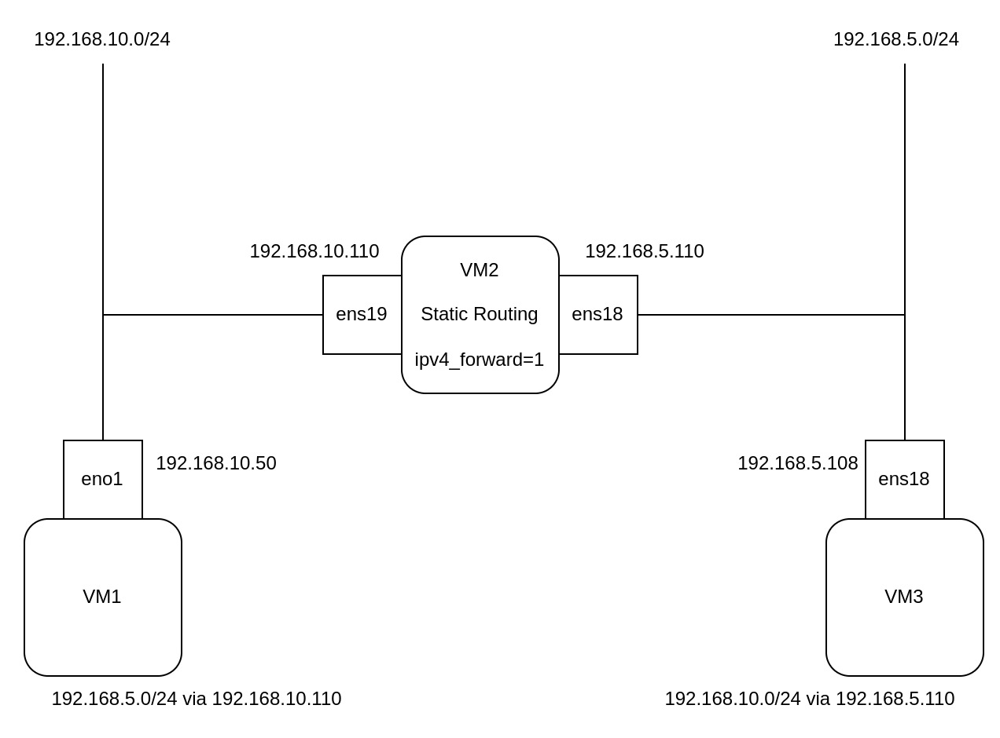

## なんのために？
家庭内で普段使っているサブネットと、サーバー等のサブネットを分けてようと思ったため。\
しかし、そのままだと家庭内で使用しているサブネットからサーバーにアクセスできないので、サブネットを越えて通信させたかったので設定方法を調べた結果、スタティックルーティングという方法でルーティングさせて通信させることにした。

## 環境
- Ubuntu Server 24.04.1
- ネットワーク図
  
  - 家庭内のサブネット：192.168.10.0/24
  - サーバー等のサブネット：192.168.5.0/24

## IPv4のフォワードを有効にする
### ネットワーク図上の"VM2"のIPv4のフォワードを有効にする
有効になっているか設定を確認する
```
cat /proc/sys/net/ipv4/ip_forward
```
結果
- "0"：IPフォワーディングが無効になっている
- "1"：IPフォワーディングが有効になっている

### 一時的に有効化する
再起動をするとリセットされる
```
echo 1 | sudo tee /proc/sys/net/ipv4/ip_forward
```

### 永続的に有効化する
再起動をしてもリセットされないようにする\
下記の設定ファイルを編集する
```
sudo nano /etc/sysctl.conf
```
下記を追加する
```
net.ipv4.ip_forward=1
```
設定を反映する
```
sudo sysctl -p
```

## ルーターにするVM2に設定する
### "VM2"についているNIC（ens18/ens19）の固定IPアドレスを設定する
設定ファイルをコピーする
```
sudo cp /etc/netplan/50-cloud-init.yaml /etc/netplan/99-config.yaml
```
設定ファイルを編集する
```
sudo nano /etc/netplan/99-config.yaml
```
設定を反映させる
```
sudo netplan apply
```

- 99-config.yaml
```
network:
    version: 2
    renderer: networkd
    ethernets:
      ens18:
        dhcp4: false
        addresses:
          - 192.168.5.110/24
        #routes:
          #- to: 192.168.5.0/24
            #scope: link
    　ens19:
        dhcp4: false
        addresses:
          - 192.168.10.110/24
        #routes:
          #- to: 192.168.10.0/24
            #scope: link
```

### スタティックルートを設定する
直接接続のためルーティング設定をしなくても自動的に設定される

設定されているか確認をする
```
ip route
```
```
192.168.5.0/24 dev ens18 proto kernel scope link src 192.168.10.110
192.168.10.0/24 dev ens19 proto kernel scope link src 192.168.5.110
```

## それぞれのサブネットにあるクライアントにスタティックルートを設定する
※OSはどちらもUbuntuServer24.04.1

### 一時的に追加する
"ip route add"コマンドで追加したスタティックルートは再起動をすると消えてしまう

"192.168.10.0/24"にある"VM1(192.168.10.50)"のPCに設定
```
sudo ip route add 192.168.5.0/24 via 192.168.10.35 dev eno1
```
- 記載例："ip route add <対象へのネットワーク> via <ゲートウェイ> dev <インターフェース名>"

"192.168.5.0/24"にある"VM3(192.168.5.108)"のPCに設定
```
sudo ip route add 192.168.10.0/24 via 192.168.5.110 dev ens18
```

### 永続的に追加する
netplanの設定ファイルにスタティックルートを追加する
```
network:
    version: 2
    renderer: networkd
    ethernets:
      ens18:
        dhcp4: false
        addresses:
          - 192.168.10.50/24
        routes:
          - to: 192.168.5.0/24
            via: 192.168.10.110
```

下記は"192.168.5.0/24"のサブネットへの通信をゲートウェイ"192.168.10.110"へ送るスタティックルートの設定の例
```
routes:
  - to: 192.168.5.0/24
    via: 192.168.10.110
```

設定を反映させる
```
sudo netplan apply
```

ルーティングが設定されているか確認する
```
ip route
```

## 疎通しているかpingで確認する
pingを飛ばして確認する
- "VM1(192.168.10.50)"から下記コマンドを実行する
```
ping 192.168.5.108
```
実行結果
```
ping 192.168.5.108 
PING 192.168.5.108 (192.168.5.108) 56(84) bytes of data.
64 bytes from 192.168.5.108: icmp_seq=1 ttl=63 time=0.789 ms
64 bytes from 192.168.5.108: icmp_seq=2 ttl=63 time=0.991 ms
64 bytes from 192.168.5.108: icmp_seq=3 ttl=63 time=0.920 ms
64 bytes from 192.168.5.108: icmp_seq=4 ttl=63 time=0.933 ms
^C
--- 192.168.5.108 ping statistics ---
4 packets transmitted, 4 received, 0% packet loss, time 3041ms
rtt min/avg/max/mdev = 0.789/0.908/0.991/0.073 ms
```
問題なければ、サブネットを越えて通信ができた

ネットワーク図
    

## 参考URL
- Netplan documentation
    - https://netplan.readthedocs.io/en/latest/netplan-yaml/#default-routes
- 【Ubuntu18.04のネットワーク設定方法】Netplanの解説
    - https://www.komee.org/entry/2018/06/13/170000
- Ubuntu netplan書き方の基本設定とトラブル対処法
    - https://hamagen.blog/ubuntu-netplan-write/
- サーバーをルーターにする設定「/proc/sys/net/ipv4/ip_forward」とは?
    - https://note.com/minato_kame/n/n8002de5a9b03
- VLAN の中で IP Forwarding を設定する(Akamai)
    - https://qiita.com/110hideki/items/851291f0d33acc577a82#ip-forwarding-%E3%81%AE%E8%A8%AD%E5%AE%9A
- ルーティングテーブルを表示・操作するコマンドを確認する
    - https://takapi86.hatenablog.com/entry/2019/09/23/232240
- 【Linux】ip routeで表示されるdev,via,src,protoの意味と見方
    - https://www.mtioutput.com/entry/iproute-cmd-howtosee
- 基本的なTCP/IP通信の仕組み（別セグメント間の通信）
    - https://infrastructure-engineer.com/tcpip-basic-0002/
- 【Linux】静的ルーティングをコマンドで追加・削除・確認する方法
    - https://infra-exp.com/linux_static_route/

