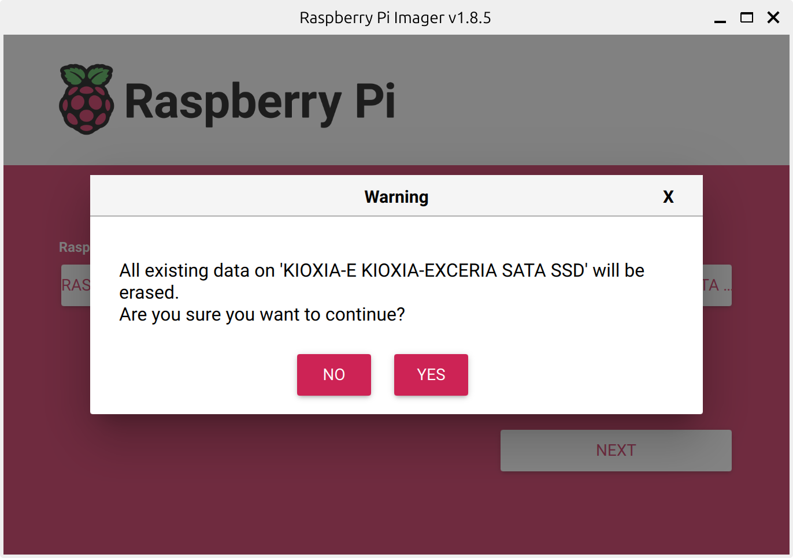
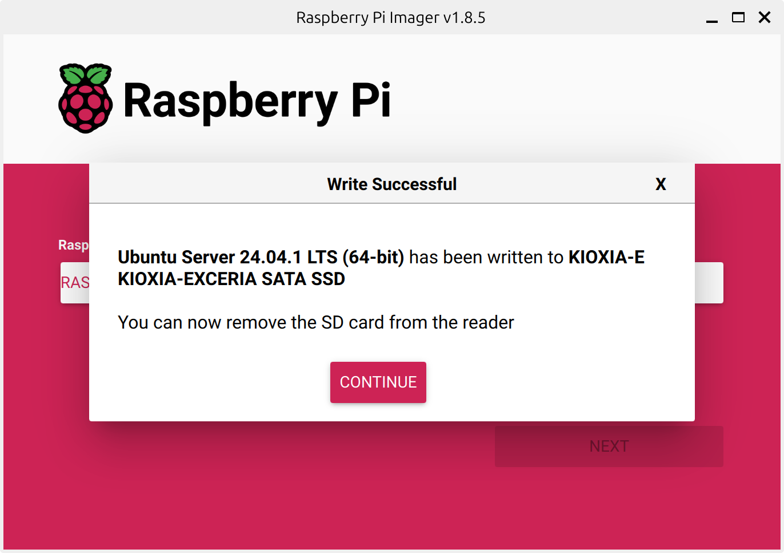

## 環境
- Raspberry Pi 5 Model B 8GB（この記事では"ラズパイ5"と記載）
  
- KIOXIA SATA SSD 480GB
- Ubuntu 24.04.1 LTS aarch64
- USB-SATA変換アダプタ
- Raspberry Pi Imager v1.8.5

## ラズパイ5を起動する準備
"Raspberry Pi Imager"を使用して、SSDにOSイメージを書き込みます





書き込みが完了

ラズパイ5にUSB-SSDとLANケーブル、電源ケーブルを接続します

電源を入れて30秒程たったら電源ボタンを押します（電源容量不足の警告が出るため）

すると、bootが始まります

別のPCからsshでログインします

## SSHで接続する
```
ssh mao@raspberrypi5.local
```
- パスワードが求められるので入力する
- IPアドレスがわからなくても接続できる

## 必要なソフトウェアをインストール
```
sudo apt install neofetch
sudo apt install nano
```

## 電源容量不足の警告が出ないようにする
"/boot/firmware/config.txt"に"usb_max_current_enable=1"を追加する
```
sudo nano /boot/firmware/config.txt
```


## neofetch
```
mao@raspberrypi5:~$ neofetch
            .-/+oossssoo+/-.               mao@raspberrypi5 
        `:+ssssssssssssssssss+:`           ---------------- 
      -+ssssssssssssssssssyyssss+-         OS: Ubuntu 24.04.1 LTS aarch64 
    .ossssssssssssssssssdMMMNysssso.       Host: Raspberry Pi 5 Model B Rev 1.0 
   /ssssssssssshdmmNNmmyNMMMMhssssss/      Kernel: 6.8.0-1010-raspi 
  +ssssssssshmydMMMMMMMNddddyssssssss+     Uptime: 5 mins 
 /sssssssshNMMMyhhyyyyhmNMMMNhssssssss/    Packages: 739 (dpkg), 2 (snap) 
.ssssssssdMMMNhsssssssssshNMMMdssssssss.   Shell: bash 5.2.21 
+sssshhhyNMMNyssssssssssssyNMMMysssssss+   Terminal: /dev/pts/0 
ossyNMMMNyMMhsssssssssssssshmmmhssssssso   CPU: (4) @ 2.400GHz 
ossyNMMMNyMMhsssssssssssssshmmmhssssssso   Memory: 183MiB / 7937MiB 
+sssshhhyNMMNyssssssssssssyNMMMysssssss+
.ssssssssdMMMNhsssssssssshNMMMdssssssss.                           
 /sssssssshNMMMyhhyyyyhdNMMMNhssssssss/                            
  +sssssssssdmydMMMMMMMMddddyssssssss+
   /ssssssssssshdmNNNNmyNMMMMhssssss/
    .ossssssssssssssssssdMMMNysssso.
      -+sssssssssssssssssyyyssss+-
        `:+ssssssssssssssssss+:`
            .-/+oossssoo+/-.

mao@raspberrypi5:~$
```


## ディスク容量の確認
下記コマンドを実行する
```
sudo fdisk -l
df -h --total
```

実行結果
```
mao@raspberrypi5:~$ sudo fdisk -l
Disk /dev/loop0: 33.71 MiB, 35344384 bytes, 69032 sectors
Units: sectors of 1 * 512 = 512 bytes
Sector size (logical/physical): 512 bytes / 512 bytes
I/O size (minimum/optimal): 512 bytes / 512 bytes


Disk /dev/loop1: 38.57 MiB, 40443904 bytes, 78992 sectors
Units: sectors of 1 * 512 = 512 bytes
Sector size (logical/physical): 512 bytes / 512 bytes
I/O size (minimum/optimal): 512 bytes / 512 bytes


Disk /dev/sda: 447.13 GiB, 480103981056 bytes, 937703088 sectors
Disk model: XCERIA SATA SSD 
Units: sectors of 1 * 512 = 512 bytes
Sector size (logical/physical): 512 bytes / 512 bytes
I/O size (minimum/optimal): 512 bytes / 33553920 bytes
Disklabel type: dos
Disk identifier: 0x9b94b926

Device     Boot   Start       End   Sectors   Size Id Type
/dev/sda1  *       2048   1050623   1048576   512M  c W95 FAT32 (LBA)
/dev/sda2       1050624 937703054 936652431 446.6G 83 Linux
```
```
mao@raspberrypi5:~$ df -h --total
Filesystem      Size  Used Avail Use% Mounted on
tmpfs           794M  3.2M  791M   1% /run
/dev/sda2       440G  2.2G  420G   1% /
tmpfs           3.9G     0  3.9G   0% /dev/shm
tmpfs           5.0M     0  5.0M   0% /run/lock
/dev/sda1       505M   91M  414M  18% /boot/firmware
tmpfs           794M   12K  794M   1% /run/user/1000
total           446G  2.3G  426G   1% -
mao@raspberrypi5:~$ 
```

## シャットダウン
```
sudo systemctl poweroff
```
