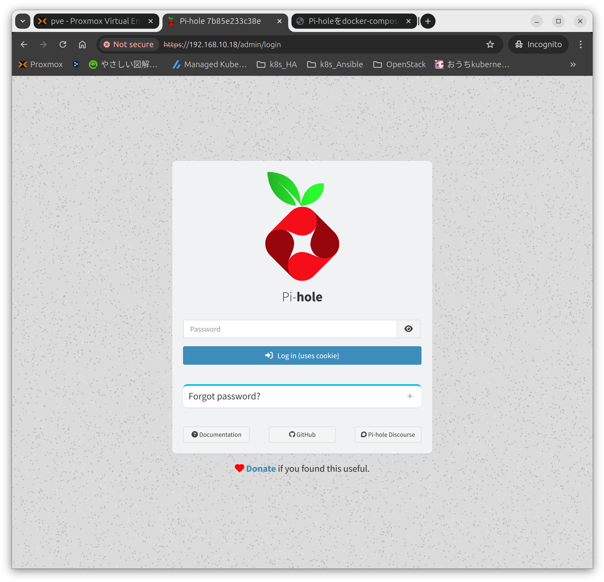
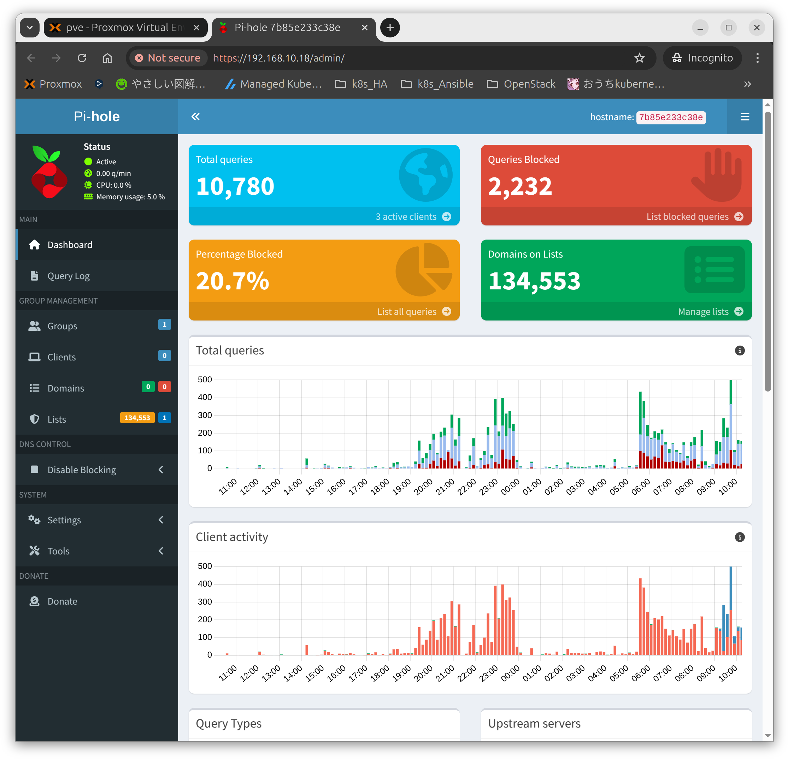
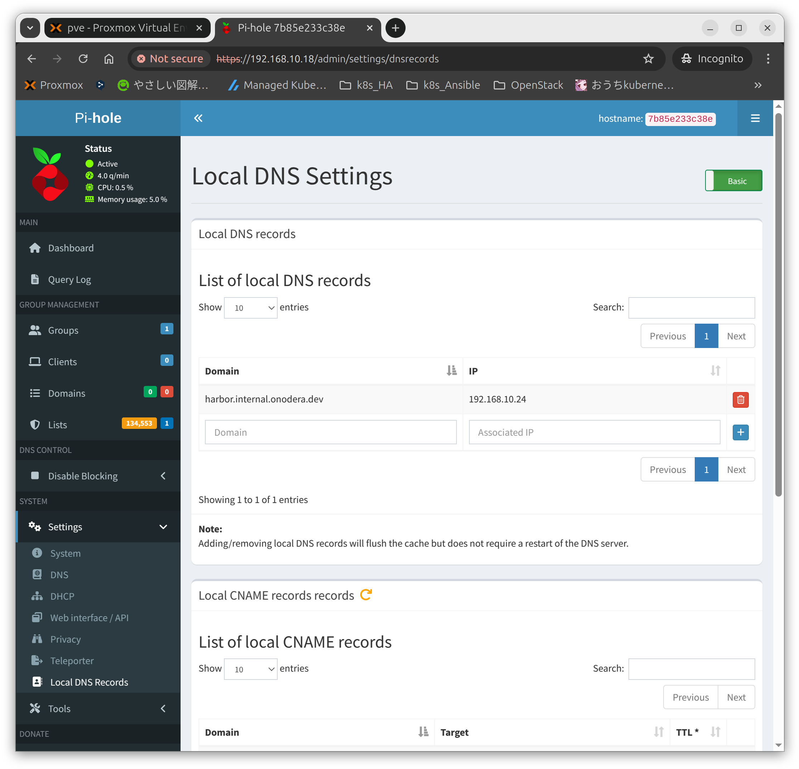

## 環境
- pihole:2025.03.0
- Ubuntu 24.04.2
- Docker Engine 28.0.1
- Docker Compose version v2.33.1

## dockerとdocker-composeのインストール
```
# Add Docker's official GPG key:
sudo apt-get update
sudo apt-get install ca-certificates curl
sudo install -m 0755 -d /etc/apt/keyrings
sudo curl -fsSL https://download.docker.com/linux/ubuntu/gpg -o /etc/apt/keyrings/docker.asc
sudo chmod a+r /etc/apt/keyrings/docker.asc

# Add the repository to Apt sources:
echo \
  "deb [arch=$(dpkg --print-architecture) signed-by=/etc/apt/keyrings/docker.asc] https://download.docker.com/linux/ubuntu \
  $(. /etc/os-release && echo "${UBUNTU_CODENAME:-$VERSION_CODENAME}") stable" | \
  sudo tee /etc/apt/sources.list.d/docker.list > /dev/null
sudo apt-get update
```
```
sudo apt-get install docker-ce docker-ce-cli containerd.io docker-buildx-plugin docker-compose-plugin
```

## ポート53を開放する
ポート53が使用されているか確認する
```
sudo ss -lntp | grep 53
```
```
mao@pi-hole:~$ sudo ss -lntp | grep 53
LISTEN 0      4096   127.0.0.53%lo:53         0.0.0.0:*    users:(("systemd-resolve",pid=673,fd=15))
LISTEN 0      4096      127.0.0.54:53         0.0.0.0:*    users:(("systemd-resolve",pid=673,fd=17))
mao@pi-hole:~$ 
```

使用しないように、下記ファイルを編集する
```
sudo nano /etc/systemd/resolved.conf
```
下記項目を"no"へ変更する
```
[Resolve]
DNSStubListener=no
```

リスタートする
```
sudo systemctl restart systemd-resolved
sudo systemctl status systemd-resolved
```

## Pi-holeを起動する
フォルダを作成します
```
mkdir pi-hole
```

composeファイルを作成します
- compose.yaml
```
# More info at https://github.com/pi-hole/docker-pi-hole/ and https://docs.pi-hole.net/
services:
  pihole:
    container_name: pihole
    #image: pihole/pihole:latest
    image: pihole/pihole:2025.03.0
    # DHCPを機能させる場合は必須
    #network_mode: host
    ports:
      # DNS Ports
      - "53:53/tcp"
      - "53:53/udp"
      # Default HTTP Port
      - "80:80/tcp"
      # Default HTTPs Port. FTL will generate a self-signed certificate
      - "443:443/tcp"
      # Uncomment the line below if you are using Pi-hole as your DHCP server
      #- "67:67/udp"
      # Uncomment the line below if you are using Pi-hole as your NTP server
      #- "123:123/udp"
    environment:
      # Set the appropriate timezone for your location (https://en.wikipedia.org/wiki/List_of_tz_database_time_zones), e.g:
      #TZ: 'Europe/London'
      TZ: 'Asia/Tokyo'
      # Set a password to access the web interface. Not setting one will result in a random password being assigned
      FTLCONF_webserver_api_password: 'maomao'
      # If using Docker's default `bridge` network setting the dns listening mode should be set to 'all'
      FTLCONF_dns_listeningMode: 'all'
      WEBPASSWORD: maomao
      #WEB_PORT: 8080
    # Volumes store your data between container upgrades
    volumes:
      # For persisting Pi-hole's databases and common configuration file
      - './etc-pihole:/etc/pihole'
      # Uncomment the below if you have custom dnsmasq config files that you want to persist. Not needed for most starting fresh with Pi-hole v6. If you're upgrading from v5 you and have used this directory before, you should keep it enabled for the first v6 container start to allow for a complete migration. It can be removed afterwards. Needs environment variable FTLCONF_misc_etc_dnsmasq_d: 'true'
      #- './etc-dnsmasq.d:/etc/dnsmasq.d'
    cap_add:
      # See https://github.com/pi-hole/docker-pi-hole#note-on-capabilities
      # Required if you are using Pi-hole as your DHCP server, else not needed
      - NET_ADMIN
      # Required if you are using Pi-hole as your NTP client to be able to set the host's system time
      - SYS_TIME
      # Optional, if Pi-hole should get some more processing time
      - SYS_NICE
    restart: unless-stopped
```

起動コマンドは下記の通り
```
cd pi-hole
sudo docker compose up -d
```

停止コマンドは下記の通り
```
sudo docker compose down -v
```

## 管理画面にログインする
- https://192.168.10.18/admin/

ログインパスワードはcompose.yamlの"WEBPASSWORD:"で指定したものを入力する


## WebGUIの画面の右上にある"hostname"はコンテナIDになっている
```
mao@pi-hole:~$ sudo docker ps
CONTAINER ID   IMAGE                     COMMAND      CREATED       STATUS                 PORTS                                                                                                                                                                     NAMES
7b85e233c38e   pihole/pihole:2025.03.0   "start.sh"   12 days ago   Up 12 days (healthy)   0.0.0.0:53->53/tcp, [::]:53->53/tcp, 67/udp, 0.0.0.0:80->80/tcp, [::]:80->80/tcp, 0.0.0.0:443->443/tcp, 0.0.0.0:53->53/udp, [::]:443->443/tcp, [::]:53->53/udp, 123/udp   pihole
```


## ローカルDNSとして使う
DNSレコードは"SYSTEM">"Setting">"Local DNS Records"に記載できる


## 参考URL
- https://github.com/pi-hole/docker-pi-hole#quick-start
- https://dabun.net/md/pi-hole/
