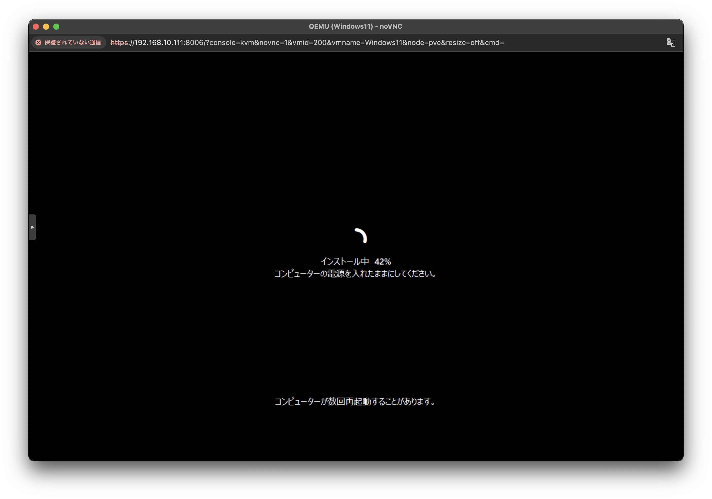

## 環境
- Promox 8.3.0
  - kernel: 6.8.12-8-pve
  - pve-manager: 8.3.4
- Windows11 24H2
- virtio-win-0.1.266

## 準備
Windows11
- https://www.microsoft.com/ja-jp/software-download/windows11

virtio（vitrio-win-0.1.266.iso）
- https://fedorapeople.org/groups/virt/virtio-win/direct-downloads/archive-virtio/

上記は両方ともPromoxにISOとしてアップロードする

##  Windows11のVM構築
ISOイメージはWindows11を選択する\
ゲストOSを"Microsoft Windows"にし、バージョンを"11/2022/2025"にする\
その下にある"VirtIOドライバ用の追加ドライブを追加"にチェックを入れる\
ISOイメージを選択する（"vitrio-win-0.1.266.iso"）\

"EFIストレージ"を保存する場所を選択する\
"Qemuエージェント"にチェックを入れる\
"TPM追加"にチェックを入れる\
"TPMストレージ"を保存する場所を選択する\
"バージョン"は"v2.0"を選択する\

ディスクは100GBくらい確保しておく

CPUの項目では"種別"を"host"にする

メモリは16GBにする

ネットワークはそのまま

確認に画面になり、問題なければ"完了"を押す

## Windows11インストール
設定を進めていきます

プロダクトキーは後で入力するので"プロダクトキーがありません"を選択する

"Windows 11 Pro"を選択する

"Windows 11 をインストールする場所の選択"の画面になったら、上のメニューの"Load Driver"か下の"ハードウェアが表示されませんか？ドライバーを読み込み、ハードウェアにアクセスします。"をクリックする

画面が変わったら"参照"をクリックし、"virtio-win-0.1.226"を選択します

"amd64">"w11"を選択し、OKをクリックします
"VirtIO SCSI pass-through controller"を選択して、"インストール"をクリックします
するとディスクが表示されます

続けて他のドライバーもインストールします

上のメニューの"Load Driver"をクリックします（"適用される通知とライセンス条項"が表示されたら"同意する"をクリックします）

"参照"をクリックし、"virtio-win-0.1.226"を選択します
"NetKVM">"w11">"amd64"を選択し、OKをクリックします
"VirtIO Ethernet Adapter"を選択して"インストール"をクリックします

同じ手順で
"Balloon">"w11">"amd64"を選択し、OKをクリックします
"VirtIO Balloon Driver"を選択して"インストール"をクリックします

次へを押します
"インストール準備完了"が表示されたら"インストール"をクリックします
インストールが始まります

ここから先は通常のWindows11と同じようにセットアップしていきます

ここまででWindows11のインストールは完了です

## Hyper-Vのインストール
Windows11のインストールが終わったらHyper-Vをインストールしていきます

コントロールパネルを開き、"プログラム"をクリックします

"Windowsの機能の有効化または無効化"をクリックし、"Hyper-V"にチェックを入れ、"OK"をクリックします\
再起動をします

タスクバーのWindowsマークをクリックし、"すべて"をクリックします

"Windowsツール"をクリックします

"Hyper-Vマネージャ"を右クリックして"ショートカットの作成"をします（デスクトップに作成しておきます）

ダブルクリックで開けます

