## 環境
- Promox 8.3.0
  - kernel: 6.8.12-8-pve
  - pve-manager: 8.3.4
- Windows11 24H2
- virtio-win-0.1.266

## Hyper-Vで仮想マシンの作成をする
インストールするOSのISOイメージをダウンロードしておきます\
今回はUbuntu24.04.2を使用します

"Hyper-Vマネージャ"を起動します

"新規">"仮想マシン"をクリックします
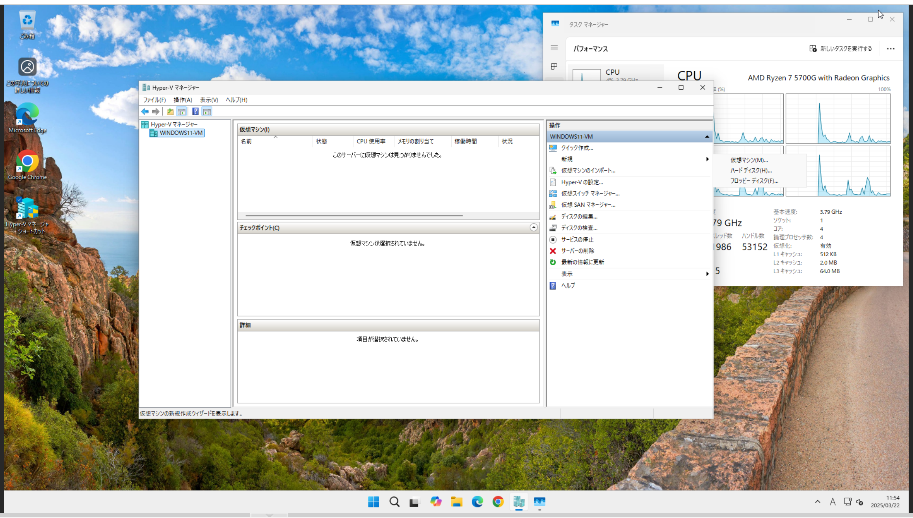

次へをクリックします
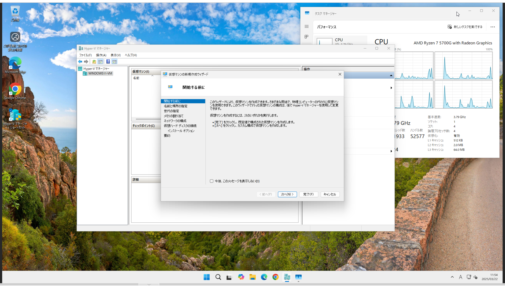

"第2世代"を選択肢します
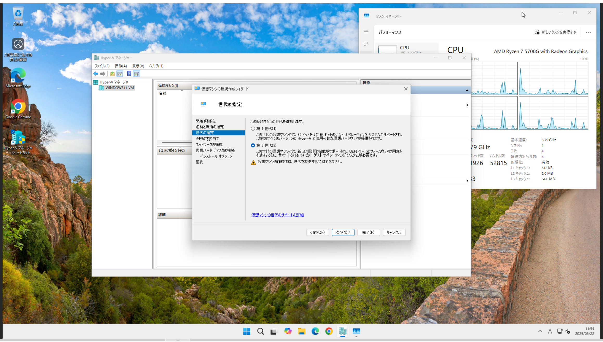

メモリを割り当てます
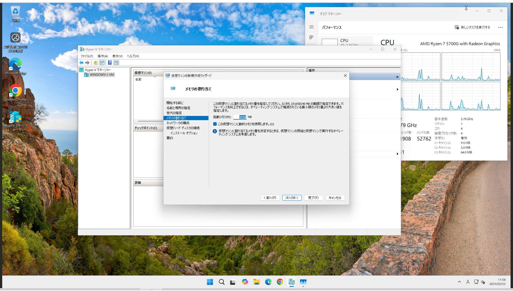

ネットワークは一旦接続せずに使用します
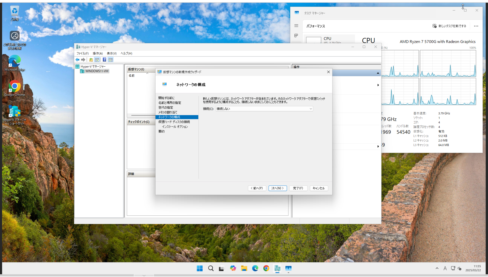

"仮想ハードディスクを作成する"を選択します\
名前、場所、容量を設定します

"ブートCD/DVD-ROMからオペレーティングシステムをインストールする"を選択し、"イメージファイル"の右の"参照"をクリックしてISOファイルを選択します
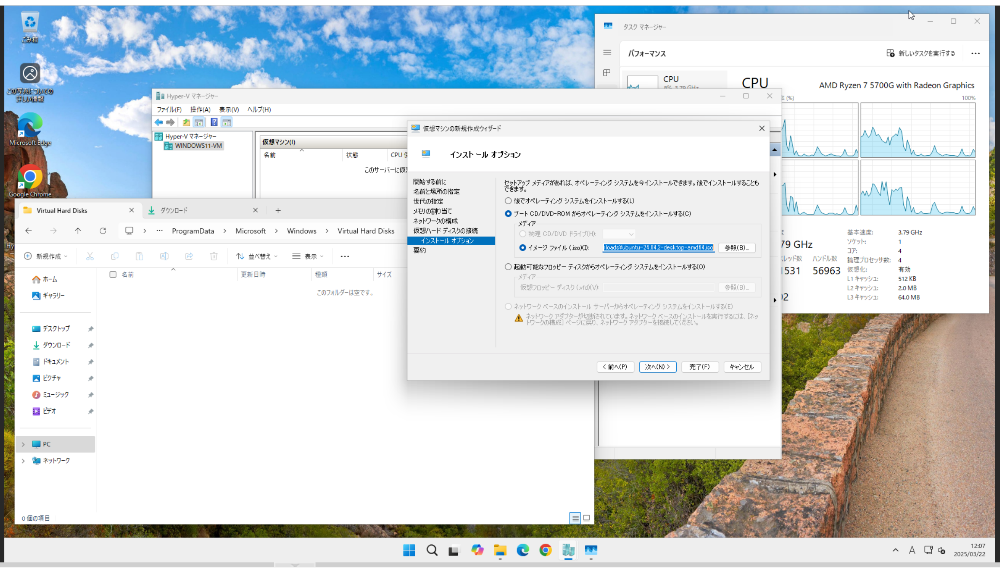
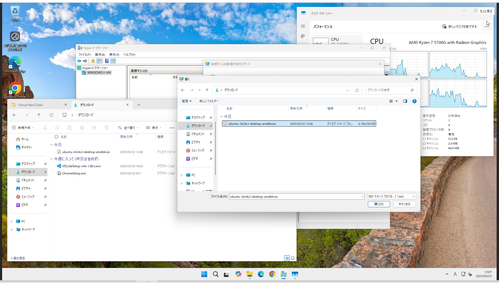

確認の画面になり、問題なければ"完了"をクリックします
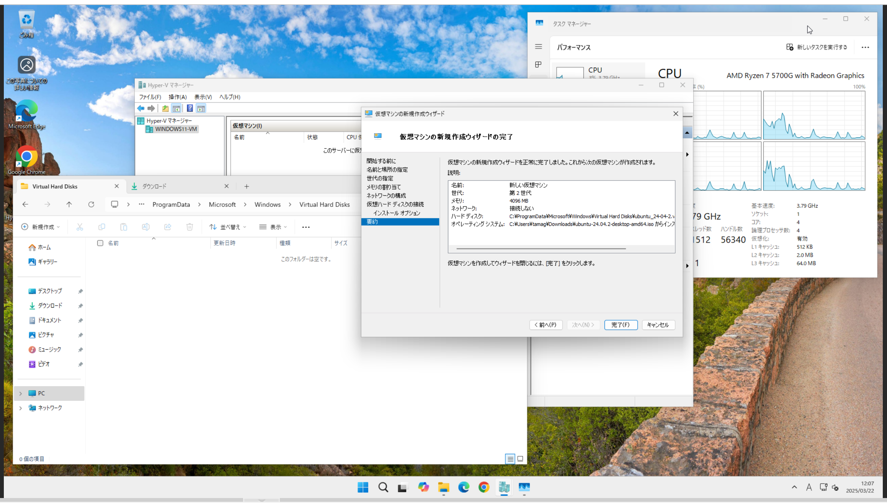

名前が"新しい仮想マシン"となっているので右クリックして名前を変更します
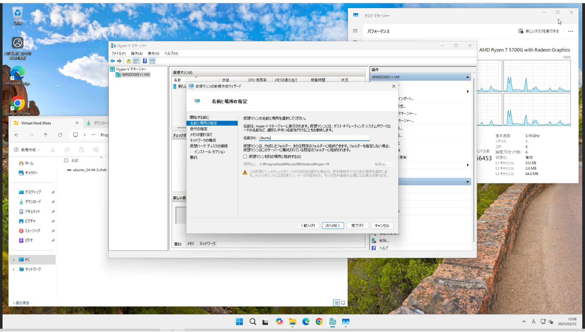

右クリックまたは右のメニューから"起動"をクリックします
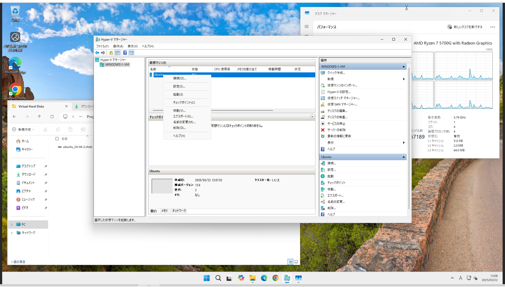
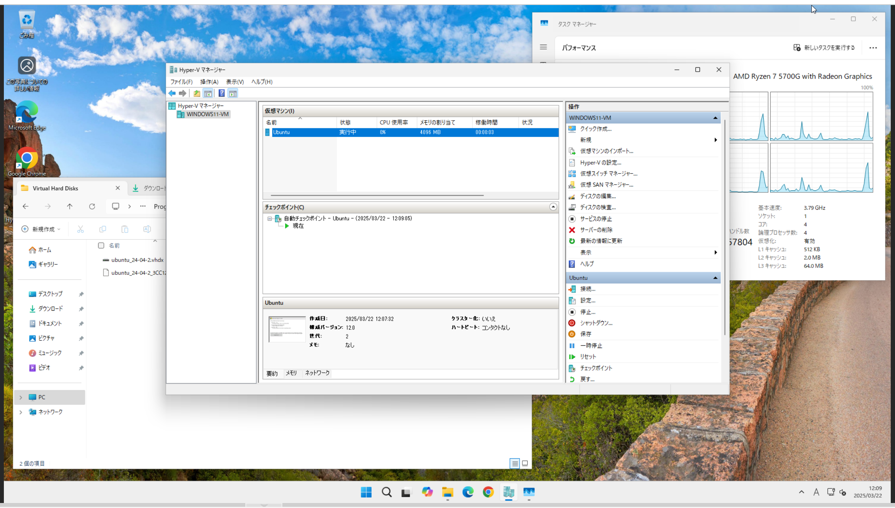

右のメニューの接続をクリックします\
起動できていません

一度"停止"をクリックして仮想マシンを止めます

右クリックをして"設定"をクリックします\
"セキュリティ"の"セキュアブートを有効にする"のチェックを外し"適用"をクリックします

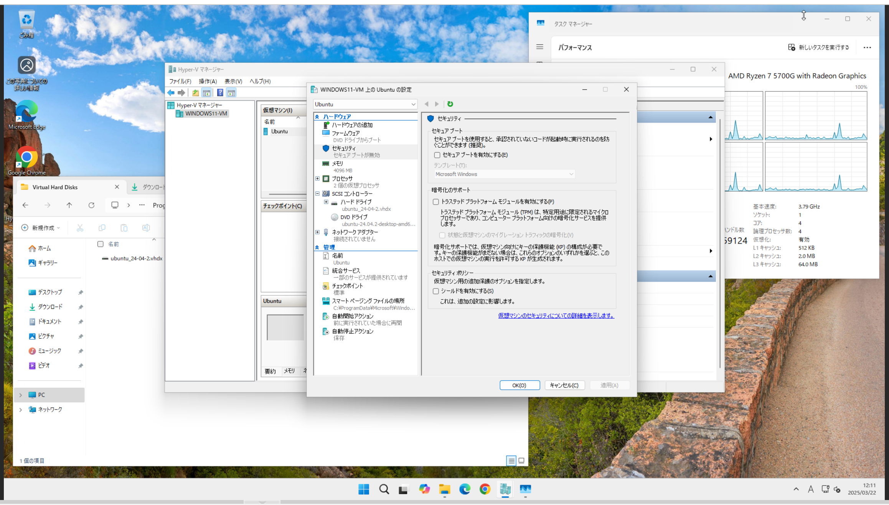

起動させます\
右のメニューの"接続"をクリックすると仮想マシンの画面が表示されます\
Ubuntuのインストール画面が表示されているので、通常のUbuntuと同じようにインストールを進めます
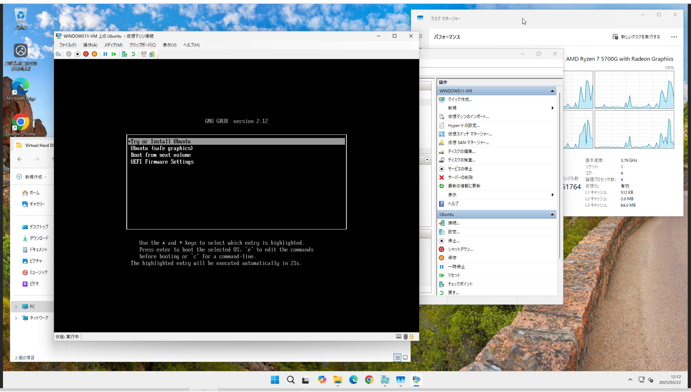

インストールが終われば完了です
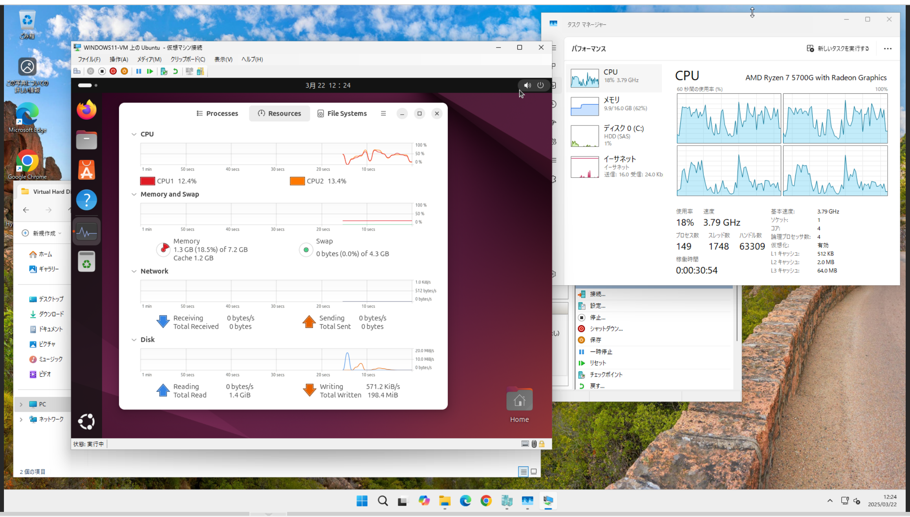

## 参考URL
- Proxmox VEの構築とVMをたてるまで
  - https://zenn.dev/no292nukegara/articles/81f2cb6af34772
- Proxmox VE7.xでwindows11VMを作成する
  - https://zenn.dev/northeggman/articles/49c6b73c03c81c
- Proxmox VE で Windows 11 VM を立てる
  - https://akam1o.hatenablog.jp/entry/2024/03/05/234501
- ProxmoxでVMコンソールの解像度を変更する
  - https://qiita.com/minoden_works/items/a4c94eb7728c946d3efe
