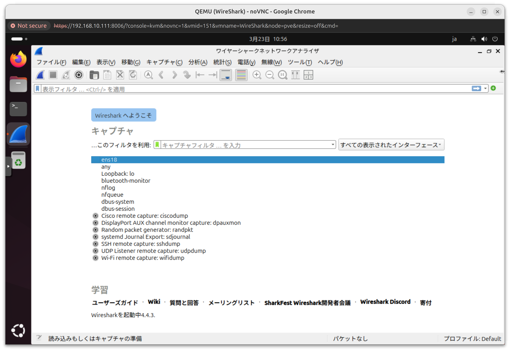

## インストール
リポジトリを追加してインストールする
```
sudo add-apt-repository ppa:wireshark-dev/stable
sudo apt update
sudo apt install wireshark
```

参考URL
- https://launchpad.net/~wireshark-dev/+archive/ubuntu/stable

## ユーザーをグループに追加する
下記コマンドで"wireshark"のグループにユーザーを追加する
```
sudo usermod -aG wireshark ***
```
- ***：ユーザー名

## 起動する
キャプチャしたいネットワークを選択する

