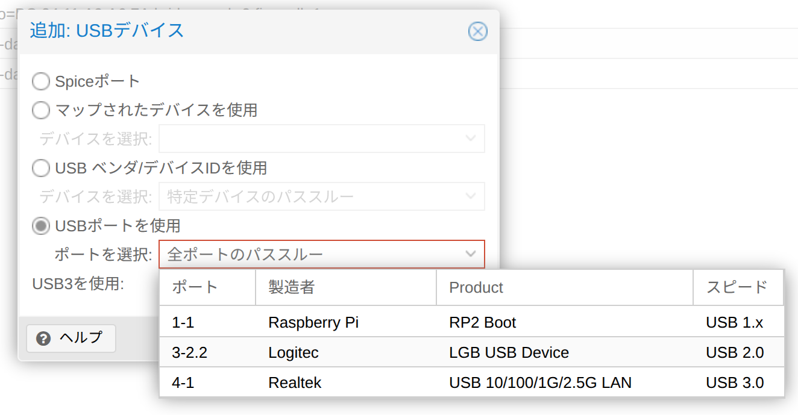
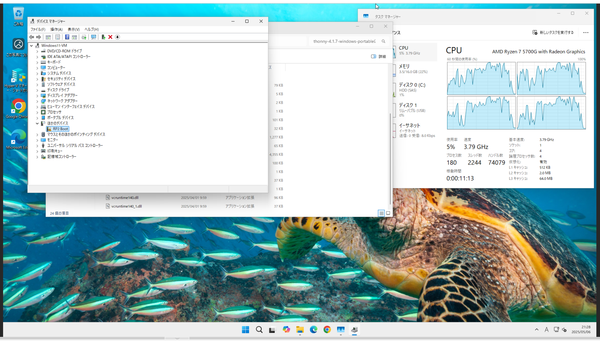
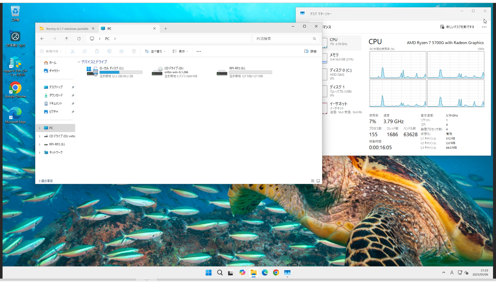
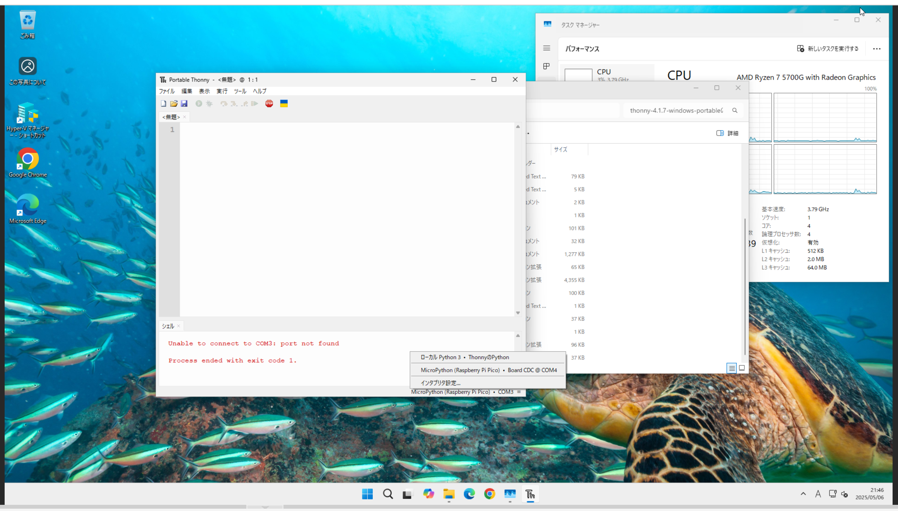

## 環境
- ファームウェア
    - RPI_PICO2-20250415-v1.25.0.uf2
- Thonny 4.1.7
- Raspberry Pi Pico(ラズパイピコ)
- Windows11 Pro 24H2

## Proxmox上からUSBポートをパススルー設定をする
本体のUSBに差し込みます

対象のVMの「ハードウェア」に「追加」＞「USBデバイス」＞「USBポートを使用」から製造者が「Raspberry Pi」になっているポートを選択します
「追加」を押します


すると一覧にUSBデバイスが追加されます

## WIndows11上から接続されているか確認する
Windows11上でデバイスマネージャーを開き「ほかのデバイス」に「RP2 Boot」が表示されていれば認識されています


エクスプローラー側からUSBメモリ等と同じように「RPI-RP2」として認識されているかを確認する


## Thonnyをインストールする
今回はzipをダウンロードして使用します\
下記のURLからダウンロードします
- https://thonny.org/

ダウンロードしたファイルを展開します\
ファイルの中にある「thonny.exe」をダブルクリックして起動します\
この段階ではまだ認識されていません

## プログラムを書き込めるようにする準備
ラズパイピコにファームウェアをアップロードします

ファームウェアは下記のURLからダウンロードします
- https://www.raspberrypi.com/documentation/microcontrollers/micropython.html#drag-and-drop-micropython
- 今回は「Pico」を選択します
- 拡張子は「.uf2」

ラズパピピコがUSBメモリと同じように認識されているので、ダウンロードしたファームウェアをコピーします\
すると自動的に再認識されます

thonny上の右下から「Raspberry Pi Pico」を選択します\
これでプログラムが書き込めるようになりました


## プログラムを書き込み
ラズパイピコ上のLEDを0.5秒間隔で点滅させるプログラムです
```
from machine import Pin
from time import sleep

led = Pin('LED', Pin.OUT)

while True:
    led.on()
    sleep(0.5)
    led.off()
    sleep(0.5)
```
「ファイル」「保存」を押すと保存先が表示されるので「Raspberry Pi Pico」を選択します\
「実行」「現在のスクリプトを実行」を押すと書き込んだプログラムが動きLEDが点滅します
