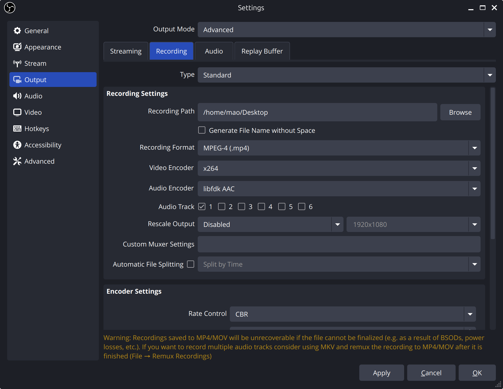

## 環境
- Ubuntu 24.04.2 LTS
- Linux 6.8.0-60-generic
- Intel® Core™ i5-13500 × 20
- Intel® UHD Graphics 770 (ADL-S GT1)

## "ffmpeg"のインストールされているか確認する
```
sudo apt list ffmpeg --installed
sudo apt list ffmpeg
```
```
> sudo apt list ffmpeg --installed 
[sudo] password for mao: 
Listing... Done
> sudo apt list ffmpeg            
Listing... Done
ffmpeg/noble 7:6.1.1-3ubuntu5 amd64
```

## "ffmpeg"のインストールをする
```
sudo apt install ffmpeg
```

## "OBS"をインストールする
```
sudo add-apt-repository ppa:obsproject/obs-studio
sudo apt update
sudo apt install obs-studio
```

## 設定の変更
"Settings"をクリックして、"Output"の"Output Mode"を"Advanced"にする


ファイルの保存場所を変更する
- "Recording"タブの"Recording Path"を自分の保存したい場所にする

保存時の拡張子を変更する
- "Recording Format"を"MPEG-4(.mp4)"にする

エンコーダーを変更する
- "Video Encoder"を"x264"にする

エラーになって録画ができない
- https://obsproject.com/forum/threads/trying-to-record-results-in-couldnt-initialize-muxer-os_process_pipe_write-for-info-structure-failed.182163/
- "Settings"をクリックして、"Audio"の"Sample Rate"を"44.1 kHz"にする

## 参考URL
- https://obsproject.com/ja/download
