## CloudflareとGithubの連携
Cloudflareのダッシュボードページを開きます\
右上の"追加"を押し、"Pages"を押します

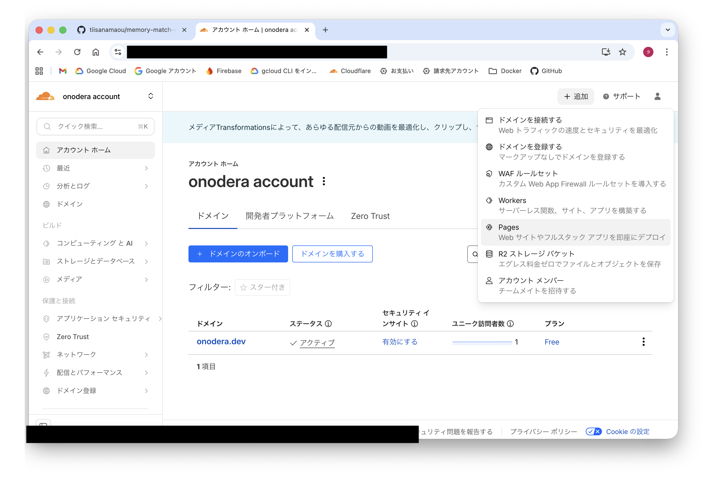

ページが変わり、"既存のGitリポジトリをインポートする"を押します
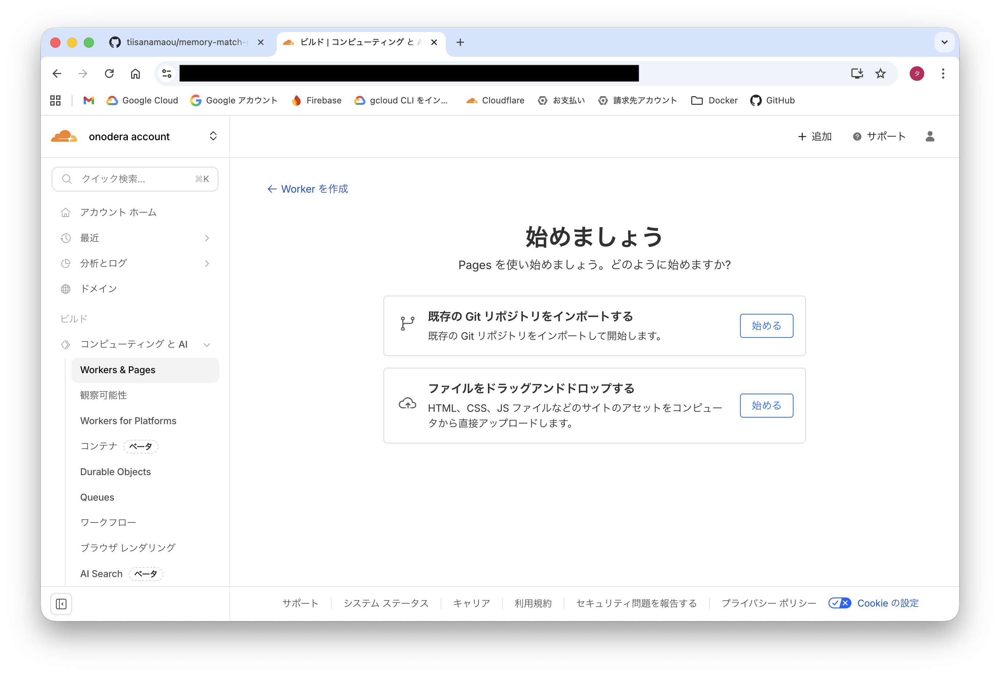

アカウントからサイトをデプロイするという画面になったら、下の方にある"Githubに接続"を押します
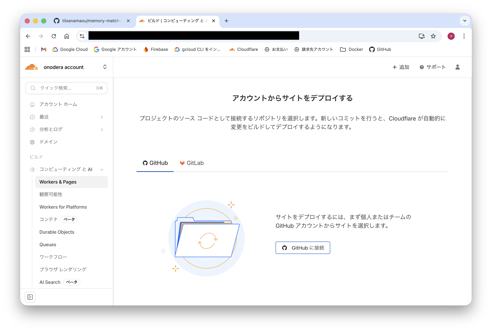

Githubの認証ページが表示されるので許可します\
このとき"All repositories"でも良いが、必要なリポジトリのみ許可したいので"Only select repositories"を選択する\
その後、許可するリポジトリを選択します\
下の方にある"Install & Authorize"を押す
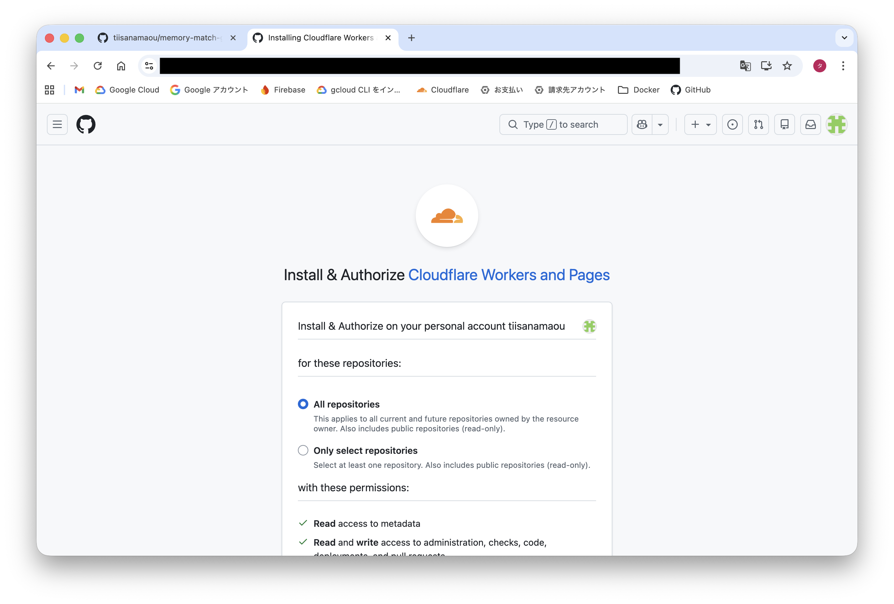
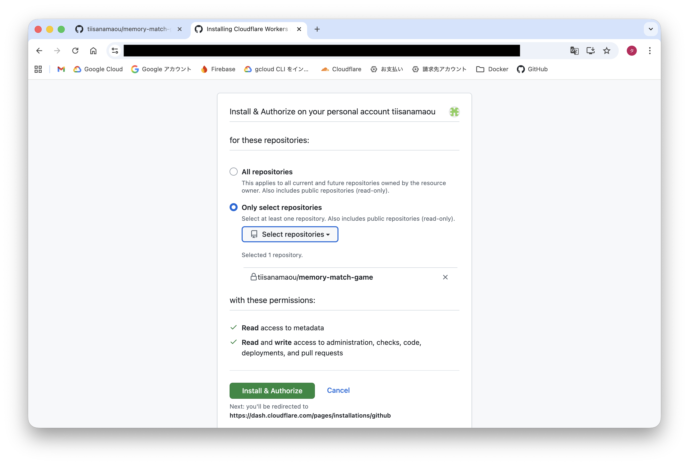

無事認証が通ったら"セットアップの開始"を押します
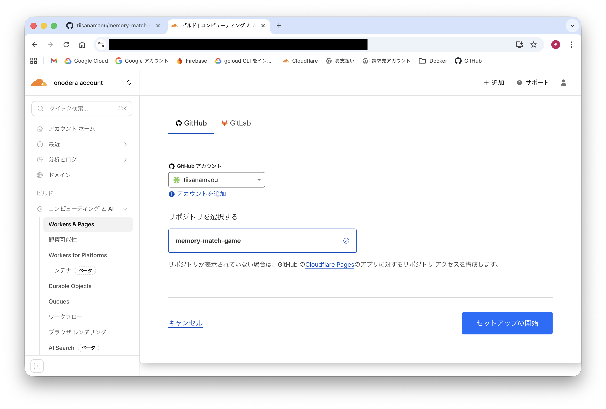

## ビルドとデプロイ
"ビルドとデプロイのセットアップ"の画面になります\
"プロジェクト名"と"プロダクションブランチ"を入力・選択します\
下の方のビルドの設定は、今回はHTML等のファイルを直接リポジトリにプッシュしているので特に設定しません\
※HTML等のファイルはAIを用いて作成しました\
"保存してデプロイする"を押します
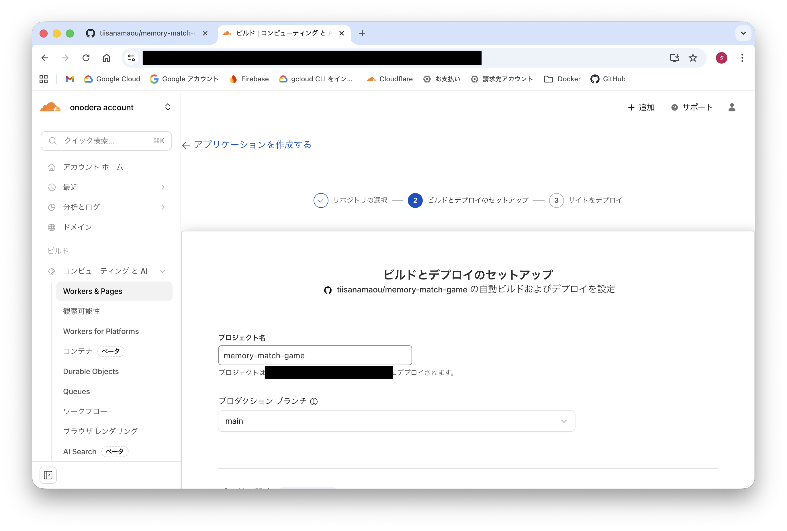
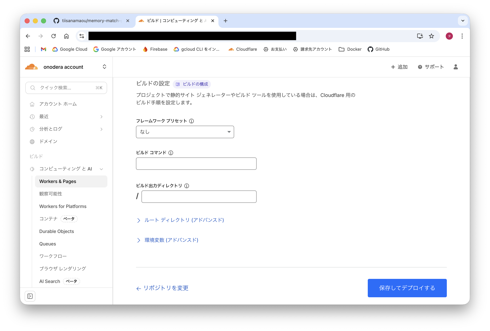

"ビルドおよびデプロイを実行しています"と表示されるので待ちます
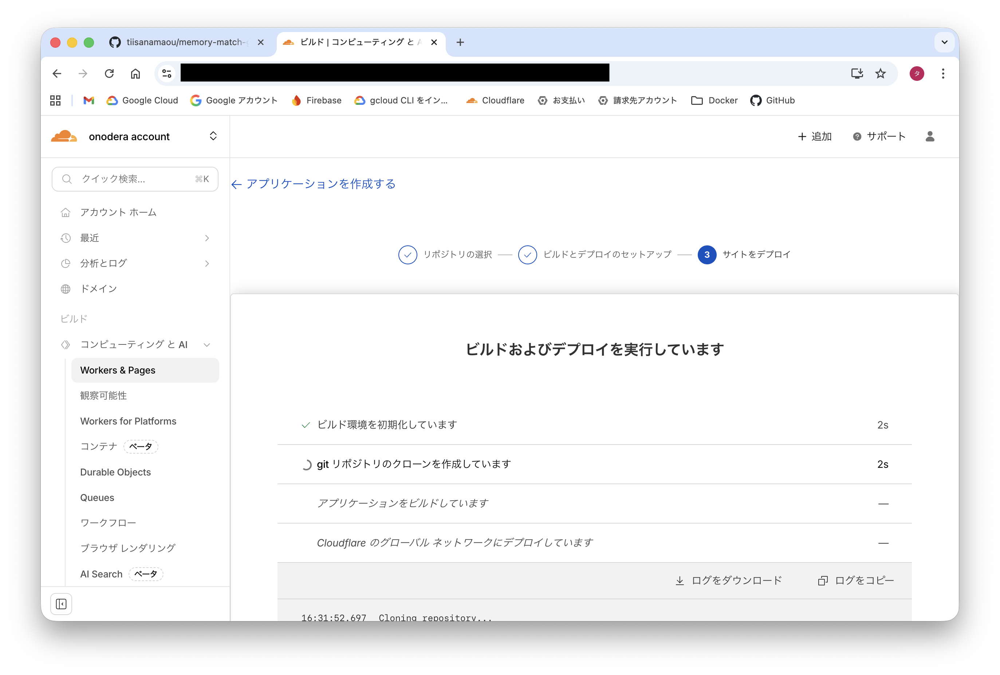

完了すると"成功しました！..."と表示されます
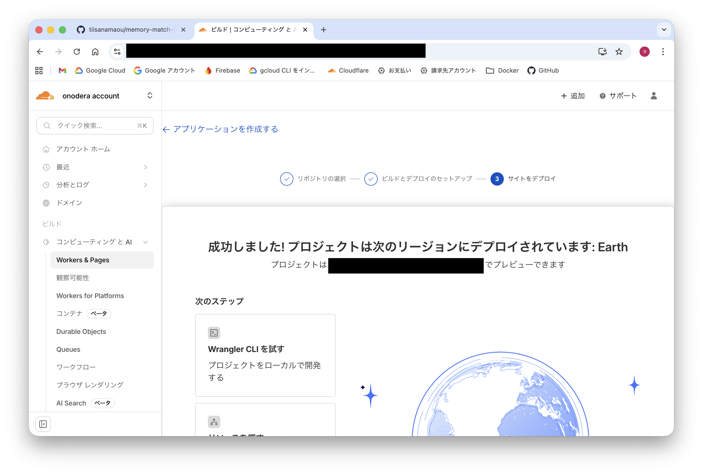

表示されているURLに行くとデプロイしたサイトが表示されています
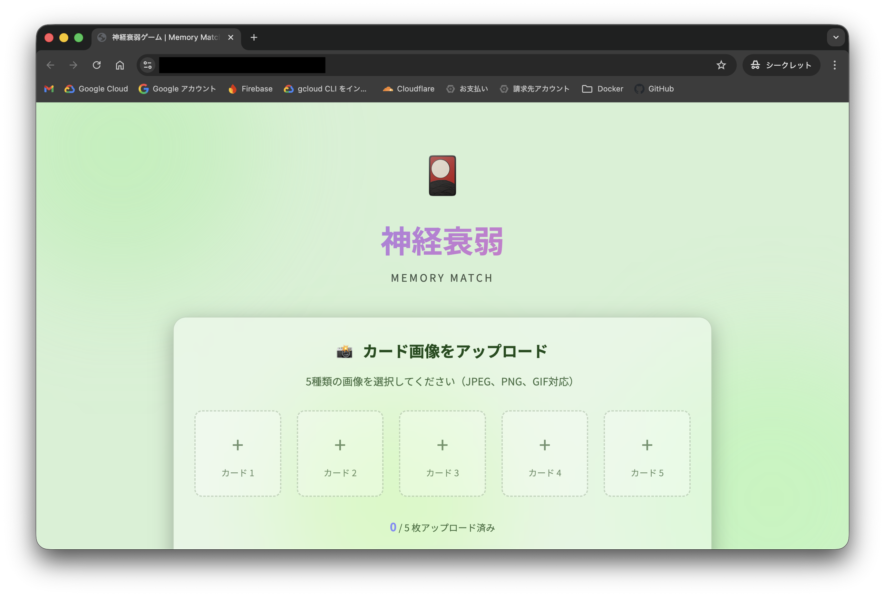
