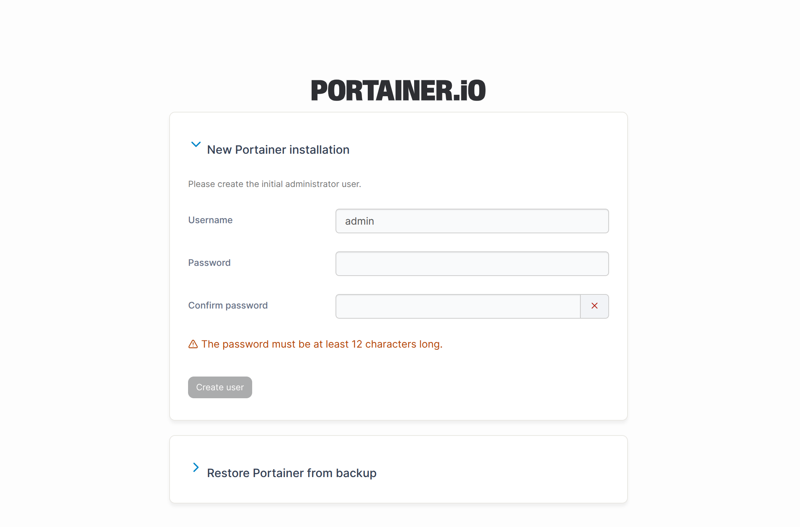
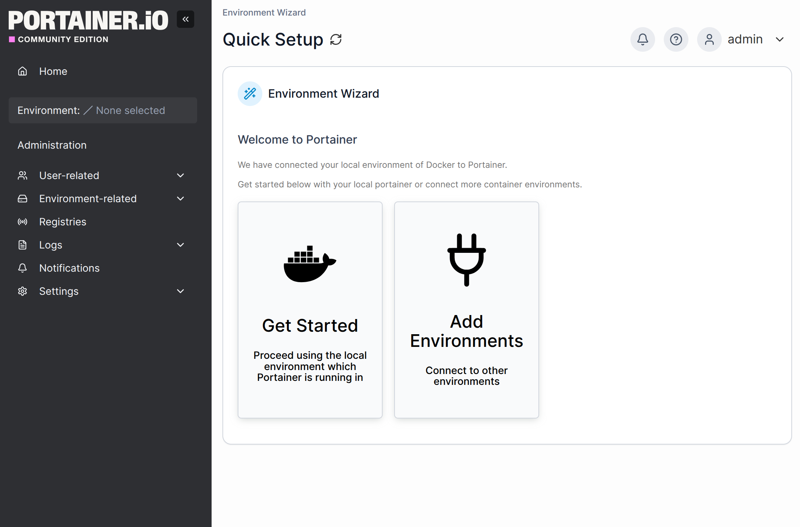
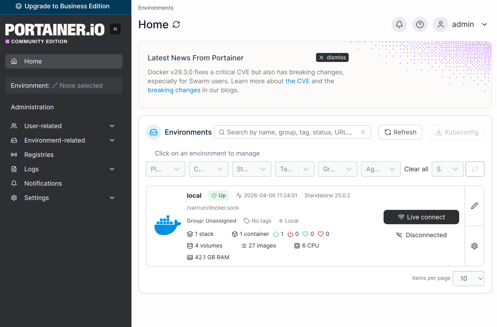
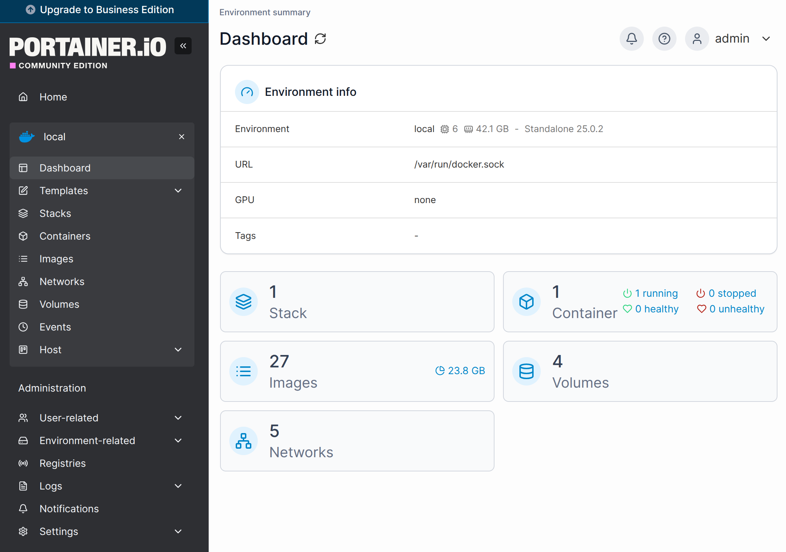

## 環境
- Ubuntu 24.04.1 LTS
- Docker 29.1.3
- portainer-ce:2.39.1

## composeファイル
基本は公式ドキュメントの通りにします
- バージョンしやすいようにバージョンを指定する"portainer-ce:2.39.1"
```
services:
  portainer:
    container_name: portainer
    #image: portainer/portainer-ce:sts
    image: portainer/portainer-ce:2.39.1
    restart: always
    volumes:
      - /var/run/docker.sock:/var/run/docker.sock
      - portainer_data:/data
    ports:
      - 9443:9443
      - 8000:8000  # Remove if you do not intend to use Edge Agents

volumes:
  portainer_data:
    name: portainer_data

networks:
  default:
    name: portainer_network
```

## 実行
```
sudo docker compose up -d 
sudo docker compose down -v
```

## WebUI
Portainerを実行しているサーバーのIPの"9443"ポートにアクセスする
- https://IPアドレス:9443/

初回はパスワードを設定する


イメージやコンテナをWebUI上から管理できる




## 参考URL
- https://docs.portainer.io/start/install-ce/server/docker/linux#docker-compose
