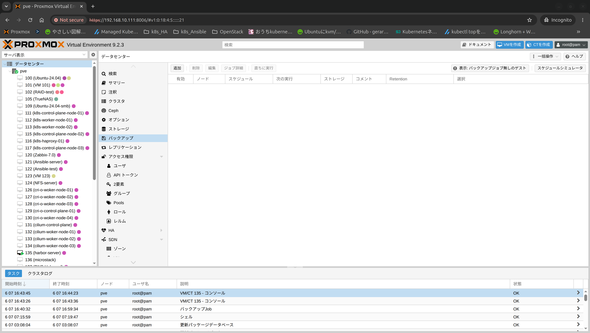
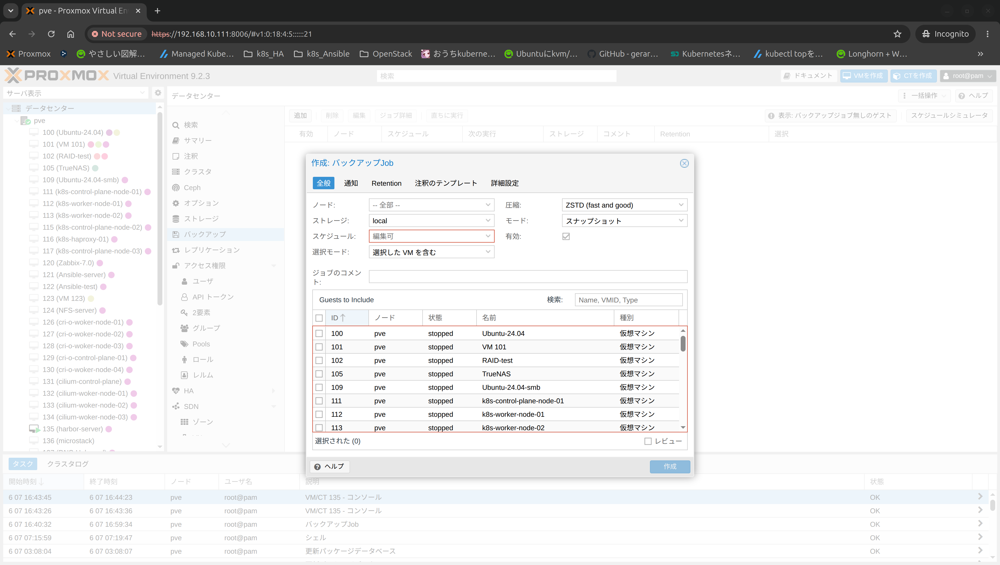
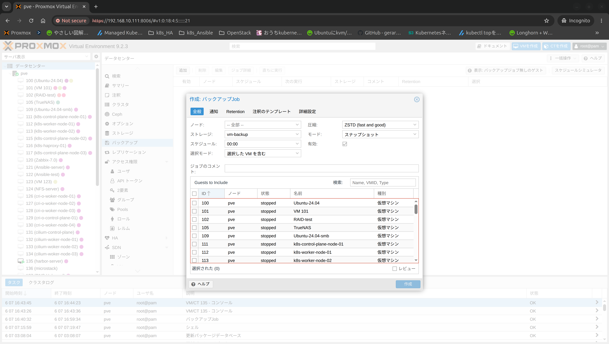
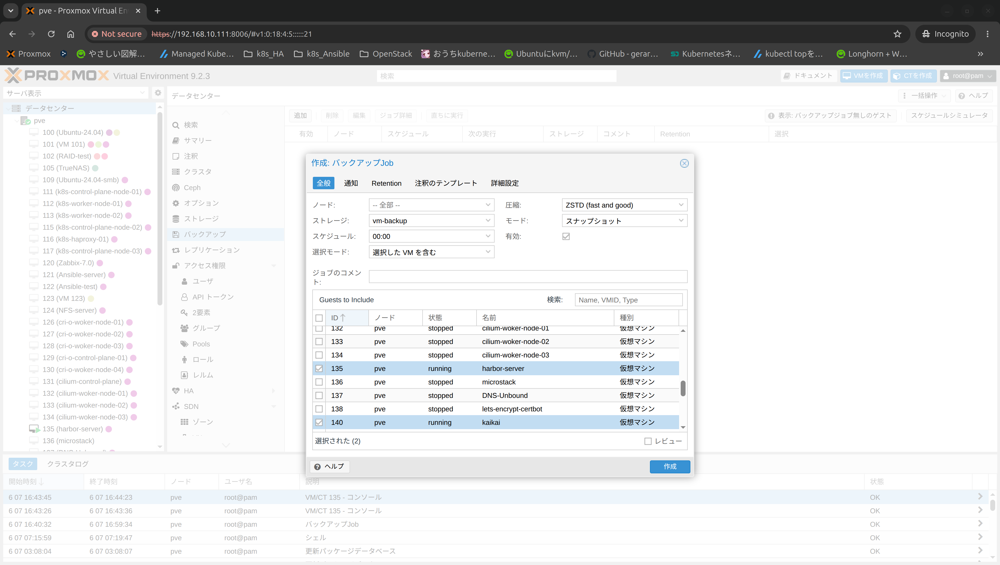
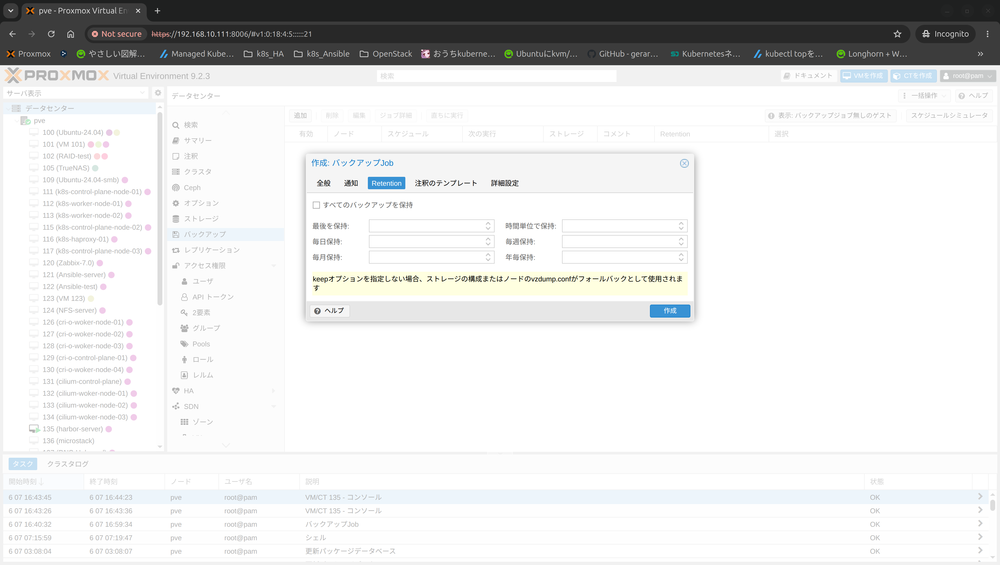
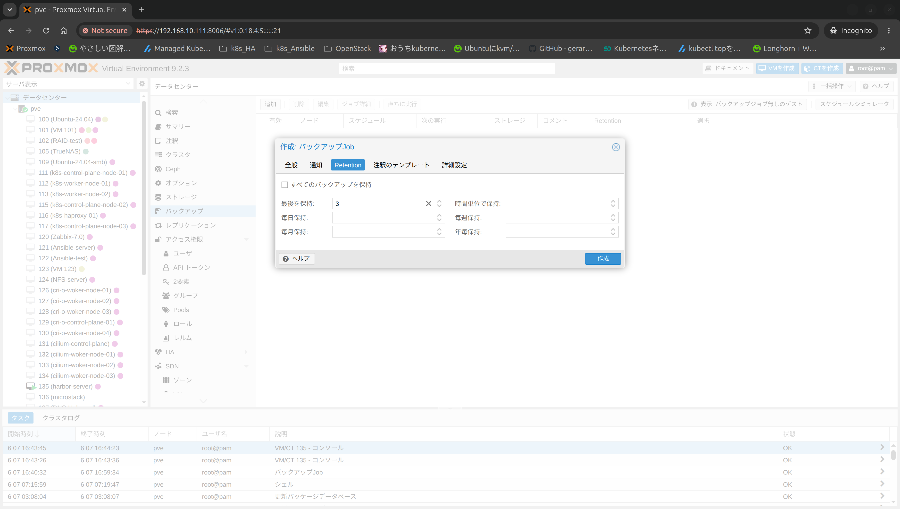

## 環境
- proxmox-ve: 9.2.0 (running kernel: 6.14.8-2-pve)

## 設定手順
管理画面にログインし、"データセンター"＞"バックアップ"の項目を押します

"追加"を押すと、設定画面が出てきます

"ストレージ"はバックアップの保存先を選択します\
"スケジュール"はどのタイミングでバックアップするかを決めます

- "00:00"：毎日00時00分にバックアップを開始する

バックアップするVMを選択します

"Retention"でバックアップを保持する設定をします

"3"にして最新のバックアップ3つを残す設定にしています

"作成"を押すと作成されます

## 参考URL
- Proxmox VE-HDDを増設したので、バックアップ環境を構築する
    - https://www.logw.jp/server/10684.html
