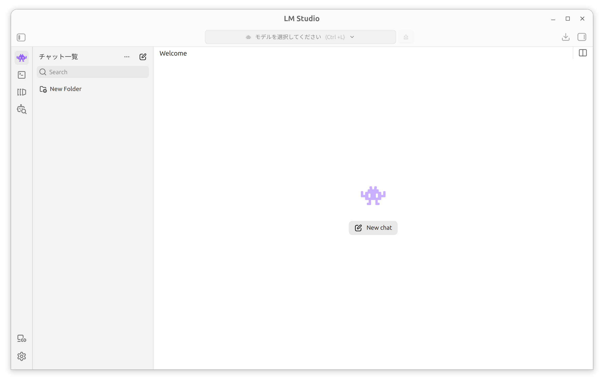

## 環境
- Ubuntu 24.04.4 LTS
- Linux 6.8.0-124-generic
- LM-Studio-0.4.18-1-x64

## DL
公式サイトからダウンロードする

URL
- https://lmstudio.ai/

ダウンロードしたファイル拡張子が".AppImage"を右クリックし"Properties"から"Executable as Program"をオンにする

## libfuse2
AppImageを実行するには"libfuse2"というライブラリが必要
インストールされているかの確認
```
dpkg -l | grep libfuse2
```

インストールされていなければインストールする
```
sudo apt install libfuse2
```

## 実行
AppImageファイルをダブルクリックして起動できます


## unsloth
- Gemma4
    - https://huggingface.co/collections/unsloth/gemma-4
- GLM-5.2
    - https://huggingface.co/unsloth/GLM-5.2-GGUF
- Qwen3.6
    - https://huggingface.co/collections/unsloth/qwen36
