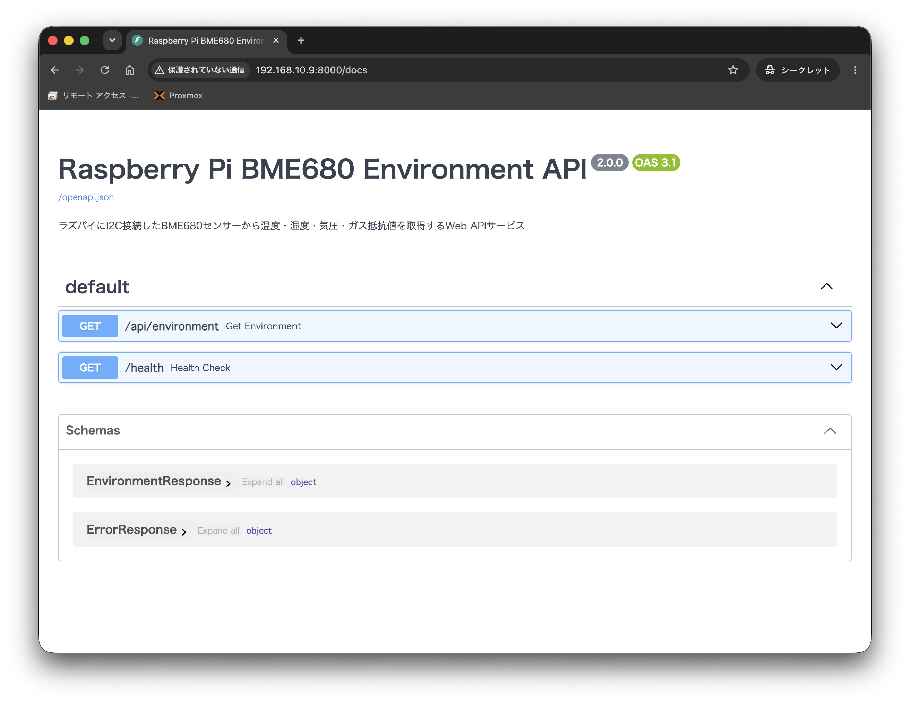

## OSの準備
- Raspberry 5 8GB
- Raspberry Pi OS Lite (64bit)
    - GUIなし

書き込みは下記ソフトを使用する
- Raspberry Pi Imager

電源供給の警告がでるので、電源ボタンを押してスキップする

プログラムはAI（Gemini 3.7 flash,GPT-5.6 Sol）を使用しています

## 環境
- OS情報
```
mao@raspberrypi5:~ $ cat /etc/os-release
PRETTY_NAME="Debian GNU/Linux 13 (trixie)"
NAME="Debian GNU/Linux"
VERSION_ID="13"
VERSION="13 (trixie)"
VERSION_CODENAME=trixie
DEBIAN_VERSION_FULL=13.6
ID=debian
HOME_URL="https://www.debian.org/"
SUPPORT_URL="https://www.debian.org/support"
BUG_REPORT_URL="https://bugs.debian.org/"
```

- Python 3.13.5
- uv 0.12.3 (aarch64-unknown-linux-gnu)

## 初期設定
更新する
```
sudo apt update
sudo apt upgrade
```

SSHの有効化をする
```
sudo systemctl enable ssh
```

ホスト名を変更する
```
sudo hostnamectl set-hostname raspberrypi5
```

ホスト名が変更されたことを確認する
```
hostnamectl
```

シャットダウンをする
```
sudo systemctl poweroff
```
電源ボタンを押して起動する

## SSH接続をする
```
ssh
```

電源警告の設定を変更する\
下記ファイルを開き、下記を追記する
```
sudo nano /boot/firmware/config.txt
```
追記内容（[all]の下に記載する）
```
usb_max_current_enable=1
```

## I2Cセンサーを接続する
使用するセンサー
- [114469]BME680使用 温湿度・気圧・ガスセンサーモジュールキット
- https://akizukidenshi.com/catalog/g/g114469/

| BME680 端子 | Raspberry Pi5 GPIO ピン |
| :--- | :--- |
| **VCC** (VIN) | Pin 1 (3.3V) |
| **GND** | Pin 6 (GND) |
| **SDA** (SDI) | Pin 3 (GPIO 2 / SDA) |
| **SCL** (SCK) | Pin 5 (GPIO 3 / SCL) |

## I2Cの有効化
```
sudo raspi-config
```

I2Cツールのインストールと動作確認
```
sudo apt update
sudo apt install -y i2c-tools
```
- "3 Interface Options"
- "I4 I2C"
- "Would you like the ARM I2C interface to be enabled?"と聞かれるので"Yes"を選択する

I2Cデバイスの認識確認
```
sudo i2cdetect -y 1
```
```
mao@raspberrypi5:~ $ sudo i2cdetect -y 1
sudo: unable to resolve host raspberrypi5: Name or service not known
     0  1  2  3  4  5  6  7  8  9  a  b  c  d  e  f
00:                         -- -- -- -- -- -- -- -- 
10: -- -- -- -- -- -- -- -- -- -- -- -- -- -- -- -- 
20: -- -- -- -- -- -- -- -- -- -- -- -- -- -- -- -- 
30: -- -- -- -- -- -- -- -- -- -- -- -- -- -- -- -- 
40: -- -- -- -- -- -- -- -- -- -- -- -- -- -- -- -- 
50: -- -- -- -- -- -- -- -- -- -- -- -- -- -- -- -- 
60: -- -- -- -- -- -- -- -- -- -- -- -- -- -- -- -- 
70: -- -- -- -- -- -- -- 77                         
mao@raspberrypi5:~ $ 
```

## uvのインストール
インストールコマンド
```
curl -LsSf https://astral.sh/uv/install.sh | sh
source ~/.bashrc
```

バージョン確認
```
uv --version
```
```
uv 0.12.3 (aarch64-unknown-linux-gnu)
```

依存関係のインストール
```
uv sync
```
```
mao@raspberrypi5:~/raspi-temp-api-server $ uv sync
Using CPython 3.13.5 interpreter at: /usr/bin/python3
Creating virtual environment at: .venv
Resolved 25 packages in 592ms
warning: Skipping installation of entry points (`project.scripts`) for package `raspberrypi-temp-api` because this project is not packaged; to install entry points, set `tool.uv.package = true` or define a `build-system`
Prepared 15 packages in 192ms
Installed 15 packages in 7ms
 + annotated-doc==0.0.5
 + annotated-types==0.8.0
 + anyio==4.14.2
 + bme680==2.0.0
 + click==8.4.2
 + fastapi==0.141.1
 + h11==0.16.0
 + idna==3.18
 + pydantic==2.13.4
 + pydantic-core==2.46.4
 + smbus2==0.6.1
 + starlette==1.6.0
 + typing-extensions==4.16.0
 + typing-inspection==0.4.4
 + uvicorn==0.52.1
mao@raspberrypi5:~/raspi-temp-api-server $ 
```

## APIサーバーの起動
実行コマンド
```
uv run python main.py
```

Swagger UI ドキュメントのURL
```
http://192.168.10.9:8000/docs
```


## コード
main.py
```
import os
from datetime import datetime
from typing import Optional
from fastapi import FastAPI, HTTPException
from pydantic import BaseModel, Field
from contextlib import asynccontextmanager

from sensor import BME680Sensor

# 環境変数による設定変更対応
I2C_ADDRESS = int(os.getenv("I2C_ADDRESS", "0x77"), 16)
MOCK_MODE = os.getenv("MOCK_MODE", "false").lower() in ("true", "1", "yes")

sensor: Optional[BME680Sensor] = None


@asynccontextmanager
async def lifespan(app: FastAPI):
    global sensor
    # 起動時処理：センサーの初期化
    sensor = BME680Sensor(i2c_addr=I2C_ADDRESS, mock=MOCK_MODE)
    yield
    # 終了時処理：リソース解放
    if sensor:
        sensor.close()


app = FastAPI(
    title="Raspberry Pi BME680 Environment API",
    description="ラズパイにI2C接続したBME680センサーから温度・湿度・気圧・ガス抵抗値を取得するWeb APIサービス",
    version="2.0.0",
    lifespan=lifespan,
)


# --- レスポンスモデル ---

class EnvironmentResponse(BaseModel):
    status: str = Field(..., examples=["success"])
    temperature: float = Field(..., examples=[24.5], description="温度 (℃)")
    humidity: float = Field(..., examples=[55.3], description="相対湿度 (%)")
    pressure: float = Field(..., examples=[1013.25], description="気圧 (hPa)")
    gas_resistance: Optional[float] = Field(
        None, examples=[120000.0],
        description="ガス抵抗値 (Ω)。ヒーターが安定していない場合は null",
    )
    timestamp: str = Field(
        ..., examples=["2026-08-13T11:00:00.000000"],
        description="取得時刻 (ISO 8601)",
    )
    is_mock: bool = Field(..., examples=[False], description="モックデータフラグ")


class ErrorResponse(BaseModel):
    status: str = Field("error", examples=["error"])
    message: str = Field(..., examples=["BME680通信エラーが発生しました"])


# --- エンドポイント ---

@app.get(
    "/api/environment",
    response_model=EnvironmentResponse,
    responses={500: {"model": ErrorResponse}},
)
async def get_environment():
    """
    BME680センサーから温度・湿度・気圧・ガス抵抗値を取得して返します。
    """
    if not sensor:
        raise HTTPException(
            status_code=500, detail="BME680 sensor is not initialized."
        )

    try:
        reading = sensor.read()
        return EnvironmentResponse(
            status="success",
            temperature=reading.temperature,
            humidity=reading.humidity,
            pressure=reading.pressure,
            gas_resistance=reading.gas_resistance,
            timestamp=datetime.now().isoformat(),
            is_mock=sensor.mock,
        )
    except Exception as e:
        raise HTTPException(status_code=500, detail=str(e))


@app.get("/api/temperature", response_model=EnvironmentResponse, include_in_schema=False)
async def get_temperature():
    """後方互換用: /api/environment と同一の結果を返します。"""
    return await get_environment()


@app.get("/health")
async def health_check():
    """
    サーバー状態確認用のヘルスチェックエンドポイント
    """
    return {
        "status": "healthy",
        "sensor_mock_mode": sensor.mock if sensor else True,
    }


if __name__ == "__main__":
    import uvicorn
    # 開発用単体実行時の設定（ポート: 8000）
    uvicorn.run("main:app", host="0.0.0.0", port=8000, reload=True)
```

sensor.py
```
import random
import logging
from dataclasses import dataclass
from typing import Optional

logger = logging.getLogger(__name__)


@dataclass
class BME680Reading:
    """BME680センサーの測定結果を保持するデータクラス"""
    temperature: float   # 温度 (℃)
    humidity: float      # 相対湿度 (%)
    pressure: float      # 気圧 (hPa)
    gas_resistance: Optional[float]  # ガス抵抗値 (Ω)、未安定時はNone


class BME680Sensor:
    """
    BME680 環境センサー制御クラス

    Pimoroni の bme680 ライブラリを使用して I2C 経由で
    温度・湿度・気圧・ガス抵抗値を取得します。
    ライブラリが利用できない環境ではモックモードにフォールバックします。
    """

    def __init__(self, i2c_addr: int = 0x77, mock: bool = False):
        self.i2c_addr = i2c_addr
        self.mock = mock
        self._device = None

        if not self.mock:
            try:
                import bme680
                self._device = bme680.BME680(i2c_addr=self.i2c_addr)

                # オーバーサンプリング設定
                self._device.set_humidity_oversample(bme680.OS_2X)
                self._device.set_pressure_oversample(bme680.OS_4X)
                self._device.set_temperature_oversample(bme680.OS_8X)
                self._device.set_filter(bme680.FILTER_SIZE_3)

                # ガスセンサー設定
                self._device.set_gas_status(bme680.ENABLE_GAS_MEAS)
                self._device.set_gas_heater_temperature(320)
                self._device.set_gas_heater_duration(150)
                self._device.select_gas_heater_profile(0)

                logger.info(
                    f"BME680 initialized (address: 0x{self.i2c_addr:02x})"
                )
            except Exception as e:
                logger.warning(
                    f"Failed to initialize BME680: {e}. Falling back to mock mode."
                )
                self.mock = True

    def read(self) -> BME680Reading:
        """
        センサーから全測定値を一括取得します。

        Returns:
            BME680Reading: 温度・湿度・気圧・ガス抵抗値を格納したオブジェクト

        Raises:
            RuntimeError: センサーからのデータ取得に失敗した場合
        """
        if self.mock or self._device is None:
            return BME680Reading(
                temperature=round(20.0 + random.uniform(0.0, 10.0), 2),
                humidity=round(40.0 + random.uniform(0.0, 30.0), 2),
                pressure=round(1000.0 + random.uniform(0.0, 30.0), 2),
                gas_resistance=round(50000.0 + random.uniform(0.0, 200000.0), 0),
            )

        try:
            if not self._device.get_sensor_data():
                raise RuntimeError("BME680: get_sensor_data() returned False")

            gas = None
            if self._device.data.heat_stable:
                gas = round(self._device.data.gas_resistance, 0)

            return BME680Reading(
                temperature=round(self._device.data.temperature, 2),
                humidity=round(self._device.data.humidity, 2),
                pressure=round(self._device.data.pressure, 2),
                gas_resistance=gas,
            )
        except Exception as e:
            logger.error(f"BME680 read error: {e}")
            raise RuntimeError(f"BME680 Read Error: {e}")

    def close(self):
        """リソースの解放（bme680ライブラリは明示的なcloseは不要だが互換性のため残す）"""
        self._device = None
```

pyproject.toml
```
[project]
name = "raspberrypi-temp-api"
version = "1.0.0"
description = "ラズパイにI2C接続した温度センサーから温度情報を取得するREST APIサーバー"
requires-python = ">=3.9"
dependencies = [
    "fastapi>=0.100.0",
    "uvicorn>=0.22.0",
    "bme680>=1.0.5",
    "pydantic>=2.0.0",
]

[project.scripts]
temp-api = "main:start"
```

temp-api.service
```
[Unit]
Description=Raspberry Pi I2C Temperature API Server
After=network.target

[Service]
Type=simple
User=mao
WorkingDirectory=/home/mao/raspi-temp-api-server
Environment=PATH=/home/mao/.local/bin:/usr/local/bin:/usr/bin:/bin
ExecStart=/home/mao/.local/bin/uv run uvicorn main:app --host 0.0.0.0 --port 8000
Restart=always
RestartSec=5
Environment=I2C_ADDRESS=0x77
Environment=MOCK_MODE=false

[Install]
WantedBy=multi-user.target
```

## 自動起動させる方法
サーバーが起動したときに自動で起動できるように設定する
```
sudo cp temp-api.service /etc/systemd/system/
sudo systemctl daemon-reload
sudo systemctl enable temp-api.service
sudo systemctl start temp-api.service
sudo systemctl status temp-api.service
```

サービスを削除するとき
```
sudo systemctl stop temp-api.service
sudo systemctl disable temp-api.service
sudo rm /etc/systemd/system/temp-api.service
sudo systemctl daemon-reload
```

これでAPIを叩くと現在の温度湿度気圧を返すAPIサーバーが構築できた
