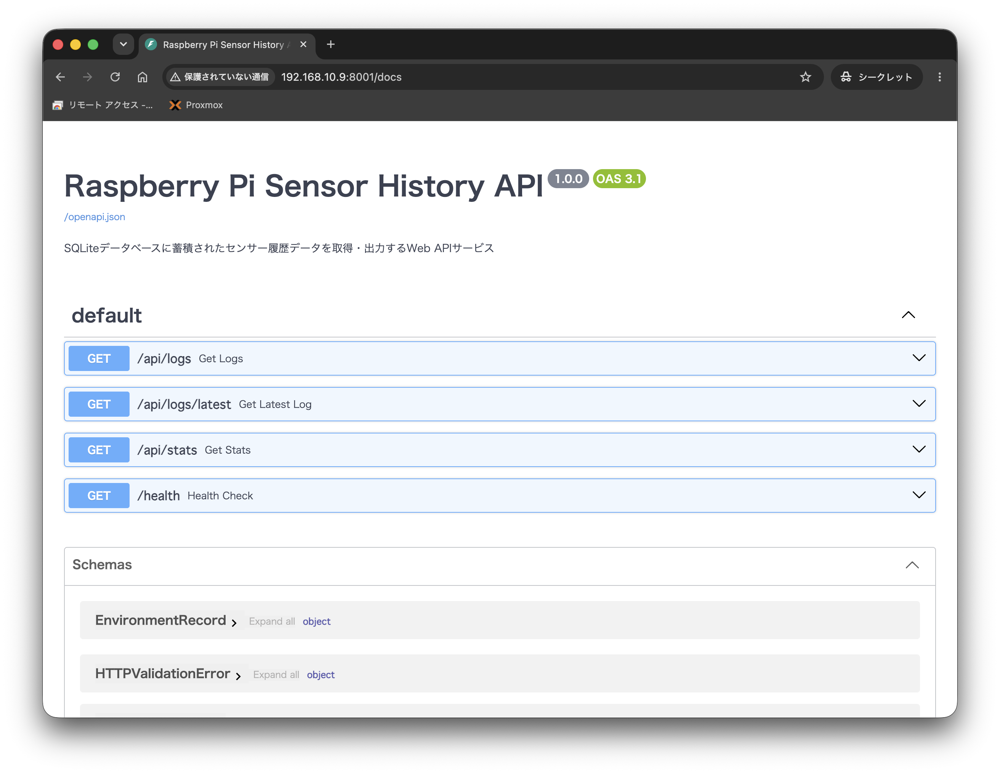
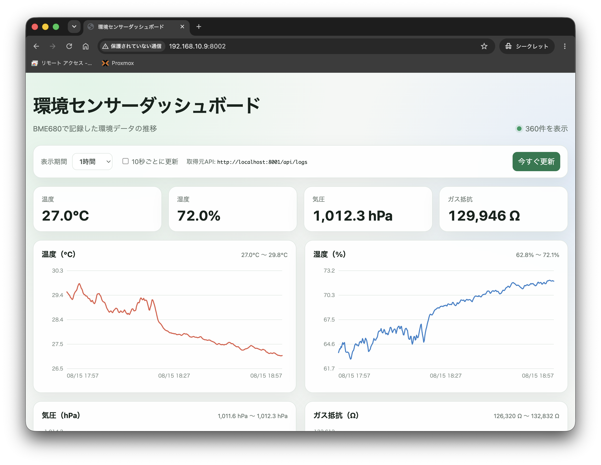

## SQLiteにデータを保存する
APIサーバーのプログラムを実行したあとに実行するとlocalhostを叩いて、SQLiteにデータを保存するプログラム
```
uv run python collector.py
```

コード
- collector.py
```
import os
import time
import sqlite3
import signal
import json
import logging
import urllib.request
from datetime import datetime, timezone, timedelta

# 日本時間 (JST: UTC+9) のタイムゾーン定義
JST = timezone(timedelta(hours=9))

# ロギング設定
logging.basicConfig(
    level=logging.INFO,
    format="%(asctime)s [%(levelname)s] %(message)s"
)
logger = logging.getLogger(__name__)

# 設定パラメータ（環境変数から変更可能）
API_URL = os.getenv("API_URL", "http://localhost:8000/api/environment")
DB_PATH = os.getenv("DB_PATH", "sensor_data.db")
INTERVAL_SECONDS = int(os.getenv("INTERVAL_SECONDS", "10"))

# ループ制御フラグ
running = True

def signal_handler(signum, frame):
    """Ctrl+C や SIGTERM で安全に終了するためのシグナルハンドラー"""
    global running
    logger.info("終了シグナルを受信しました。データロガーを停止します...")
    running = False

# シグナル登録
signal.signal(signal.SIGINT, signal_handler)
signal.signal(signal.SIGTERM, signal_handler)

def init_db(db_path: str):
    """SQLiteデータベースとテーブルを初期化します"""
    conn = sqlite3.connect(db_path)
    cursor = conn.cursor()
    cursor.execute("""
        CREATE TABLE IF NOT EXISTS environment_log (
            id INTEGER PRIMARY KEY AUTOINCREMENT,
            timestamp TEXT NOT NULL,
            temperature REAL NOT NULL,
            humidity REAL NOT NULL,
            pressure REAL NOT NULL,
            gas_resistance REAL,
            is_mock INTEGER NOT NULL
        )
    """)
    cursor.execute("""
        CREATE INDEX IF NOT EXISTS idx_timestamp ON environment_log(timestamp)
    """)
    conn.commit()
    conn.close()
    logger.info(f"データベースの初期化が完了しました: {db_path}")

def fetch_from_api(url: str) -> dict:
    """APIサーバー (http://localhost:8000/api/environment) を叩いてJSONを取得"""
    req = urllib.request.Request(url, headers={"User-Agent": "TempCollector/1.0"})
    with urllib.request.urlopen(req, timeout=5) as response:
        if response.status == 200:
            data = response.read().decode("utf-8")
            return json.loads(data)
        else:
            raise RuntimeError(f"API HTTP Status Code: {response.status}")

def save_to_db(db_path: str, data: dict):
    """取得したデータJSONをSQLiteに保存します（タイムスタンプは常に日本時間JSTで記録）"""
    # 明示的に日本時間 (JST) の現在時刻 ISO8601 文字列を取得
    timestamp_jst = datetime.now(JST).isoformat()

    conn = sqlite3.connect(db_path)
    cursor = conn.cursor()
    cursor.execute("""
        INSERT INTO environment_log (timestamp, temperature, humidity, pressure, gas_resistance, is_mock)
        VALUES (?, ?, ?, ?, ?, ?)
    """, (
        timestamp_jst,
        data.get("temperature"),
        data.get("humidity"),
        data.get("pressure"),
        data.get("gas_resistance"),
        1 if data.get("is_mock", False) else 0
    ))
    conn.commit()
    conn.close()
    logger.info(
        f"[{timestamp_jst}] 保存成功 -> Temp: {data.get('temperature')}℃, Hum: {data.get('humidity')}%, Press: {data.get('pressure')}hPa, Gas: {data.get('gas_resistance')}Ω"
    )

def main():
    logger.info(f"APIポーリング型データロガーを開始します（ターゲット: {API_URL}, 間隔: {INTERVAL_SECONDS}秒）")
    init_db(DB_PATH)

    while running:
        start_time = time.time()
        try:
            # 1. APIサーバーを叩く
            api_data = fetch_from_api(API_URL)
            # 2. SQLiteに保存する
            save_to_db(DB_PATH, api_data)
        except Exception as e:
            logger.error(f"API取得/保存エラー (APIサーバーが起動しているか確認してください): {e}")

        # 10秒間隔を維持するための処理
        elapsed = time.time() - start_time
        sleep_time = max(0.0, INTERVAL_SECONDS - elapsed)
        
        sleep_step = 0.5
        total_slept = 0.0
        while running and total_slept < sleep_time:
            time.sleep(min(sleep_step, sleep_time - total_slept))
            total_slept += sleep_step

    logger.info("データロガーを正常に終了しました。")

if __name__ == "__main__":
    main()
```

## 保存したデータを閲覧する
SQLiteに保存したデータをターミナル上で閲覧するプログラム

コード
- show_data.py
```
import os
import sys
import sqlite3
from datetime import datetime

DB_PATH = os.getenv("DB_PATH", "sensor_data.db")

def show_database_records(limit: int = 10):
    """SQLiteデータベースの最新データをフォーマットして表示します"""
    if not os.path.exists(DB_PATH):
        print(f"ERROR: データベースファイル '{DB_PATH}' が見つかりません。")
        print("先に collector.py を実行してデータを蓄積してください。")
        return

    try:
        conn = sqlite3.connect(DB_PATH)
        cursor = conn.cursor()

        # 総件数の取得
        cursor.execute("SELECT COUNT(*) FROM environment_log")
        total_count = cursor.fetchone()[0]

        if total_count == 0:
            print("WARNING: データベースは存在しますが、データがまだ登録されていません。")
            conn.close()
            return

        # 統計情報の取得（平均、最高、最低温度）
        cursor.execute("""
            SELECT 
                ROUND(AVG(temperature), 2), 
                ROUND(MAX(temperature), 2), 
                ROUND(MIN(temperature), 2) 
            FROM environment_log
        """)
        avg_temp, max_temp, min_temp = cursor.fetchone()

        # 最新データの取得
        cursor.execute(f"""
            SELECT id, timestamp, temperature, humidity, pressure, gas_resistance, is_mock
            FROM environment_log
            ORDER BY id DESC
            LIMIT {limit}
        """)
        rows = cursor.fetchall()
        conn.close()

        print("=" * 80)
        print(f"センサーデータベース確認ツール ({DB_PATH})")
        print("=" * 80)
        print(f"累計レコード数 : {total_count} 件")
        print(f"温度統計       : 平均 {avg_temp}℃ / 最高 {max_temp}℃ / 最低 {min_temp}℃")
        print("-" * 80)
        print(f"最新 {len(rows)} 件のデータ:")
        print("-" * 80)
        # ヘッダー表示
        header = f"{'ID':<6} | {'日時 (Timestamp)':<26} | {'温度 (℃)':<8} | {'湿度 (%)':<8} | {'気圧 (hPa)':<10} | {'種別':<6}"
        print(header)
        print("-" * 80)

        # レコードの表示
        for row in rows:
            record_id, ts, temp, hum, press, gas, is_mock = row
            # ISOフォーマットの日時を少し見やすく整形（秒まで）
            try:
                dt = datetime.fromisoformat(ts)
                formatted_ts = dt.strftime("%Y-%m-%d %H:%M:%S")
            except Exception:
                formatted_ts = str(ts)[:19]

            data_type = "モック" if is_mock else "実機"
            print(f"{record_id:<6} | {formatted_ts:<26} | {temp:<8.1f} | {hum:<8.1f} | {press:<10.1f} | {data_type:<6}")

        print("=" * 80)

    except sqlite3.Error as e:
        print(f"SQLiteエラーが発生しました: {e}")

if __name__ == "__main__":
    # コマンドライン引数で表示件数を指定可能 (例: python show_data.py 20)
    limit_count = 10
    if len(sys.argv) > 1 and sys.argv[1].isdigit():
        limit_count = int(sys.argv[1])
    
    show_database_records(limit_count)
```

データを表示する
```
uv run python show_data.py
```

行数指定（下記は最新20行）
- デフォルトは10件
```
uv run python show_data.py 20
```

データ例
```
mao@raspberrypi5:~/raspi-temp-api-server $ uv run python show_data.py
================================================================================
センサーデータベース確認ツール (sensor_data.db)
================================================================================
累計レコード数 : 7 件
温度統計       : 平均 28.85℃ / 最高 28.87℃ / 最低 28.83℃
--------------------------------------------------------------------------------
最新 7 件のデータ:
--------------------------------------------------------------------------------
ID     | 日時 (Timestamp)             | 温度 (℃)   | 湿度 (%)   | 気圧 (hPa)   | 種別
--------------------------------------------------------------------------------
7      | 2026-08-13 07:43:13        | 28.9     | 71.7     | 1007.6     | 実機
6      | 2026-08-13 07:43:03        | 28.9     | 71.7     | 1007.6     | 実機
5      | 2026-08-13 07:42:53        | 28.9     | 71.8     | 1007.6     | 実機
4      | 2026-08-13 07:42:43        | 28.8     | 71.8     | 1007.6     | 実機
3      | 2026-08-13 07:42:33        | 28.8     | 71.8     | 1007.6     | 実機
2      | 2026-08-13 07:42:23        | 28.8     | 71.9     | 1007.6     | 実機
1      | 2026-08-13 07:42:13        | 28.8     | 72.0     | 1007.6     | 実機
================================================================================
mao@raspberrypi5:~/raspi-temp-api-server $ 
```

## データをSQLiteに保存するプログラムの自動起動の設定をする

コード
- temp-logger.service
```
[Unit]
Description=Raspberry Pi I2C Temperature & Environment Logger (SQLite)
After=network.target

[Service]
Type=simple
User=mao
WorkingDirectory=/home/mao/raspi-temp-api-server
Environment=PATH=/home/mao/.local/bin:/usr/local/bin:/usr/bin:/bin
ExecStart=/home/mao/.local/bin/uv run python collector.py
Restart=always
RestartSec=5
Environment=I2C_ADDRESS=0x77
Environment=MOCK_MODE=false
Environment=INTERVAL_SECONDS=10
Environment=DB_PATH=sensor_data.db

[Install]
WantedBy=multi-user.target
```

設定方法
```
sudo cp temp-logger.service /etc/systemd/system/
sudo systemctl daemon-reload
sudo systemctl enable temp-logger.service
sudo systemctl start temp-logger.service
sudo systemctl status temp-logger.service
```

## データベースに保存した内容をAPIから取得できるようにする
SQLiteに保存したデータをAPIから取得できるようにするプログラム

コード
- db_api.py
```
import os
import sqlite3
from typing import List, Optional
from fastapi import FastAPI, HTTPException, Query
from pydantic import BaseModel, Field

# 設定パラメータ（環境変数から変更可能）
DB_PATH = os.getenv("DB_PATH", "sensor_data.db")
PORT = int(os.getenv("PORT", "8001"))

app = FastAPI(
    title="Raspberry Pi Sensor History API",
    description="SQLiteデータベースに蓄積されたセンサー履歴データを取得・出力するWeb APIサービス",
    version="1.0.0",
)


# --- レスポンスモデル ---

class EnvironmentRecord(BaseModel):
    id: int = Field(..., examples=[1])
    timestamp: str = Field(..., examples=["2026-08-14T09:30:00+09:00"], description="測定時刻 (ISO 8601)")
    temperature: float = Field(..., examples=[24.5], description="温度 (℃)")
    humidity: float = Field(..., examples=[55.3], description="相対湿度 (%)")
    pressure: float = Field(..., examples=[1013.25], description="気圧 (hPa)")
    gas_resistance: Optional[float] = Field(
        None, examples=[120000.0],
        description="ガス抵抗値 (Ω)。未取得時は null",
    )
    is_mock: bool = Field(..., examples=[False], description="モックデータフラグ")


class HistoryResponse(BaseModel):
    status: str = Field("success", examples=["success"])
    total_count: int = Field(..., examples=[150], description="DB内の総レコード数")
    returned_count: int = Field(..., examples=[10], description="今回取得した件数")
    data: List[EnvironmentRecord] = Field(..., description="履歴データ一覧")


class StatsData(BaseModel):
    avg: Optional[float] = Field(None, examples=[24.5], description="平均値")
    max: Optional[float] = Field(None, examples=[28.0], description="最大値")
    min: Optional[float] = Field(None, examples=[21.0], description="最小値")


class StatsResponse(BaseModel):
    status: str = Field("success", examples=["success"])
    total_records: int = Field(..., examples=[150], description="総レコード数")
    temperature: StatsData
    humidity: StatsData
    pressure: StatsData


# --- ヘルパー関数 ---

def get_db_connection():
    """SQLite接続を取得し、辞書形式で列名アクセス可能にします"""
    if not os.path.exists(DB_PATH):
        raise HTTPException(
            status_code=404,
            detail=f"データベースファイル '{DB_PATH}' が見つかりません。collector.py が実行されているか確認してください。"
        )
    conn = sqlite3.connect(DB_PATH)
    conn.row_factory = sqlite3.Row
    return conn


# --- エンドポイント ---

@app.get("/api/logs", response_model=HistoryResponse)
async def get_logs(
    limit: int = Query(100, ge=1, le=1000, description="取得する最大件数 (1〜1000)"),
    offset: int = Query(0, ge=0, description="スキップする件数 (ページネーション用)"),
    order: str = Query("desc", pattern="^(asc|desc)$", description="並び順 (desc: 新しい順, asc: 古い順)"),
):
    """
    SQLiteに保存された環境データの履歴一覧を取得します。
    """
    try:
        conn = get_db_connection()
        cursor = conn.cursor()

        # 総件数取得
        cursor.execute("SELECT COUNT(*) FROM environment_log")
        total_count = cursor.fetchone()[0]

        # 履歴取得
        order_clause = "DESC" if order.lower() == "desc" else "ASC"
        cursor.execute(f"""
            SELECT id, timestamp, temperature, humidity, pressure, gas_resistance, is_mock
            FROM environment_log
            ORDER BY id {order_clause}
            LIMIT ? OFFSET ?
        """, (limit, offset))

        rows = cursor.fetchall()
        conn.close()

        records = [
            EnvironmentRecord(
                id=row["id"],
                timestamp=row["timestamp"],
                temperature=row["temperature"],
                humidity=row["humidity"],
                pressure=row["pressure"],
                gas_resistance=row["gas_resistance"],
                is_mock=bool(row["is_mock"]),
            )
            for row in rows
        ]

        return HistoryResponse(
            status="success",
            total_count=total_count,
            returned_count=len(records),
            data=records,
        )

    except sqlite3.Error as e:
        raise HTTPException(status_code=500, detail=f"Database error: {e}")


@app.get("/api/logs/latest", response_model=EnvironmentRecord)
async def get_latest_log():
    """
    SQLiteに保存された最新の1件を取得します。
    """
    try:
        conn = get_db_connection()
        cursor = conn.cursor()

        cursor.execute("""
            SELECT id, timestamp, temperature, humidity, pressure, gas_resistance, is_mock
            FROM environment_log
            ORDER BY id DESC
            LIMIT 1
        """)
        row = cursor.fetchone()
        conn.close()

        if not row:
            raise HTTPException(status_code=404, detail="データがまだ登録されていません。")

        return EnvironmentRecord(
            id=row["id"],
            timestamp=row["timestamp"],
            temperature=row["temperature"],
            humidity=row["humidity"],
            pressure=row["pressure"],
            gas_resistance=row["gas_resistance"],
            is_mock=bool(row["is_mock"]),
        )

    except sqlite3.Error as e:
        raise HTTPException(status_code=500, detail=f"Database error: {e}")


@app.get("/api/stats", response_model=StatsResponse)
async def get_stats():
    """
    蓄積データの統計情報（総件数、温度・湿度・気圧の平均/最高/最低）を取得します。
    """
    try:
        conn = get_db_connection()
        cursor = conn.cursor()

        cursor.execute("""
            SELECT 
                COUNT(*) as total,
                ROUND(AVG(temperature), 2) as temp_avg,
                ROUND(MAX(temperature), 2) as temp_max,
                ROUND(MIN(temperature), 2) as temp_min,
                ROUND(AVG(humidity), 2) as hum_avg,
                ROUND(MAX(humidity), 2) as hum_max,
                ROUND(MIN(humidity), 2) as hum_min,
                ROUND(AVG(pressure), 2) as press_avg,
                ROUND(MAX(pressure), 2) as press_max,
                ROUND(MIN(pressure), 2) as press_min
            FROM environment_log
        """)
        row = cursor.fetchone()
        conn.close()

        if not row or row["total"] == 0:
            raise HTTPException(status_code=404, detail="データがまだ登録されていません。")

        return StatsResponse(
            status="success",
            total_records=row["total"],
            temperature=StatsData(avg=row["temp_avg"], max=row["temp_max"], min=row["temp_min"]),
            humidity=StatsData(avg=row["hum_avg"], max=row["hum_max"], min=row["hum_min"]),
            pressure=StatsData(avg=row["press_avg"], max=row["press_max"], min=row["press_min"]),
        )

    except sqlite3.Error as e:
        raise HTTPException(status_code=500, detail=f"Database error: {e}")


@app.get("/health")
async def health_check():
    """
    ヘルスチェックエンドポイント
    """
    db_exists = os.path.exists(DB_PATH)
    return {
        "status": "healthy",
        "database_exists": db_exists,
        "database_path": DB_PATH
    }


if __name__ == "__main__":
    import uvicorn
    # 既存のmain.py(ポート8000)と競合しないよう、デフォルトポートは 8001 に設定
    uvicorn.run("db_api:app", host="0.0.0.0", port=PORT, reload=True)
```

実行コマンド
```
uv run python db_api.py
```

Swagger UI ドキュメントのURL
```
http://192.168.10.9:8001/docs
```



## WebUIで表示する
保存したデータをWebUIから閲覧できるようにするプログラム

コード
- web_ui.py
```
"""保存データを折れ線グラフで表示するWeb UI。

接続先:
    Web UI:    http://localhost:8002
    履歴API:   http://localhost:8001/api/logs

接続先とポートは、このファイル内のHISTORY_API_URLとPORTに固定記載しています。
"""

from html import escape
import json
import urllib.error
import urllib.parse
import urllib.request

from fastapi import FastAPI, HTTPException, Query
from fastapi.responses import HTMLResponse


HISTORY_API_URL = "http://localhost:8001/api/logs"
PORT = 8002

app = FastAPI(
    title="Raspberry Pi Sensor Web UI",
    description="SQLiteに保存されたBME680センサーデータを折れ線グラフで表示します。",
    version="1.0.0",
)


HTML = r"""<!doctype html>
<html lang="ja">
<head>
  <meta charset="utf-8">
  <meta name="viewport" content="width=device-width, initial-scale=1">
  <title>環境センサーダッシュボード</title>
  <style>
    :root {
      color-scheme: light;
      --bg: #f4f7f5;
      --panel: rgba(255, 255, 255, 0.92);
      --text: #17231d;
      --muted: #617068;
      --border: #dce5df;
      --accent: #17794d;
      --shadow: 0 12px 34px rgba(24, 57, 41, 0.08);
    }
    * { box-sizing: border-box; }
    body {
      margin: 0;
      min-height: 100vh;
      color: var(--text);
      background:
        radial-gradient(circle at 10% 0%, #dff4e7 0, transparent 34rem),
        radial-gradient(circle at 100% 20%, #e2edf9 0, transparent 30rem),
        var(--bg);
      font-family: -apple-system, BlinkMacSystemFont, "Segoe UI", sans-serif;
    }
    main { width: min(1200px, calc(100% - 32px)); margin: 0 auto; padding: 42px 0 56px; }
    header { display: flex; align-items: end; justify-content: space-between; gap: 24px; margin-bottom: 24px; }
    h1 { margin: 0; font-size: clamp(1.65rem, 4vw, 2.5rem); letter-spacing: -0.04em; }
    .subtitle { margin: 8px 0 0; color: var(--muted); }
    .status { display: flex; align-items: center; gap: 8px; color: var(--muted); white-space: nowrap; }
    .dot { width: 10px; height: 10px; border-radius: 50%; background: #e09a31; box-shadow: 0 0 0 4px #e09a3122; }
    .dot.ok { background: #1d9b62; box-shadow: 0 0 0 4px #1d9b6222; }
    .toolbar, .card, .chart-card {
      background: var(--panel);
      border: 1px solid var(--border);
      border-radius: 18px;
      box-shadow: var(--shadow);
      backdrop-filter: blur(12px);
    }
    .toolbar { display: flex; flex-wrap: wrap; align-items: center; gap: 12px 18px; padding: 14px 16px; margin-bottom: 18px; }
    .endpoint { color: var(--muted); font-size: 0.82rem; overflow-wrap: anywhere; }
    .endpoint code { color: var(--text); }
    label { color: var(--muted); font-size: 0.9rem; }
    select, button {
      margin-left: 7px;
      border: 1px solid var(--border);
      border-radius: 10px;
      background: white;
      color: var(--text);
      padding: 8px 11px;
      font: inherit;
    }
    button { margin-left: auto; border-color: var(--accent); background: var(--accent); color: white; cursor: pointer; }
    button:hover { filter: brightness(1.07); }
    input { accent-color: var(--accent); }
    .summary { display: grid; grid-template-columns: repeat(4, 1fr); gap: 14px; margin-bottom: 18px; }
    .card { padding: 17px 18px; }
    .card .name { color: var(--muted); font-size: 0.85rem; }
    .card .value { margin-top: 7px; font-size: clamp(1.35rem, 3vw, 1.9rem); font-weight: 700; font-variant-numeric: tabular-nums; }
    .charts { display: grid; grid-template-columns: 1fr 1fr; gap: 18px; }
    .chart-card { min-width: 0; padding: 18px; }
    .chart-head { display: flex; align-items: baseline; justify-content: space-between; margin-bottom: 12px; }
    .chart-head h2 { margin: 0; font-size: 1rem; }
    .range { color: var(--muted); font-size: 0.8rem; }
    .canvas-wrap { position: relative; height: 260px; }
    canvas { width: 100%; height: 100%; display: block; }
    .error { display: none; margin-bottom: 18px; padding: 14px 16px; color: #8a2d24; background: #fff0ed; border: 1px solid #f1c8c1; border-radius: 12px; }
    footer { margin-top: 18px; color: var(--muted); font-size: 0.82rem; text-align: right; }
    @media (max-width: 760px) {
      main { width: min(100% - 20px, 1200px); padding-top: 24px; }
      header { align-items: start; flex-direction: column; gap: 12px; }
      .summary { grid-template-columns: 1fr 1fr; }
      .charts { grid-template-columns: 1fr; }
      button { margin-left: 0; }
      .canvas-wrap { height: 230px; }
    }
  </style>
</head>
<body>
  <main>
    <header>
      <div>
        <h1>環境センサーダッシュボード</h1>
        <p class="subtitle">BME680で記録した環境データの推移</p>
      </div>
      <div class="status"><span id="dot" class="dot"></span><span id="status">読み込み中…</span></div>
    </header>

    <section class="toolbar">
      <label>表示件数
        <select id="limit">
          <option value="50">50件</option>
          <option value="100" selected>100件</option>
          <option value="300">300件</option>
          <option value="1000">1000件</option>
        </select>
      </label>
      <label><input id="autoRefresh" type="checkbox" checked> 10秒ごとに更新</label>
      <span class="endpoint">取得元API: <code>__HISTORY_API_URL__</code></span>
      <button id="refresh" type="button">今すぐ更新</button>
    </section>

    <div id="error" class="error"></div>

    <section class="summary">
      <div class="card"><div class="name">温度</div><div id="latest-temperature" class="value">--</div></div>
      <div class="card"><div class="name">湿度</div><div id="latest-humidity" class="value">--</div></div>
      <div class="card"><div class="name">気圧</div><div id="latest-pressure" class="value">--</div></div>
      <div class="card"><div class="name">ガス抵抗</div><div id="latest-gas_resistance" class="value">--</div></div>
    </section>

    <section class="charts">
      <article class="chart-card">
        <div class="chart-head"><h2>温度（℃）</h2><span id="range-temperature" class="range"></span></div>
        <div class="canvas-wrap"><canvas id="chart-temperature"></canvas></div>
      </article>
      <article class="chart-card">
        <div class="chart-head"><h2>湿度（%）</h2><span id="range-humidity" class="range"></span></div>
        <div class="canvas-wrap"><canvas id="chart-humidity"></canvas></div>
      </article>
      <article class="chart-card">
        <div class="chart-head"><h2>気圧（hPa）</h2><span id="range-pressure" class="range"></span></div>
        <div class="canvas-wrap"><canvas id="chart-pressure"></canvas></div>
      </article>
      <article class="chart-card">
        <div class="chart-head"><h2>ガス抵抗（Ω）</h2><span id="range-gas_resistance" class="range"></span></div>
        <div class="canvas-wrap"><canvas id="chart-gas_resistance"></canvas></div>
      </article>
    </section>
    <footer id="updated">最終更新: --</footer>
  </main>

  <script>
    const metrics = {
      temperature: { color: "#e05a47", unit: "℃", digits: 1 },
      humidity: { color: "#2f80c9", unit: "%", digits: 1 },
      pressure: { color: "#7859b8", unit: " hPa", digits: 1 },
      gas_resistance: { color: "#d19027", unit: " Ω", digits: 0 }
    };
    let records = [];

    function formatValue(value, metric) {
      if (value === null || value === undefined) return "--";
      return Number(value).toLocaleString("ja-JP", {
        minimumFractionDigits: metrics[metric].digits,
        maximumFractionDigits: metrics[metric].digits
      }) + metrics[metric].unit;
    }

    function formatTime(value) {
      const date = new Date(value);
      if (Number.isNaN(date.getTime())) return value;
      return date.toLocaleString("ja-JP", { month: "2-digit", day: "2-digit", hour: "2-digit", minute: "2-digit" });
    }

    function drawChart(metric) {
      const canvas = document.getElementById(`chart-${metric}`);
      const rect = canvas.getBoundingClientRect();
      const ratio = window.devicePixelRatio || 1;
      canvas.width = Math.max(1, Math.floor(rect.width * ratio));
      canvas.height = Math.max(1, Math.floor(rect.height * ratio));
      const ctx = canvas.getContext("2d");
      ctx.scale(ratio, ratio);

      const width = rect.width;
      const height = rect.height;
      const pad = { left: 55, right: 12, top: 12, bottom: 34 };
      const plotW = width - pad.left - pad.right;
      const plotH = height - pad.top - pad.bottom;
      const values = records.map(row => row[metric]);
      const valid = values.filter(value => value !== null && Number.isFinite(Number(value))).map(Number);
      ctx.clearRect(0, 0, width, height);

      if (!valid.length) {
        ctx.fillStyle = "#7a8981";
        ctx.font = "13px sans-serif";
        ctx.textAlign = "center";
        ctx.fillText("表示できるデータがありません", width / 2, height / 2);
        document.getElementById(`range-${metric}`).textContent = "データなし";
        return;
      }

      let min = Math.min(...valid);
      let max = Math.max(...valid);
      const margin = Math.max((max - min) * 0.12, Math.abs(max) * 0.002, 0.5);
      min -= margin;
      max += margin;
      document.getElementById(`range-${metric}`).textContent = `${formatValue(Math.min(...valid), metric)} ～ ${formatValue(Math.max(...valid), metric)}`;

      ctx.strokeStyle = "#dfe7e2";
      ctx.fillStyle = "#718078";
      ctx.lineWidth = 1;
      ctx.font = "11px sans-serif";
      for (let i = 0; i <= 4; i++) {
        const y = pad.top + plotH * i / 4;
        ctx.beginPath();
        ctx.moveTo(pad.left, y);
        ctx.lineTo(width - pad.right, y);
        ctx.stroke();
        const label = max - (max - min) * i / 4;
        ctx.textAlign = "right";
        ctx.textBaseline = "middle";
        ctx.fillText(label.toLocaleString("ja-JP", { maximumFractionDigits: metrics[metric].digits }), pad.left - 8, y);
      }

      const labelIndexes = [...new Set([0, Math.floor((records.length - 1) / 2), records.length - 1])];
      ctx.textBaseline = "top";
      labelIndexes.forEach((index, position) => {
        const x = pad.left + (records.length === 1 ? plotW / 2 : plotW * index / (records.length - 1));
        ctx.textAlign = position === 0 ? "left" : position === labelIndexes.length - 1 ? "right" : "center";
        ctx.fillText(formatTime(records[index].timestamp), x, height - pad.bottom + 10);
      });

      ctx.strokeStyle = metrics[metric].color;
      ctx.lineWidth = 2.2;
      ctx.lineJoin = "round";
      ctx.lineCap = "round";
      ctx.beginPath();
      let drawing = false;
      values.forEach((value, index) => {
        if (value === null || !Number.isFinite(Number(value))) {
          drawing = false;
          return;
        }
        const x = pad.left + (records.length === 1 ? plotW / 2 : plotW * index / (records.length - 1));
        const y = pad.top + (max - Number(value)) / (max - min) * plotH;
        if (!drawing) ctx.moveTo(x, y); else ctx.lineTo(x, y);
        drawing = true;
      });
      ctx.stroke();

      if (records.length === 1) {
        const y = pad.top + (max - Number(valid[0])) / (max - min) * plotH;
        ctx.fillStyle = metrics[metric].color;
        ctx.beginPath();
        ctx.arc(pad.left + plotW / 2, y, 4, 0, Math.PI * 2);
        ctx.fill();
      }
    }

    function render() {
      const latest = records.at(-1);
      Object.keys(metrics).forEach(metric => {
        document.getElementById(`latest-${metric}`).textContent = latest ? formatValue(latest[metric], metric) : "--";
        drawChart(metric);
      });
    }

    async function loadData() {
      const error = document.getElementById("error");
      const button = document.getElementById("refresh");
      error.style.display = "none";
      button.disabled = true;
      try {
        const limit = document.getElementById("limit").value;
        const response = await fetch(`/api/chart-data?limit=${encodeURIComponent(limit)}`, { cache: "no-store" });
        const payload = await response.json();
        if (!response.ok) throw new Error(payload.detail || "データを取得できませんでした。");
        records = payload.data;
        render();
        document.getElementById("dot").classList.add("ok");
        document.getElementById("status").textContent = `${payload.count.toLocaleString("ja-JP")}件を表示`;
        document.getElementById("updated").textContent = `最終更新: ${new Date().toLocaleString("ja-JP")}`;
      } catch (err) {
        document.getElementById("dot").classList.remove("ok");
        document.getElementById("status").textContent = "取得エラー";
        error.textContent = err.message;
        error.style.display = "block";
      } finally {
        button.disabled = false;
      }
    }

    document.getElementById("refresh").addEventListener("click", loadData);
    document.getElementById("limit").addEventListener("change", loadData);
    window.addEventListener("resize", () => records.length && render());
    setInterval(() => document.getElementById("autoRefresh").checked && loadData(), 10000);
    loadData();
  </script>
</body>
</html>
"""


def fetch_history(limit: int) -> list[dict]:
    """localhostの履歴APIから最新データを取得し、古い順に並べて返します。"""
    separator = "&" if "?" in HISTORY_API_URL else "?"
    query = urllib.parse.urlencode(
        {"limit": limit, "offset": 0, "order": "desc"}
    )
    request = urllib.request.Request(
        f"{HISTORY_API_URL}{separator}{query}",
        headers={"Accept": "application/json", "User-Agent": "SensorWebUI/1.0"},
    )

    try:
        with urllib.request.urlopen(request, timeout=5) as response:
            payload = json.loads(response.read().decode("utf-8"))
    except urllib.error.HTTPError as exc:
        try:
            error_payload = json.loads(exc.read().decode("utf-8"))
            detail = error_payload.get("detail", f"履歴APIがHTTP {exc.code}を返しました。")
        except (json.JSONDecodeError, UnicodeDecodeError, AttributeError):
            detail = f"履歴APIがHTTP {exc.code}を返しました。"
        raise HTTPException(status_code=502, detail=detail) from exc
    except urllib.error.URLError as exc:
        raise HTTPException(
            status_code=503,
            detail="localhost:8001の履歴APIに接続できません。db_api.pyを起動してください。",
        ) from exc
    except (json.JSONDecodeError, UnicodeDecodeError) as exc:
        raise HTTPException(
            status_code=502,
            detail="履歴APIから正しいJSONレスポンスを取得できませんでした。",
        ) from exc

    if not isinstance(payload, dict) or not isinstance(payload.get("data"), list):
        raise HTTPException(
            status_code=502,
            detail="履歴APIのレスポンス形式が正しくありません。",
        )

    # 履歴APIは新しい順で返すため、グラフ描画用に古い順へ戻す。
    return list(reversed(payload["data"]))


@app.get("/", response_class=HTMLResponse, include_in_schema=False)
def dashboard() -> HTMLResponse:
    return HTMLResponse(
        HTML.replace("__HISTORY_API_URL__", escape(HISTORY_API_URL))
    )


@app.get("/api/chart-data")
def chart_data(
    limit: int = Query(100, ge=1, le=1000, description="表示する最新データの件数"),
):
    rows = fetch_history(limit)
    return {
        "count": len(rows),
        "data": rows,
    }


@app.get("/health")
def health_check():
    try:
        fetch_history(1)
        return {
            "status": "healthy",
            "history_api_url": HISTORY_API_URL,
            "history_api_reachable": True,
        }
    except HTTPException as exc:
        return {
            "status": "degraded",
            "history_api_url": HISTORY_API_URL,
            "history_api_reachable": False,
            "detail": exc.detail,
        }


def start():
    import uvicorn

    uvicorn.run("web_ui:app", host="0.0.0.0", port=PORT)


if __name__ == "__main__":
    start()
```

URL
```
http://192.168.10.9:8002
```



## 自動起動の設定
コード
- db-api.service
```
[Unit]
Description=Raspberry Pi Sensor History API Server
After=network.target

[Service]
Type=simple
User=mao
WorkingDirectory=/home/mao/raspi-temp-api-server
Environment=PATH=/home/mao/.local/bin:/usr/local/bin:/usr/bin:/bin
ExecStart=/home/mao/.local/bin/uv run python db_api.py
Restart=always
RestartSec=5
Environment=DB_PATH=sensor_data.db
Environment=PORT=8001

[Install]
WantedBy=multi-user.target
```

- web-ui.service
```
[Unit]
Description=Raspberry Pi Sensor Web UI
After=network.target db-api.service
Requires=db-api.service

[Service]
Type=simple
User=mao
WorkingDirectory=/home/mao/raspi-temp-api-server
Environment=PATH=/home/mao/.local/bin:/usr/local/bin:/usr/bin:/bin
ExecStart=/home/mao/.local/bin/uv run python web_ui.py
Restart=always
RestartSec=5

[Install]
WantedBy=multi-user.target
```

systemdの設定
```
sudo cp db-api.service /etc/systemd/system/
sudo cp web-ui.service /etc/systemd/system/

sudo systemctl daemon-reload
sudo systemctl enable db-api.service web-ui.service
sudo systemctl start db-api.service web-ui.service
```

これでセンサーの値をSQLiteに保存してWebUIで表示させることができようになった、かつ、それぞれAPIで個別に情報を取得できるようになった
