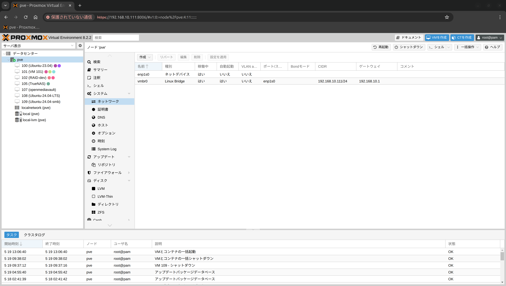
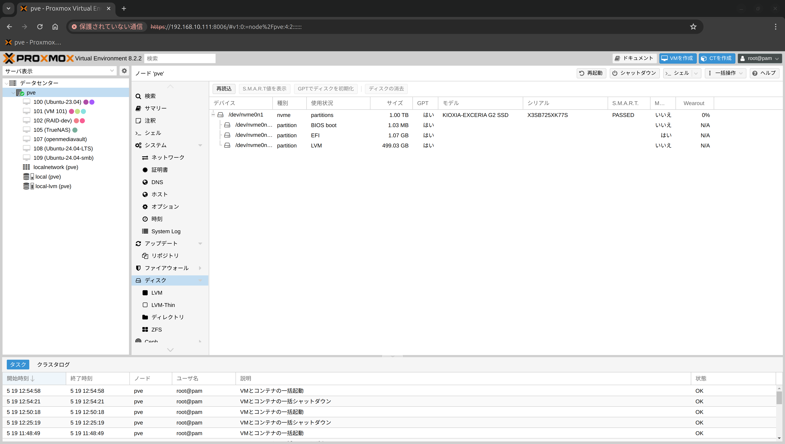
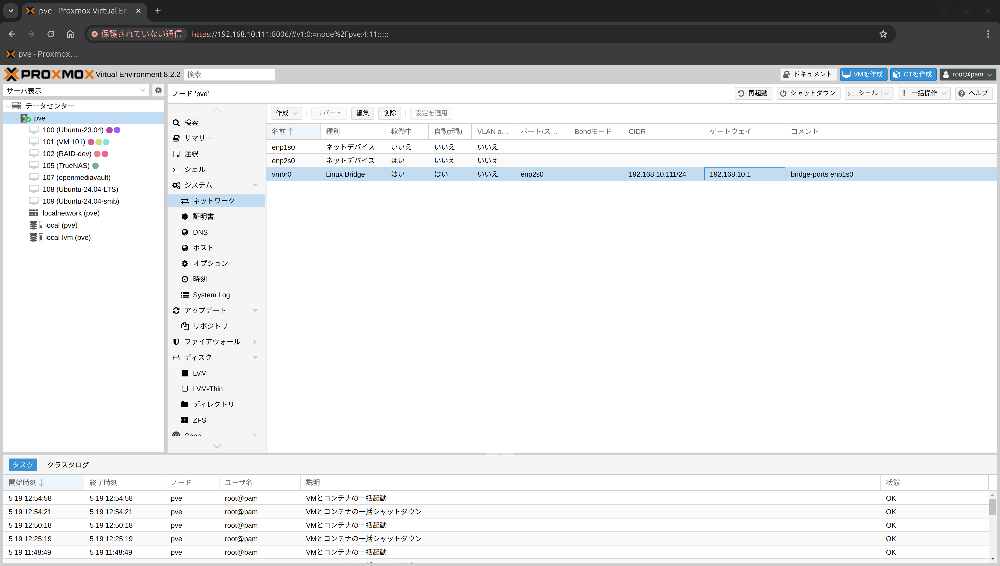

## 発生現象
Deskmini x300(CPU:Ryzen7 5700G) に元々SATA SSDを差していたがデータをM.2 SSDにクローンをして差し替えると、有線LANが繋がらなくなる  
結果、ProxmoxのWebGUIにアクセスできなくなる

## 対処方法
WebGUIではなく本体からコマンドで、ブリッジネットワークにリンクしている物理LANを「enp1s0」から「enp2s0」へ変更する

## 手順
### SATA SSDのとき
元々は500GBのSATA SSDを使用していた

ネットワークの設定

### M.2 SSDのとき
M.2 SSDに差し替えた

元々「enp1s0」だったが「enp2s0」にすると通信可能になった

